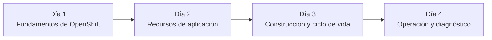

# 1.1 Encuadre: objetivo del curso, mapa de contenidos y alcance

## Objetivo de la formación

El objetivo de este curso es proporcionar una visión práctica y realista de OpenShift como plataforma de ejecución y operación de aplicaciones basadas en contenedores.

Durante las distintas sesiones aprenderemos los conceptos fundamentales sobre los que se construye la plataforma, entenderemos cómo se organiza un clúster OpenShift y adquiriremos los conocimientos necesarios para desplegar, operar y diagnosticar aplicaciones dentro de un entorno empresarial.

El enfoque del curso está orientado a comprender cómo funcionan las plataformas modernas basadas en Kubernetes y OpenShift, priorizando el entendimiento de los conceptos sobre la memorización de comandos o procedimientos.

Al finalizar la formación, el alumno deberá ser capaz de:

- Comprender la relación entre contenedores, Kubernetes y OpenShift.
- Identificar los principales componentes de una plataforma OpenShift.
- Interpretar el estado de una aplicación desplegada.
- Utilizar la consola web y la herramienta de línea de comandos (`oc`) para tareas habituales de consulta y operación.
- Entender los patrones de despliegue y operación utilizados en entornos corporativos.

!!! tip "Objetivo final"

    Al finalizar el curso, el alumno será capaz de comprender cómo se despliega, opera y diagnostica una aplicación sobre OpenShift utilizando tanto la consola web como la herramienta de línea de comandos `oc`.

## Mapa del curso

### Día 1. Fundamentos de OpenShift

- Contenedores.
- Kubernetes.
- Arquitectura OpenShift.
- Herramientas de acceso y administración.

### Día 2. Recursos de aplicación

- Projects.
- Pods.
- Deployments.
- Services.
- Routes.
- ConfigMaps y Secrets.

### Día 3. Construcción y ciclo de vida

- Imágenes.
- Builds.
- ImageStreams.
- Despliegues.
- Estrategias de actualización.

### Día 4. Operación y diagnóstico

- Observación de aplicaciones.
- Eventos.
- Logs.
- Troubleshooting básico.
- Buenas prácticas operativas.

## Enfoque de la formación

La formación está orientada a la comprensión de conceptos y al uso práctico de la plataforma.

El objetivo no es memorizar comandos, sino entender cómo se comportan los distintos componentes para poder trabajar con seguridad en entornos reales.

## Qué no cubre este curso

!!! warning "Fuera del alcance"

    Esta formación está orientada a usuarios y operadores de plataforma.

    Temas como la instalación avanzada de OpenShift, el desarrollo de operadores personalizados, GitOps avanzado o la administración completa de clústeres productivos quedan fuera del alcance de esta introducción.

## Una consideración importante

!!! note "Entorno de laboratorio"

    El entorno utilizado durante las prácticas tiene fines formativos.

    Algunas configuraciones pueden diferir de las utilizadas en entornos corporativos reales con el objetivo de simplificar el aprendizaje y facilitar los ejercicios.

## Resumen

En este capítulo hemos definido los objetivos de la formación, el alcance del curso y la hoja de ruta que seguiremos durante las distintas sesiones.

A partir del siguiente apartado comenzaremos el recorrido técnico analizando la evolución desde los servidores tradicionales hasta las plataformas basadas en contenedores.
