# 1.2 De servidor a contenedor

## Objetivos de aprendizaje

Al finalizar este apartado serás capaz de:

- Comprender la diferencia entre una aplicación instalada en un servidor tradicional y una aplicación ejecutada en un contenedor.
- Entender qué es una imagen de contenedor.
- Comprender qué es una imagen base.
- Comprender qué es un contenedor y su relación con una imagen.
- Comprender por qué los contenedores se consideran efímeros.
- Entender la filosofía de sustituir en lugar de parchear.
- Interpretar los elementos básicos de un Dockerfile.

## Del servidor tradicional al contenedor

Durante muchos años, el despliegue de aplicaciones siguió un modelo similar:

- Se preparaba un servidor físico o una máquina virtual.
- Se instalaba el sistema operativo.
- Se instalaban librerías y dependencias.
- Se desplegaba y configuraba la aplicación.
- Se realizaban actualizaciones y cambios sobre ese mismo servidor.

Era habitual que cada servidor acabara teniendo una configuración distinta.

!!! note "Problema clásico"

    "En mi servidor funciona perfectamente" era una situación frecuente.
    Pequeñas diferencias de versión, librerías o configuraciones provocaban comportamientos distintos entre entornos.

Los contenedores surgen precisamente para solucionar este problema.

La idea es sencilla: en lugar de transportar instrucciones para instalar una aplicación, transportamos la aplicación ya preparada para ejecutarse.

## Un cambio en la forma de desplegar, no en la forma de programar

Cuando se empieza a trabajar con plataformas de contenedores suele surgir una duda frecuente:

**¿Tengo que aprender a programar para OpenShift?**

La respuesta es no.

OpenShift no define cómo se desarrolla una aplicación. Lo que cambia es la forma en que la aplicación se empaqueta, despliega y opera.

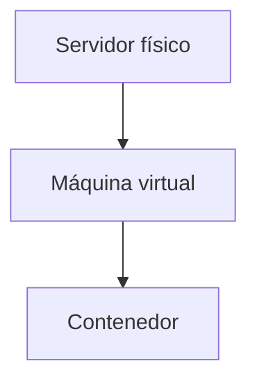

En este curso nos centraremos en comprender este último paso y cómo OpenShift facilita la ejecución y operación de aplicaciones basadas en contenedores.

## ¿Qué es una imagen de contenedor?

Una imagen es un paquete que contiene todo lo necesario para ejecutar una aplicación.

Incluye normalmente:

- Sistema operativo o parte de él.
- Librerías necesarias.
- Dependencias.
- Componentes de ejecución.
- Código de la aplicación.
- Configuración básica de arranque.

!!! tip "Idea clave"

    Una imagen es inmutable. Si necesitamos cambios, normalmente se genera una nueva imagen.

## La imagen base: el punto de partida

Rara vez una imagen se construye desde cero.

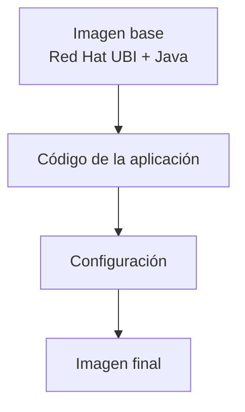

La imagen base suele contener:

- Sistema operativo ligero.
- Librerías básicas.
- Componentes comunes.
- Entorno de ejecución (Java, Python, Node.js, .NET, etc.).

### ¿Quién mantiene la imagen base?

Habitualmente intervienen varios equipos:

- Plataforma/OpenShift.
- Infraestructura.
- Seguridad.
- DevOps / CI-CD.
- Desarrollo.

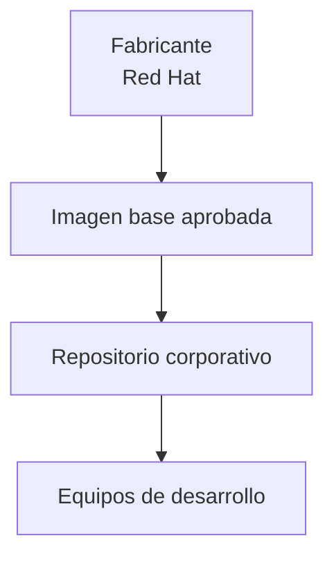

### Imágenes certificadas y homologadas

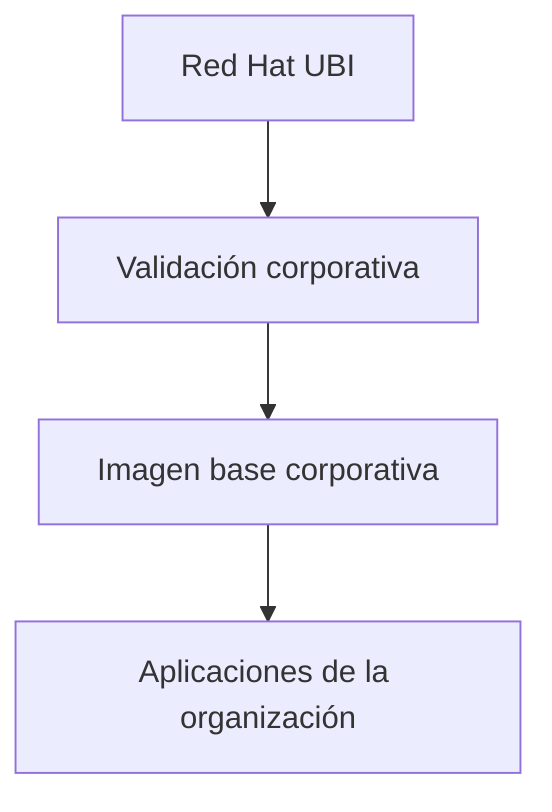

## Lectura básica de un Dockerfile

```dockerfile
FROM ubi9/openjdk-17
COPY app.jar /opt/app/app.jar
EXPOSE 8080
CMD ["java", "-jar", "/opt/app/app.jar"]
```

### FROM

Indica la imagen base utilizada.

### COPY

Copia la aplicación dentro de la imagen.

### EXPOSE

Indica el puerto utilizado.

### CMD

Define el proceso que se ejecutará al arrancar el contenedor.

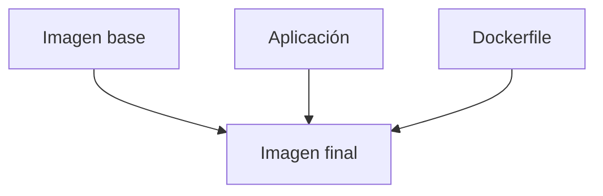

## ¿Qué es un contenedor?

Una imagen por sí sola no hace nada.

Cuando la ejecutamos se crea un contenedor.

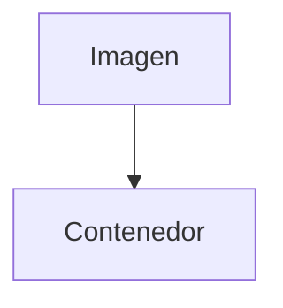

Una misma imagen puede generar múltiples contenedores:

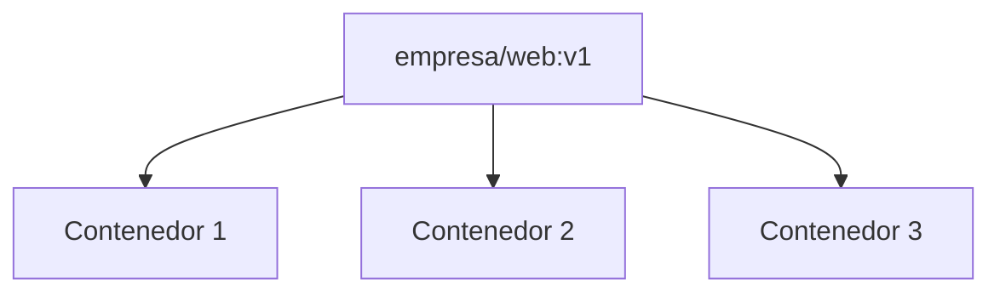

## El contenedor es efímero

Uno de los cambios de mentalidad más importantes es entender que el contenedor no está pensado para durar indefinidamente.

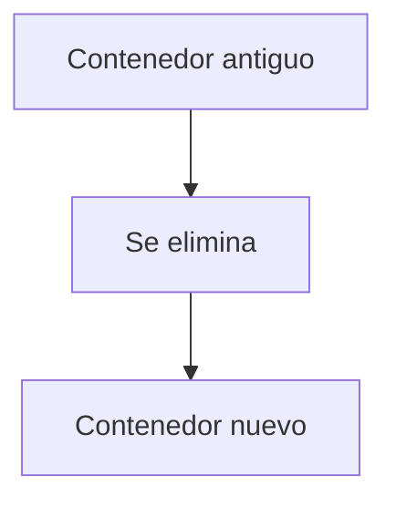

!!! warning "Mentalidad cloud-native"

    Lo importante no es el contenedor concreto, sino la imagen desde la que fue creado.

## Sustituir en lugar de parchear

### Modelo tradicional

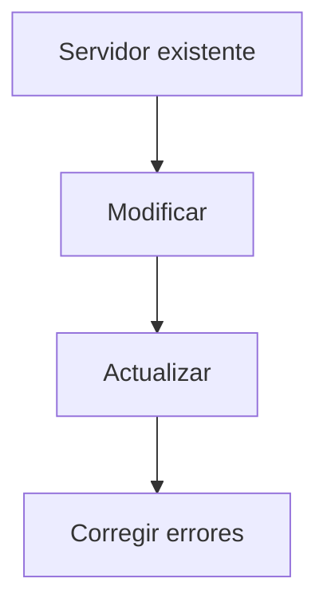

### Modelo basado en imágenes

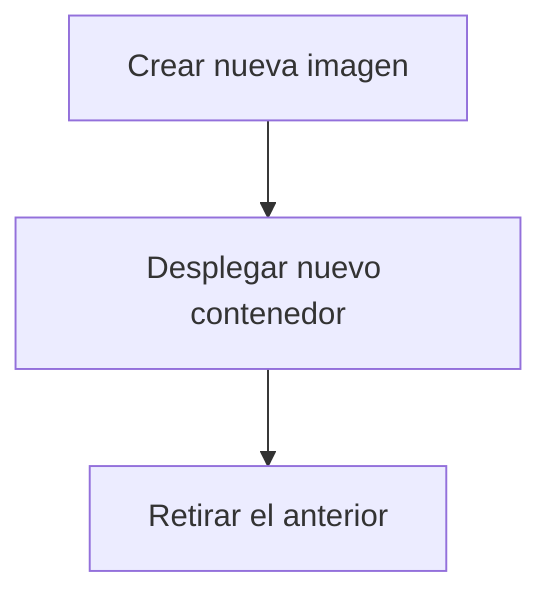

Ventajas:

- Cambios controlados.
- Rollback más sencillo.
- Mayor predictibilidad.
- Menos diferencias entre entornos.

## ¿Qué ocurre cuando cambia la aplicación?

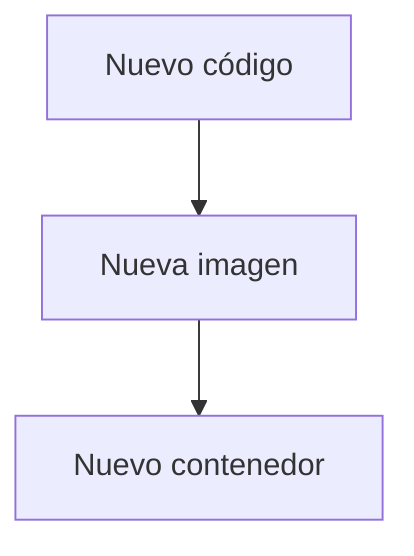

### ¿Y si el código no cambia?

También puede generarse una nueva imagen cuando cambia la imagen base.

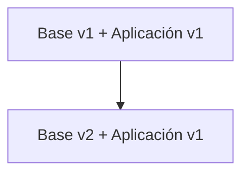

Motivos habituales:

- Cambio en la aplicación.
- Cambio en la imagen base.
- Cambio en ambos.

En todos los casos:

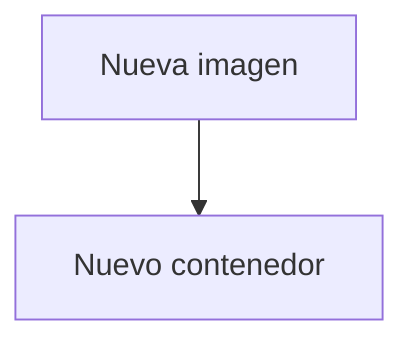

## ¿Por qué es importante entender esto en OpenShift?

OpenShift trabaja continuamente con imágenes y contenedores.

!!! tip "Para recordar"

    - Las aplicaciones se despliegan a partir de imágenes.
    - Un despliegue puede crear múltiples contenedores.
    - Los contenedores pueden reemplazarse automáticamente.
    - Los cambios deben realizarse en la imagen, no directamente en los contenedores en ejecución.
