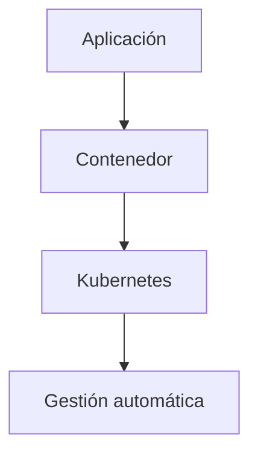
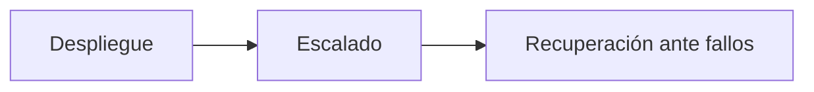
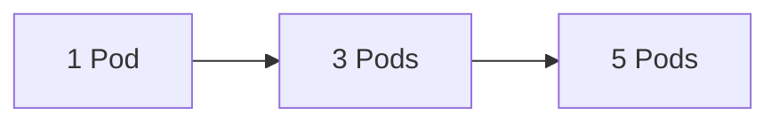
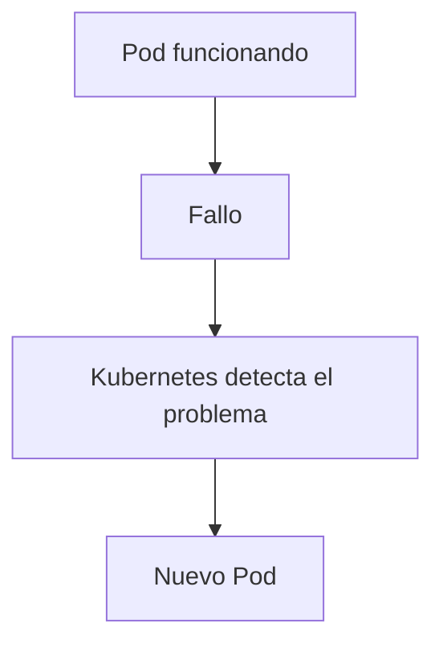
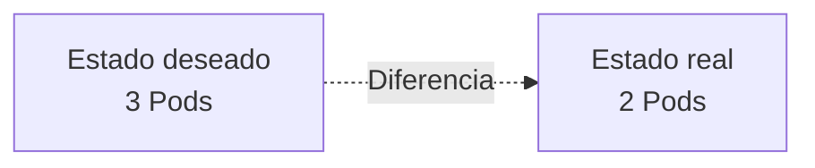
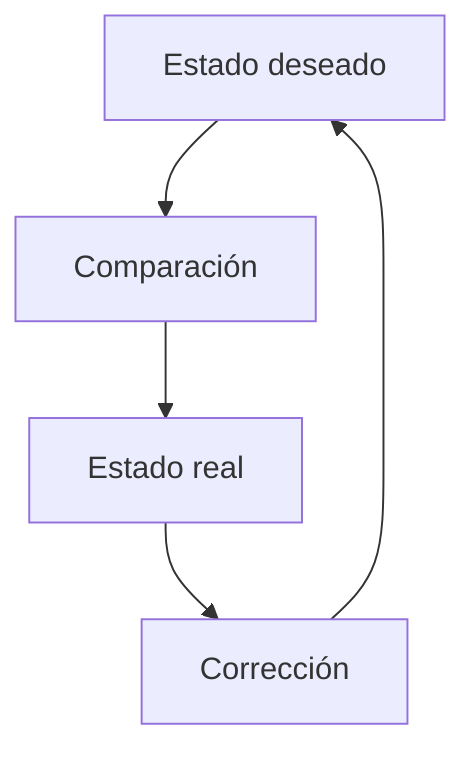
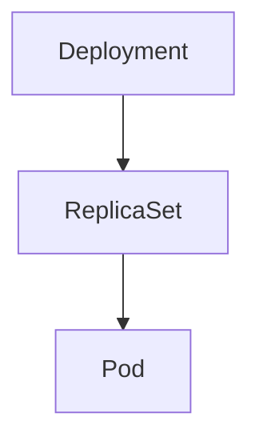
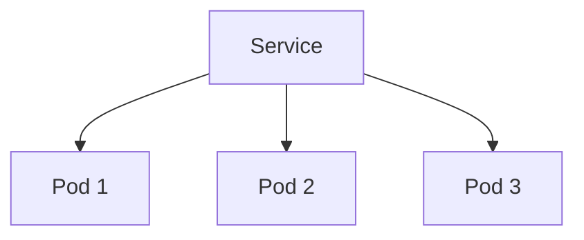

# 1.3 Kubernetes: la capa de orquestación de contenedores

## Objetivos de aprendizaje

Al finalizar este apartado serás capaz de:

- Comprender qué problema resuelve Kubernetes.
- Entender cómo ayuda a desplegar, escalar y recuperar aplicaciones.
- Comprender los conceptos de estado deseado y estado real.
- Entender qué es el bucle de reconciliación.
- Identificar el papel de los Deployments, ReplicaSets y Pods.
- Comprender para qué sirven los Services.
- Entender el papel de las etiquetas y selectores.

## De los contenedores a la orquestación

En el apartado anterior vimos cómo los contenedores permiten empaquetar una aplicación junto con todas sus dependencias.

Sin embargo, los contenedores por sí solos no resuelven todos los problemas.

Ejecutar una única aplicación en un único contenedor es relativamente sencillo. El verdadero reto aparece cuando debemos gestionar decenas, cientos o incluso miles de contenedores distribuidos entre múltiples servidores.

### Preguntas que aparecen a escala

- ¿Qué ocurre si un contenedor se detiene inesperadamente?
- ¿Cómo ejecutamos varias copias de una aplicación?
- ¿Cómo repartimos la carga entre ellas?
- ¿Cómo actualizamos una aplicación sin interrumpir el servicio?
- ¿Cómo garantizamos que las aplicaciones sigan funcionando después de un fallo?

!!! note "Problema a resolver"

    A medida que aumenta el número de aplicaciones, la gestión manual deja de ser viable.
    Aquí es donde aparece Kubernetes.

## ¿Qué es Kubernetes?

Kubernetes es una plataforma de orquestación de contenedores.

Cuando hablamos de orquestación nos referimos a la capacidad de coordinar automáticamente la ejecución de aplicaciones basadas en contenedores.

Kubernetes no sustituye a los contenedores. Los contenedores siguen siendo el mecanismo mediante el cual se ejecutan las aplicaciones.

Lo que aporta Kubernetes es la capacidad de gestionarlos de forma automática y a gran escala.



!!! tip "Idea clave"

    Kubernetes es la capa de orquestación situada por encima de los contenedores.

## Los tres problemas principales que resuelve Kubernetes

Aunque Kubernetes incorpora muchas capacidades, todas ellas giran alrededor de tres necesidades fundamentales.



### Despliegue

Kubernetes permite poner aplicaciones en funcionamiento de forma repetible y controlada.

### Escalado

Una aplicación que inicialmente necesita una única instancia puede requerir varias copias cuando aumenta la carga.



### Recuperación ante fallos

Kubernetes supervisa continuamente la situación del entorno.



!!! tip "Alta disponibilidad"

    Si una aplicación deja de estar disponible, Kubernetes intentará restaurarla automáticamente.

## La idea clave: estado deseado y estado real

Normalmente no indicamos a Kubernetes los pasos exactos que debe realizar.

Lo que hacemos es describir el resultado que esperamos obtener.



Su objetivo permanente consiste en hacer que el estado real coincida con el estado deseado.

## El bucle de reconciliación

El mecanismo mediante el cual Kubernetes mantiene alineados ambos estados se denomina bucle de reconciliación.



### Ejemplo

```text
Deseado: 3 Pods
Real:    2 Pods
```

Kubernetes detectará la diferencia y creará automáticamente un nuevo Pod.

## Cómo mantiene Kubernetes una aplicación

Cuando trabajamos con Kubernetes normalmente no creamos Pods individuales.

Lo habitual es trabajar con un recurso denominado Deployment.



### Responsabilidades

- **Deployment**: define cómo debe ejecutarse la aplicación.
- **ReplicaSet**: garantiza que exista el número correcto de Pods.
- **Pod**: ejecuta los contenedores de la aplicación.

!!! note "Lo habitual"

    Los usuarios trabajan normalmente con Deployments y no directamente con ReplicaSets.

## Etiquetas y selectores

Kubernetes relaciona muchos de sus recursos mediante etiquetas.

### Ejemplo de etiquetas

```text
app=web
entorno=desarrollo
```

### Ejemplo de selector

```text
app=web
```

!!! tip "Para recordar"

    Las etiquetas y selectores son el mecanismo principal utilizado por Kubernetes para relacionar recursos.

## Service: un punto de acceso estable

Los Pods son recursos efímeros y sus direcciones IP pueden cambiar.

Para evitar depender de direcciones IP concretas, Kubernetes utiliza un Service.



Además, Kubernetes registra automáticamente un nombre DNS interno asociado al Service.

## Ideas clave para recordar

!!! tip "Resumen"

    - Kubernetes es una plataforma de orquestación de contenedores.
    - Automatiza despliegue, escalado y recuperación ante fallos.
    - Mantiene el estado real alineado con el estado deseado.
    - Utiliza un bucle de reconciliación continuo.
    - Los Deployments gestionan aplicaciones mediante ReplicaSets y Pods.
    - Los Services proporcionan un punto de acceso estable.
    - OpenShift utiliza Kubernetes como motor de orquestación y amplía sus capacidades.
