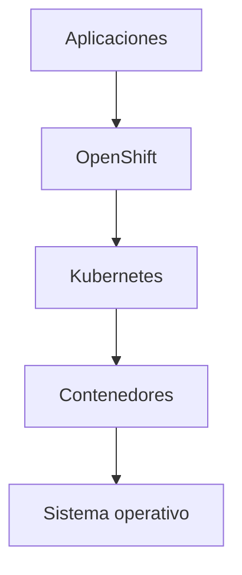
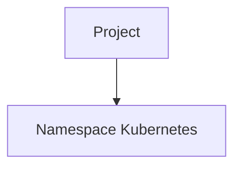
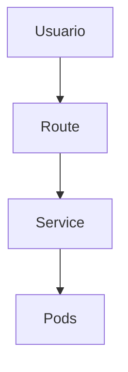
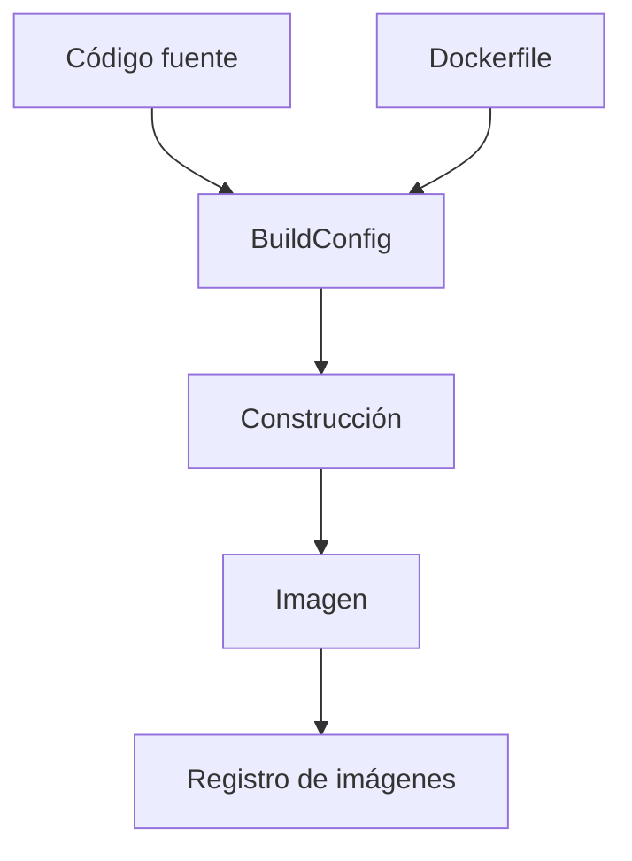
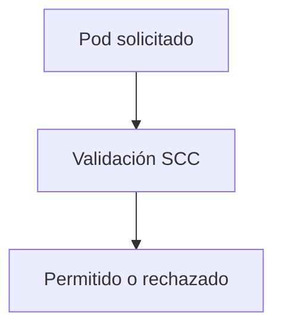
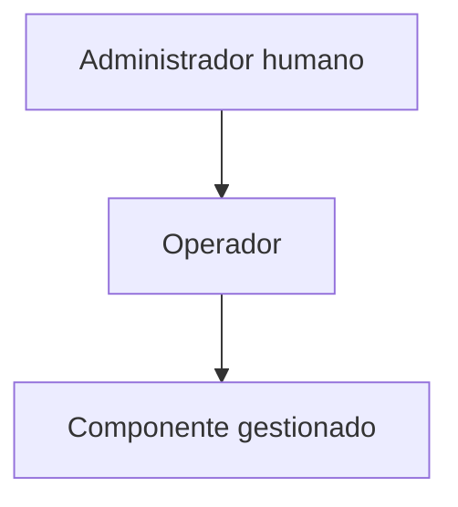
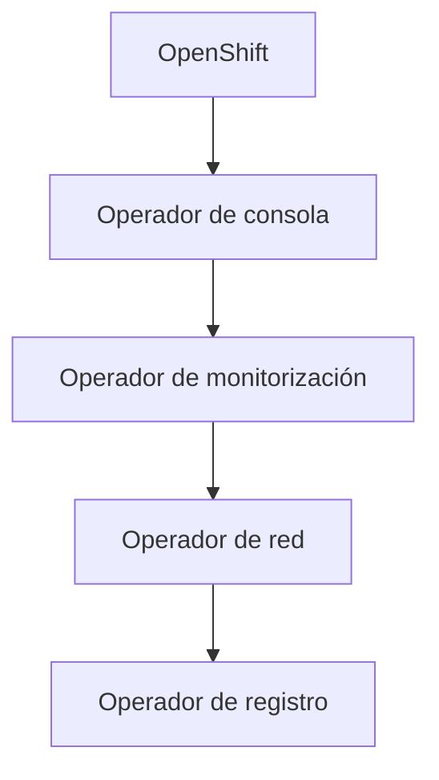
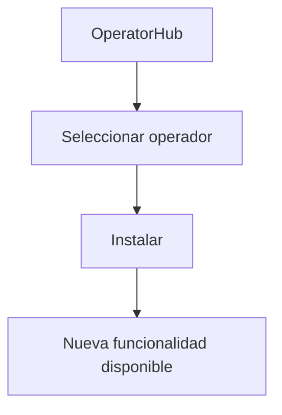
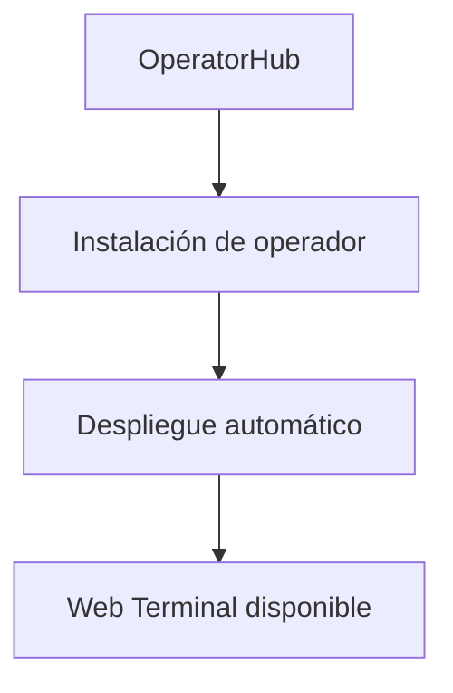

# 1.4 Qué añade OpenShift

## Objetivos de aprendizaje

Al finalizar este apartado serás capaz de:

- Comprender que OpenShift se construye sobre Kubernetes y añade capacidades adicionales.
- Identificar algunos de los recursos más característicos de OpenShift.
- Comprender la diferencia entre Project y Namespace.
- Entender el propósito de las Routes.
- Comprender el objetivo de las Security Context Constraints (SCC).
- Reconocer la existencia de BuildConfig como mecanismo de construcción de imágenes.
- Entender qué es un operador y por qué es un concepto fundamental en OpenShift.
- Comprender el papel de OperatorHub como mecanismo de extensión de la plataforma.

## Kubernetes y OpenShift: relación entre ambos

OpenShift no sustituye Kubernetes.

OpenShift utiliza Kubernetes como base y añade funcionalidades orientadas a facilitar la construcción, operación y administración de plataformas empresariales.



Todos los conceptos fundamentales siguen existiendo:

- Pods.
- Deployments.
- Services.
- Namespaces.
- ConfigMaps.
- Secrets.

!!! tip "Idea clave"

    OpenShift no reemplaza Kubernetes. OpenShift amplía Kubernetes con funcionalidades empresariales adicionales.

## Projects: el espacio de trabajo habitual

En Kubernetes existe el concepto de Namespace.

OpenShift introduce el concepto de Project, que se apoya sobre un Namespace pero añade capacidades relacionadas con usuarios, permisos y experiencia de uso.



### Ejemplos de proyectos

```text
equipo-a-dev
equipo-a-test
equipo-a-prod
```

Cada proyecto contiene sus propios recursos:

- Pods.
- Deployments.
- Services.
- Routes.
- ConfigMaps.
- Secrets.

!!! note "Durante el curso"

    Cada alumno trabajará normalmente dentro de su propio Project.

## Routes: publicar aplicaciones fuera del clúster

Un Service proporciona acceso estable dentro del clúster.

Cuando necesitamos acceso desde el exterior utilizamos una Route.



Ejemplo:

```text
https://mi-aplicacion.apps.empresa.com
```

!!! tip "Para recordar"

    Service resuelve el acceso interno.

    Route resuelve el acceso externo.

## BuildConfig: construcción de imágenes en OpenShift

OpenShift incorpora mecanismos propios para construir imágenes dentro de la plataforma.



Un BuildConfig define cómo debe ejecutarse la construcción.

Habitualmente describe:

- Origen del código.
- Estrategia de construcción.
- Destino de la imagen.

!!! note "Importante"

    BuildConfig no sustituye al Dockerfile.
    Ambos colaboran en el proceso de construcción.

## SCC: una capa adicional de seguridad

OpenShift incorpora Security Context Constraints (SCC).

Las SCC definen qué puede hacer un contenedor cuando se ejecuta.



Ejemplos de controles:

- Usuario de ejecución.
- Privilegios permitidos.
- Capacidades del sistema.
- Configuraciones de seguridad.

!!! warning "Seguridad"

    Las SCC son una de las diferencias más importantes entre OpenShift y muchas instalaciones básicas de Kubernetes.

## El concepto de operador

Un operador es un componente software encargado de instalar, configurar, mantener y actualizar otro componente software.

Puede verse como un administrador automatizado.



Los operadores utilizan los mismos principios de reconciliación vistos anteriormente en Kubernetes.

## El clúster está hecho de operadores

Gran parte de los componentes internos de OpenShift están gestionados mediante operadores.

Ejemplos:

- Consola web.
- Registro interno.
- Monitorización.
- Red.
- Certificados.
- Autenticación.
- Almacenamiento.



!!! tip "Idea fundamental"

    OpenShift es, en gran medida, una plataforma construida sobre operadores.

## OperatorHub: ampliar la plataforma

OperatorHub proporciona un catálogo de operadores instalables.



Gracias a OperatorHub es posible ampliar las capacidades del clúster de forma sencilla.

## Demostración: instalación del operador Web Terminal

Como demostración, el instructor instalará el operador Web Terminal.



!!! note "Objetivo de la demostración"

    Lo importante no es memorizar los pasos de instalación, sino comprender cómo OpenShift incorpora nuevas capacidades mediante operadores.

## Ideas clave para recordar

!!! tip "Resumen"

    - OpenShift utiliza Kubernetes como base.
    - Project es la forma habitual de trabajar con Namespaces.
    - Route proporciona acceso externo.
    - BuildConfig permite construir imágenes dentro de OpenShift.
    - SCC añade controles de seguridad adicionales.
    - Los operadores automatizan la gestión de componentes.
    - Gran parte de OpenShift está construida sobre operadores.
    - OperatorHub permite ampliar la plataforma mediante nuevos operadores.
