# 1.5 Arquitectura de un clúster OpenShift 4.x

## Objetivos de aprendizaje

Al finalizar este apartado serás capaz de:

- Identificar los principales componentes de un clúster OpenShift.
- Comprender la diferencia entre Control Plane, Workers e Infra.
- Entender el papel del API Server.
- Comprender la función de etcd.
- Entender cómo OpenShift utiliza operadores para gestionar la plataforma.
- Comprender el papel del Cluster Version Operator (CVO).
- Seguir conceptualmente el recorrido de una petición.
- Comprender el ciclo de vida y actualización de la plataforma.

## Del concepto a la plataforma real

Hasta ahora hemos visto contenedores, Kubernetes y OpenShift.

La siguiente pregunta es natural:

**¿Cómo está construido realmente un clúster OpenShift?**

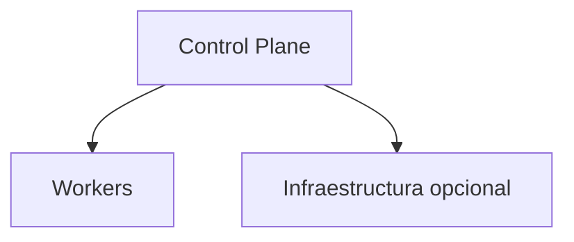

!!! tip "Idea clave"

    Un clúster OpenShift está formado por múltiples nodos que colaboran para proporcionar una única plataforma.

## Qué es un nodo

Un nodo es una máquina que forma parte del clúster.

Puede tratarse de:

- Un servidor físico.
- Una máquina virtual.
- Una instancia cloud.

### Tipos de nodos

- Control Plane.
- Worker.
- Infraestructura.

## El Control Plane

El Control Plane puede considerarse el cerebro del clúster.

Sus responsabilidades incluyen:

- Mantener el estado del clúster.
- Procesar peticiones.
- Decidir dónde ejecutar Pods.
- Coordinar componentes.
- Aplicar el estado deseado.

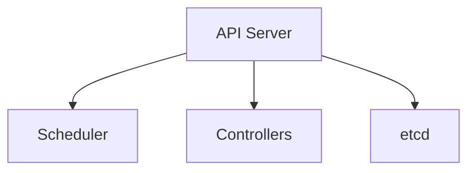

!!! note "Importante"

    Las aplicaciones de usuario normalmente se ejecutan en Workers y no en el Control Plane.

## El API Server: la puerta de entrada al clúster

Todas las operaciones realizadas sobre OpenShift terminan pasando por el API Server.

Ejemplos:

- oc login
- Creación de Deployments
- Consulta de Pods
- Uso de la consola web

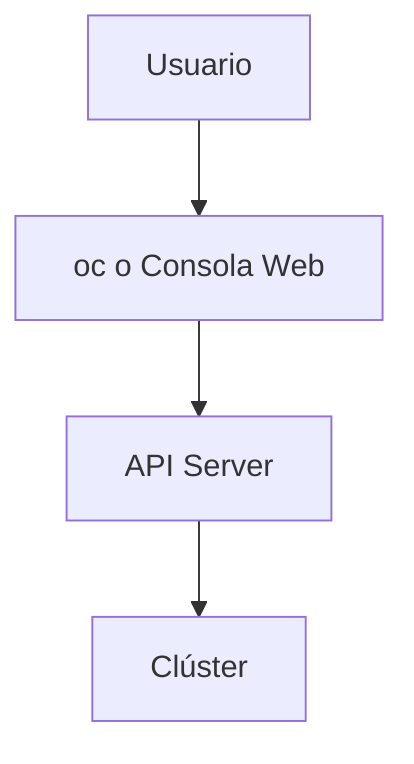

### Creación de una aplicación

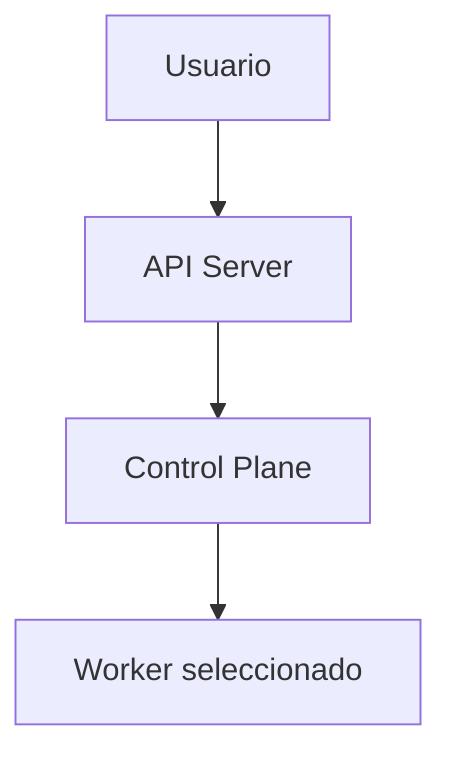

## Los nodos Worker

Los Workers ejecutan las cargas de trabajo.

Aquí encontraremos:

- Pods.
- Deployments.
- Aplicaciones.
- Procesos de construcción.
- Jobs y CronJobs.

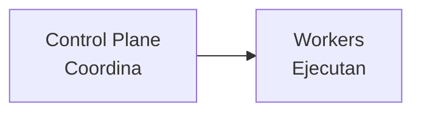

!!! tip "Para recordar"

    Control Plane coordina. Los Workers ejecutan.

## Los nodos de infraestructura

Algunos clústeres disponen de nodos dedicados para servicios de plataforma.

Ejemplos habituales:

- Router / Ingress Controller.
- Registry interno.
- Monitorización.
- Logging.
- Observabilidad.

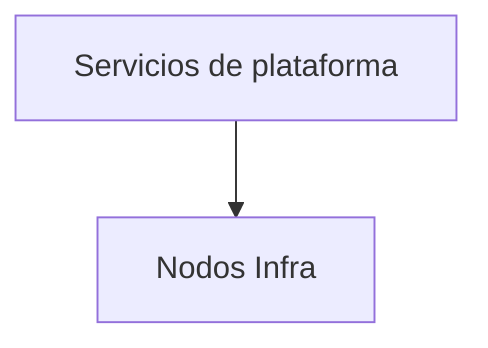

### Separación habitual

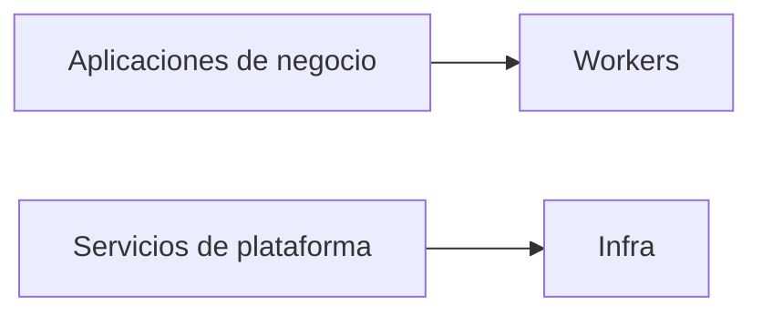

## Consideración básica sobre licenciamiento

!!! note "Visión simplificada"

    En términos generales, la capacidad utilizada por las cargas de usuario suele centrarse en los Workers. Por ello son especialmente relevantes durante el dimensionamiento de la plataforma.

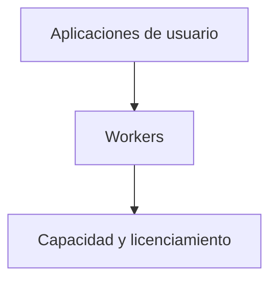

## etcd: la memoria del clúster

etcd es la base de datos distribuida del clúster.

Almacena:

- Configuración.
- Recursos.
- Estado de los objetos.
- Definiciones de aplicaciones.

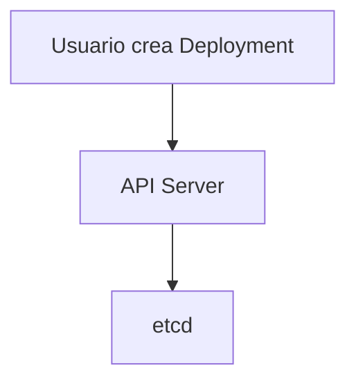

!!! warning "Componente crítico"

    etcd contiene información esencial para el funcionamiento de la plataforma y sus copias de seguridad son fundamentales.

## Una plataforma construida mediante operadores

Gran parte de OpenShift está gestionada mediante operadores.

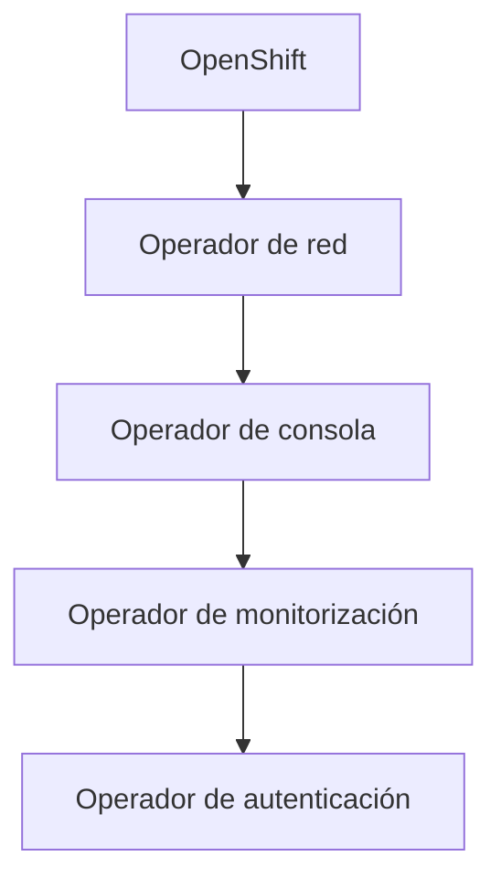

!!! tip "Indicador de salud"

    El estado de los Cluster Operators es uno de los indicadores más importantes del estado general de la plataforma.

## Un clúster gestionado

OpenShift 4 automatiza buena parte de las tareas operativas.

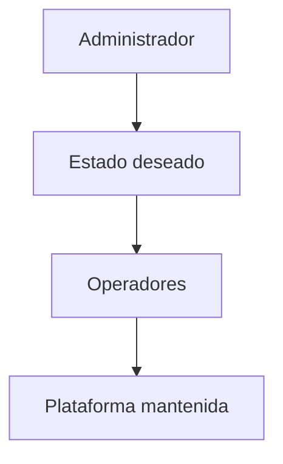

## El Cluster Version Operator (CVO)

El CVO coordina la versión global de OpenShift.

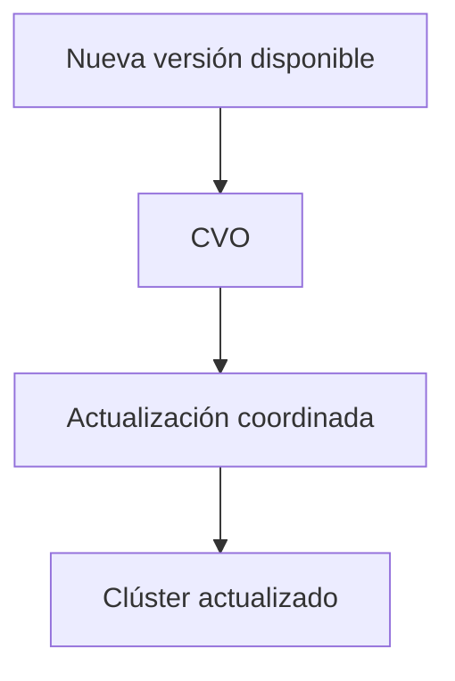

## Recorrido de una petición

Cuando un usuario accede a una aplicación:

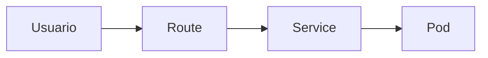

### Recordatorio

- Route publica la aplicación.
- Service proporciona acceso estable.
- Pod ejecuta la aplicación.

## El clúster también se actualiza

OpenShift evoluciona continuamente mediante nuevas versiones.

Estas versiones pueden incorporar:

- Correcciones.
- Mejoras.
- Actualizaciones de seguridad.
- Nuevas capacidades.

## Canales de actualización

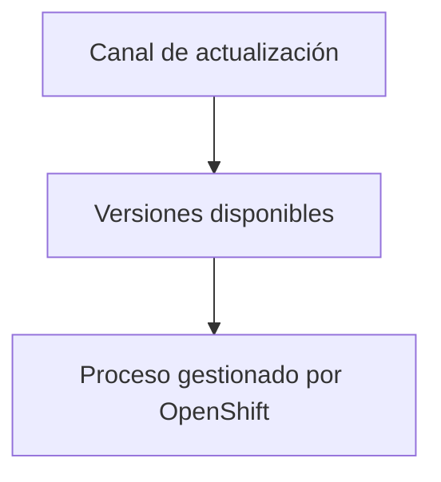

## Compatibilidad de operadores

Antes de una actualización suele verificarse:

- Estado del clúster.
- Versión actual.
- Versión objetivo.
- Operadores instalados.
- Compatibilidad.

## Ideas clave para recordar

!!! tip "Resumen"

    - El Control Plane coordina el clúster.
    - El API Server es la puerta de entrada.
    - Los Workers ejecutan las aplicaciones.
    - etcd almacena el estado crítico del clúster.
    - OpenShift está construido sobre operadores.
    - El CVO coordina las actualizaciones.
    - Una petición suele seguir la ruta Route → Service → Pod.
    - Las actualizaciones y los operadores forman parte del ciclo de vida normal de la plataforma.
