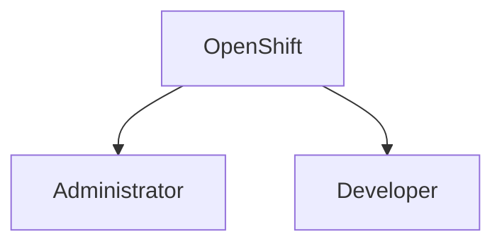
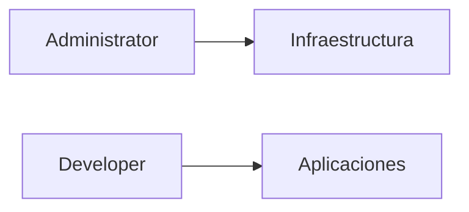
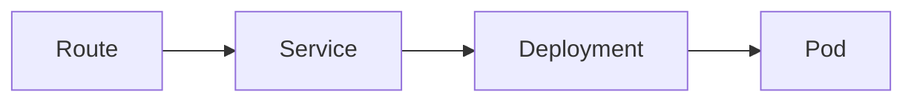
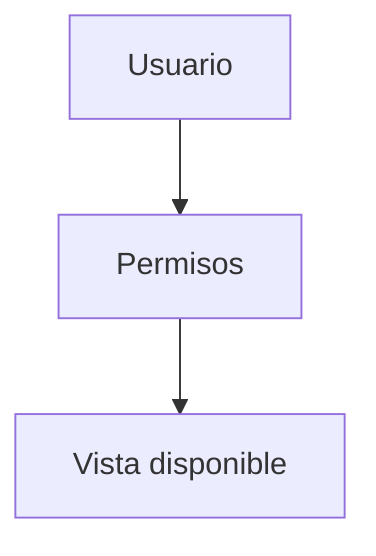
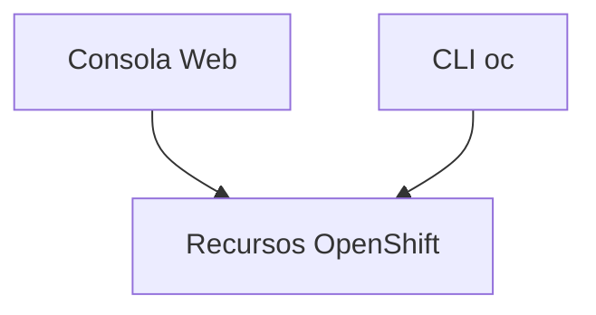

# 1.6 La consola web de OpenShift

## Objetivos de aprendizaje

Al finalizar este apartado serás capaz de:

- Comprender el papel de la consola web dentro de OpenShift.
- Diferenciar la perspectiva de administración y la perspectiva de desarrollo.
- Identificar qué tipo de información muestra cada una.
- Entender qué tareas suelen realizarse desde cada perspectiva.
- Reconocer cuándo resulta más adecuada una u otra vista.

## La puerta de entrada a OpenShift

Una de las características más valoradas de OpenShift es su consola web.

Aunque muchas tareas pueden realizarse desde línea de comandos mediante la herramienta `oc`, la consola proporciona una interfaz gráfica que facilita enormemente la visualización y gestión de los recursos de la plataforma.

Para un usuario que se inicia en OpenShift, la consola permite comprender mejor cómo se organizan las aplicaciones y cómo se relacionan entre sí los distintos componentes.

!!! tip "Primer contacto con OpenShift"

    La consola web suele ser la forma más sencilla de explorar una plataforma OpenShift por primera vez.

## Dos formas de ver la misma plataforma

Es importante entender que no existen dos OpenShift diferentes.

La plataforma es la misma.

Lo que cambia es la forma en que se presenta la información al usuario.

Las dos perspectivas principales son:

- **Administrator**
- **Developer**

## Perspectiva de administración

La perspectiva de administración está orientada a la gestión de la plataforma.

Su objetivo es facilitar el trabajo de los equipos responsables del funcionamiento global de OpenShift.

### Información habitual

- Nodos del clúster.
- Operadores instalados.
- Redes.
- Almacenamiento.
- Usuarios y permisos.
- Proyectos.
- Cuotas y límites de recursos.
- Estado general de la plataforma.

!!! note "Pregunta principal"

    ¿Cómo se encuentra la plataforma y cómo está configurada?

### ¿Quién utiliza esta perspectiva?

- Administradores de OpenShift.
- Equipos de plataforma.
- Equipos de operación.
- Personal de soporte avanzado.

## Perspectiva de desarrollo

La perspectiva de desarrollo está orientada a las aplicaciones.

Su diseño busca que un desarrollador encuentre rápidamente los recursos relacionados con su proyecto.

### Recursos habituales

- Aplicaciones.
- Pods.
- Deployments.
- Services.
- Routes.
- Builds.
- Imágenes de contenedor.
- Logs.

!!! note "Pregunta principal"

    ¿Cómo se encuentra mi aplicación?

### ¿Quién utiliza esta perspectiva?

- Desarrolladores.
- Equipos DevOps.
- Equipos de integración.
- Usuarios de aplicaciones.

## Comparación rápida de perspectivas

!!! tip "Para recordar"

    Administrator se centra en la plataforma.

    Developer se centra en las aplicaciones.

## La vista Topology

Una de las vistas más características de la perspectiva Developer es **Topology**.

Esta vista representa gráficamente los principales componentes de una aplicación y las relaciones existentes entre ellos.

Para un usuario que comienza a trabajar con OpenShift resulta especialmente útil porque permite obtener una visión global del proyecto sin necesidad de navegar por múltiples menús.

!!! tip "Una vista muy útil"

    Topology suele ser la forma más rápida de entender cómo está construida una aplicación dentro de un proyecto.

## La importancia de los permisos

No todos los usuarios ven exactamente lo mismo en la consola.

OpenShift aplica un modelo de control de acceso basado en permisos.

Por ejemplo:

- Un administrador puede visualizar recursos de todo el clúster.
- Un desarrollador normalmente trabajará únicamente sobre los proyectos a los que tiene acceso.

!!! warning "Comportamiento esperado"

    Es completamente normal que distintos usuarios vean menús y opciones diferentes.

## Consola web y línea de comandos

La consola web y la herramienta `oc` no son alternativas excluyentes.

Ambas permiten trabajar sobre los mismos recursos.

Ejemplos:

- Un Pod puede consultarse desde la consola.
- El mismo Pod puede consultarse mediante `oc`.
- Los logs pueden visualizarse desde la consola.
- Los mismos logs pueden obtenerse mediante línea de comandos.

!!! tip "Enfoque recomendado"

    La consola facilita el aprendizaje y la exploración.

    La CLI aporta rapidez, automatización y repetibilidad.

## Ideas clave para recordar

!!! tip "Resumen"

    - La consola web es una de las principales formas de interactuar con OpenShift.
    - Administrator está orientada a la gestión de la plataforma.
    - Developer está orientada a las aplicaciones.
    - Topology proporciona una representación visual de una aplicación.
    - Los permisos determinan qué información ve cada usuario.
    - La consola web y la herramienta oc trabajan sobre los mismos recursos.
