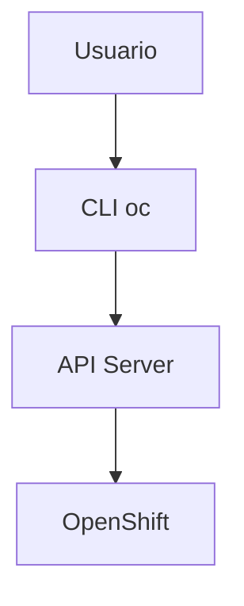
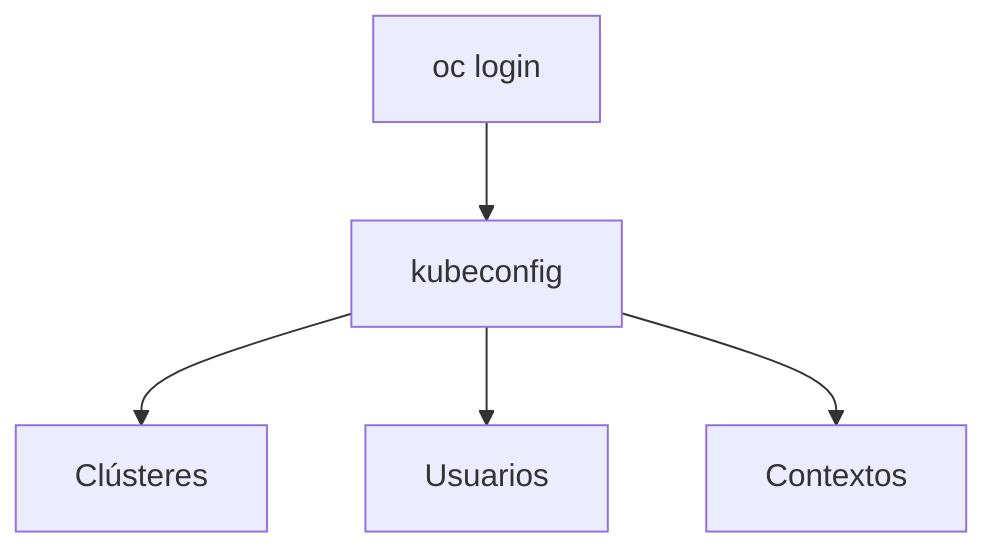
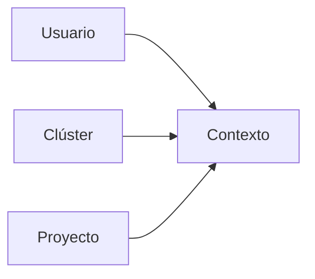
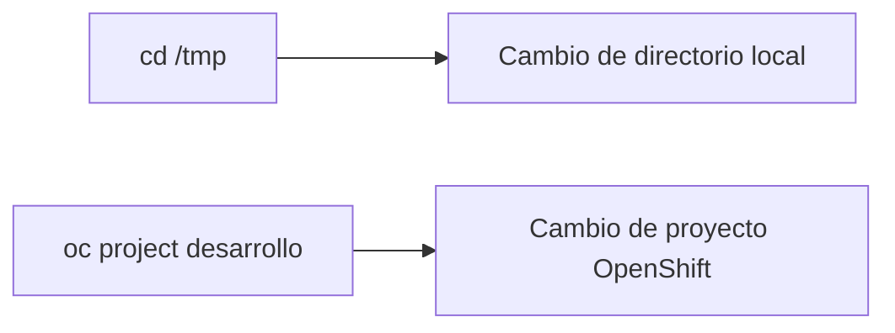
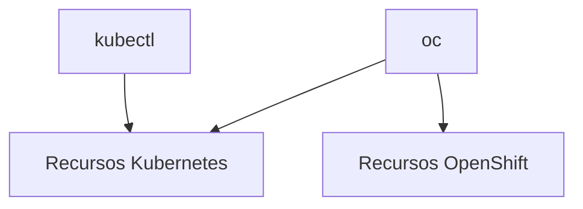
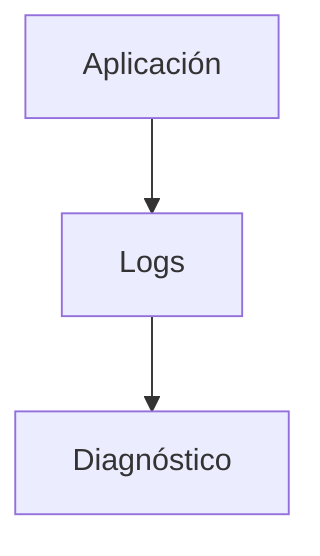
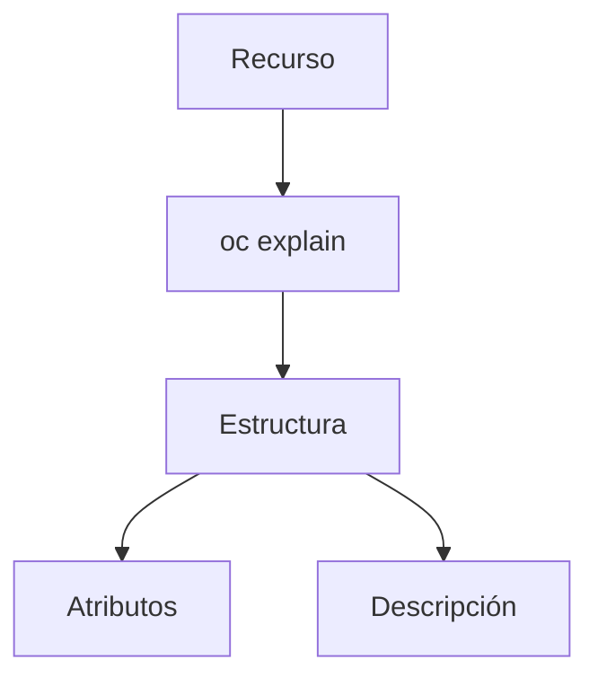
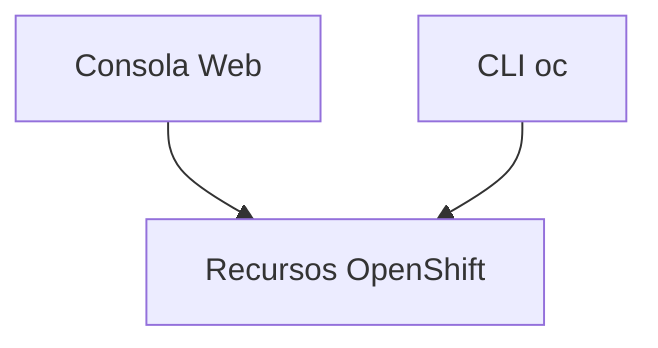

# 1.7 El cliente OC

## Objetivos de aprendizaje

Al finalizar este apartado serás capaz de:

- Comprender qué es la herramienta `oc`.
- Conectarte a un clúster OpenShift mediante `oc login`.
- Identificar dónde se almacena la configuración de acceso.
- Entender qué es un contexto y por qué resulta importante.
- Utilizar `oc project` para cambiar de proyecto de trabajo.
- Diferenciar OpenShift CLI (`oc`) de Kubernetes CLI (`kubectl`).
- Consultar información básica sobre recursos mediante `get`, `describe` y `logs`.
- Utilizar `oc explain` para descubrir recursos y atributos sin depender de documentación externa.

## ¿Qué es OC?

Hasta ahora hemos visto la consola web como una de las principales formas de interactuar con OpenShift. La segunda herramienta fundamental es el cliente de línea de comandos **oc**. citeturn57search7



Desde `oc` es posible:

- Consultar recursos.
- Desplegar aplicaciones.
- Obtener logs.
- Escalar aplicaciones.
- Gestionar configuraciones.
- Automatizar tareas mediante scripts.

!!! tip "Idea clave"

    Prácticamente cualquier acción que realizamos desde la consola web termina convirtiéndose en llamadas a la API del clúster. `oc` utiliza esa misma API.

## Conectarse al clúster: oc login

Antes de poder trabajar es necesario autenticarse.

```bash
oc login https://api.cluster.ejemplo.com:6443
```

También es posible utilizar un token:

```bash
oc login --token=<TOKEN> --server=https://api.cluster.ejemplo.com:6443
```

### ¿Tengo que hacer login cada vez?

Normalmente no.

Tras autenticarse correctamente, el cliente guarda la información necesaria para reutilizar la sesión en futuras ejecuciones.

!!! tip "Trabajo diario"

    Lo habitual es realizar el login una vez y reutilizar la configuración almacenada localmente.

## El fichero kubeconfig

Cuando se realiza un `oc login`, la configuración se almacena en un fichero denominado **kubeconfig**. citeturn57search7

Contiene información como:

- Clústeres conocidos.
- Usuarios.
- Métodos de autenticación.
- Contextos.
- Proyecto activo.

### Ubicación habitual

**Linux / macOS**

```text
~/.kube/config
```

**Windows**

```text
%USERPROFILE%\.kube\config
```



## ¿Qué es un contexto?

Un contexto define la combinación:

```text
Usuario + Clúster + Proyecto
```



Consultar contexto actual:

```bash
oc config current-context
```

Listar contextos:

```bash
oc config get-contexts
```

!!! warning "Antes de modificar recursos"

    Comprueba siempre el contexto activo para evitar trabajar sobre el clúster o proyecto equivocado.

## Trabajar con proyectos: oc project

Consultar proyecto activo:

```bash
oc project
```

Cambiar de proyecto:

```bash
oc project desarrollo
```

### Lo que suele confundirse al principio



!!! note "Importante"

    `oc project` no cambia una carpeta local. Cambia el espacio de trabajo sobre el que actuarán los siguientes comandos.

## OC y kubectl

De forma simplificada:

```text
kubectl = Kubernetes
oc      = Kubernetes + OpenShift
```



Entre los recursos específicos de OpenShift encontramos:

- Projects.
- Routes.
- ImageStreams.
- BuildConfigs.

## Consultar recursos con oc get

```bash
oc get pods
oc get deployments
oc get services
oc get routes
```

!!! tip "Para recordar"

    `get` responde a la pregunta: ¿Qué existe y cuál es su estado general?

## Obtener más detalle con oc describe

```bash
oc describe pod mi-aplicacion-1-abcde
```

`describe` proporciona información detallada:

- Etiquetas.
- Imágenes utilizadas.
- Eventos.
- Configuración.
- Estado de contenedores.

```text
get      -> resumen
describe -> detalle
```

## Consultar logs con oc logs

```bash
oc logs mi-aplicacion-1-abcde
```

Suele ser uno de los primeros comandos utilizados durante el diagnóstico.



## La herramienta más infravalorada: oc explain

```bash
oc explain deployment
```

Profundizar en un atributo:

```bash
oc explain deployment.spec
oc explain deployment.spec.template
```



### Una analogía útil

```text
oc get      -> ¿Qué existe?
oc describe -> ¿Cómo está configurado?
oc explain  -> ¿Qué significa cada campo?
```

!!! tip "Autonomía"

    Aprender a utilizar `oc explain` reduce enormemente la dependencia de ejemplos externos y documentación adicional.

## Consola web y CLI: dos vistas del mismo mundo



La consola facilita la exploración visual.

La CLI aporta:

- Rapidez.
- Repetibilidad.
- Automatización.
- Diagnóstico avanzado.

## Ideas clave para recordar

!!! tip "Resumen"

    - `oc` es el cliente de línea de comandos de OpenShift.
    - `oc login` permite autenticarse contra un clúster.
    - La configuración se almacena en kubeconfig.
    - Un contexto define usuario, clúster y proyecto.
    - `oc project` cambia el proyecto activo.
    - `oc` incluye Kubernetes y extensiones específicas de OpenShift.
    - `oc get`, `oc describe` y `oc logs` son herramientas fundamentales.
    - `oc explain` es una de las mejores ayudas para aprender OpenShift.
