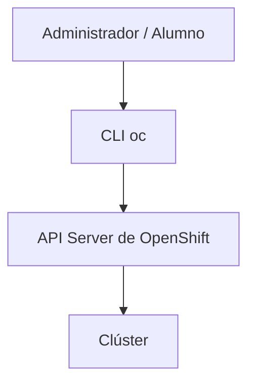
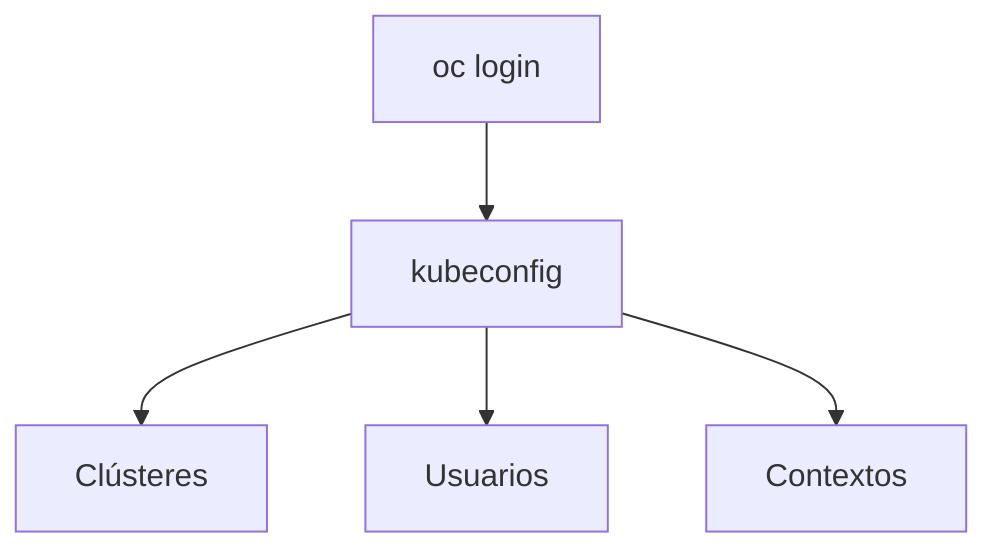
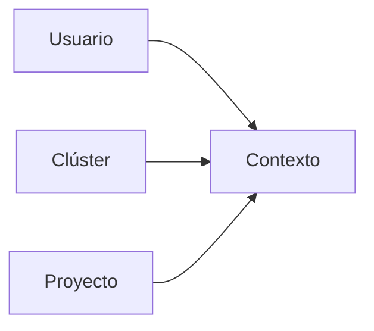
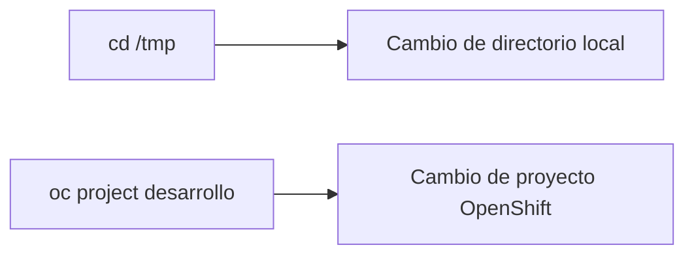
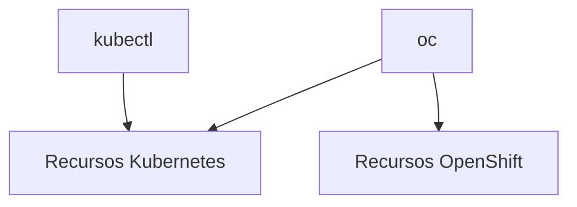
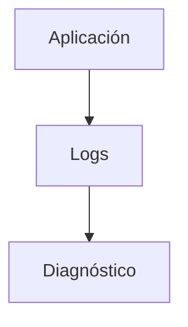
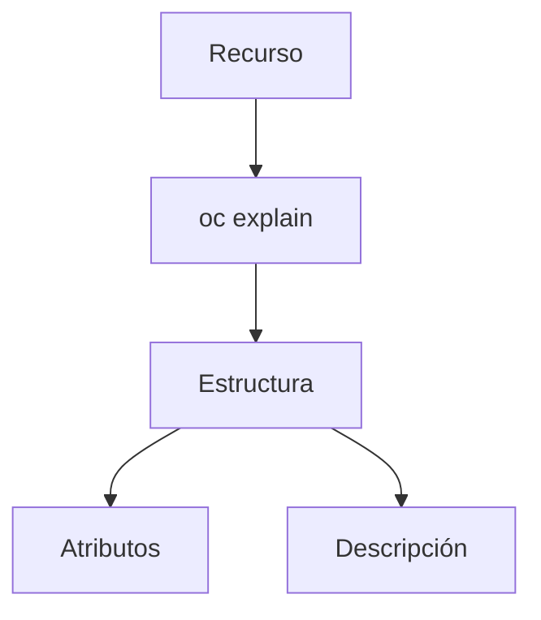
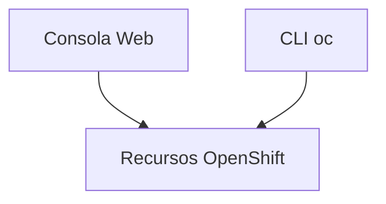

# 1.7 El cliente `oc`: `oc login`, dónde vive el kubeconfig, qué es el contexto, `oc project` (que no es un `cd`), diferencias con `kubectl`. `get` / `describe` / `logs`, y `oc explain`

## Objetivos de aprendizaje

Al finalizar este apartado serás capaz de:

- Comprender qué es y para qué sirve el comando `oc` frente a la consola gráfica.
- Conectarte a un clúster OpenShift mediante `oc login`.
- Identificar dónde se almacena la configuración de acceso (`kubeconfig`).
- Entender qué es un contexto y por qué resulta importante.
- Utilizar `oc project` para cambiar de proyecto de trabajo.
- Diferenciar OpenShift CLI (`oc`) de Kubernetes CLI (`kubectl`).
- Consultar información básica sobre recursos mediante `get`, `describe` y `logs`.
- Utilizar `oc explain` para descubrir recursos y atributos sin depender de documentación externa.

---

## De la comodidad visual al control total: ¿por qué necesitamos `oc`?

Hasta ahora hemos explorado la consola web de OpenShift como una de las principales formas de interactuar con la plataforma. Es una interfaz magnífica para hacernos una idea visual de lo que ocurre en el clúster y entender las relaciones entre componentes en la vista *Topology*.

Sin embargo, a medida que un administrador o un desarrollador gana soltura en el día a día, la consola gráfica se queda corta para ciertas tareas. Aquí es donde entra en juego el cliente de línea de comandos **`oc`**.


```mermaid
flowchart TD
    A[Administrador / Alumno]
    --> B[CLI oc]
    --> C[API Server de OpenShift]
    --> D[Clúster]
```

Con la línea de comandos conseguimos:
- **Agilidad:** Ejecutar acciones complejas con una sola instrucción sin navegar por múltiples menús.
- **Repetibilidad:** Poder copiar, pegar y automatizar operaciones mediante scripts.
- **Diagnóstico quirúrgico:** Extraer logs masivos, trazas de errores o descripciones profundas de un recurso cuando algo falla.

!!! tip "Idea clave"

    La consola web y el comando `oc` no son herramientas excluyentes ni mundos separados. Por debajo, cada clic que haces en la interfaz gráfica genera exactamente la misma llamada a la API que podrías lanzar tú mismo escribiendo un comando en la terminal.

---

## Conectarse al clúster: `oc login`

Antes de poder trabajar es necesario autenticarse ante la plataforma.

```bash
oc login [https://api.cluster.ejemplo.com:6443](https://api.cluster.ejemplo.com:6443)
```

También es posible utilizar un token de acceso:

```bash
oc login --token=<TOKEN> --server=[https://api.cluster.ejemplo.com:6443](https://api.cluster.ejemplo.com:6443)
```

---

## El fichero `kubeconfig`

Cuando se realiza un `oc login`, la configuración de acceso se almacena en un fichero denominado **kubeconfig**. 

Contiene información como:
- Clústeres conocidos.
- Usuarios.
- Métodos de autenticación.
- Contextos.
- Proyecto activo.

### Ubicación habitual

**Linux / macOS**
```text
~/.kube/config
```

**Windows**
```text
%USERPROFILE%\.kube\config
```


```mermaid
flowchart TD
    A[oc login]
    --> B[kubeconfig]
    --> C[Clústeres]
    B --> D[Usuarios]
    B --> E[Contextos]
```

---

## ¿Qué es un contexto?

Un contexto define la combinación de:

$$\text{Usuario} + \text{Clúster} + \text{Proyecto}$$


```mermaid
flowchart LR
    U[Usuario]
    --> Ctx[Contexto]

    C[Clúster]
    --> Ctx

    P[Proyecto]
    --> Ctx
```

Consultar el contexto actual:
```bash
oc config current-context
```

Listar los contextos disponibles:
```bash
oc config get-contexts
```

!!! warning "Antes de modificar recursos"

    Comprueba siempre el contexto activo para evitar trabajar sobre el clúster o proyecto equivocado.

---

## Trabajar con proyectos: `oc project`

Consultar el proyecto activo:
```bash
oc project
```

Cambiar de proyecto:
```bash
oc project desarrollo
```

### Lo que suele confundirse al principio


```mermaid
flowchart LR
    A[cd /tmp]
    --> B[Cambio de directorio local]

    C[oc project desarrollo]
    --> D[Cambio de proyecto OpenShift]
```

!!! note "Importante"

    `oc project` no cambia una carpeta local. Cambia el espacio de trabajo sobre el que actuarán los siguientes comandos.

---

## `oc` y `kubectl`

De forma simplificada:

```text
kubectl = Kubernetes
oc      = Kubernetes + OpenShift
```


```mermaid
flowchart TD
    A[kubectl]
    --> B[Recursos Kubernetes]

    C[oc]
    --> B
    C --> D[Recursos OpenShift]
```

Entre los recursos específicos de OpenShift encontramos:
- Projects.
- Routes.
- ImageStreams.
- BuildConfigs.

---

## Consultar recursos con `oc get`

```bash
oc get pods
oc get deployments
oc get services
oc get routes
```

!!! tip "Para recordar"

    `get` responde a la pregunta: ¿Qué existe y cuál es su estado general?

---

## Obtener más detalle con `oc describe`

```bash
oc describe pod mi-aplicacion-1-abcde
```

`describe` proporciona información detallada:
- Etiquetas.
- Imágenes utilizadas.
- Eventos.
- Configuración.
- Estado de contenedores.

```text
get      -> resumen
describe -> detalle
```

---

## Consultar logs con `oc logs`

```bash
oc logs mi-aplicacion-1-abcde
```

Suele ser uno de los primeros comandos utilizados durante el diagnóstico.


```mermaid
flowchart TD
    A[Aplicación]
    --> B[Logs]
    --> C[Diagnóstico]
```

---

## La herramienta más infravalorada: `oc explain`

```bash
oc explain deployment
```

Para profundizar en un atributo específico:

```bash
oc explain deployment.spec
oc explain deployment.spec.template
```


```mermaid
flowchart TD
    A[Recurso]
    --> B[oc explain]
    --> C[Estructura]
    C --> D[Atributos]
    C --> E[Descripción]
```

### Una analogía útil

```text
oc get      -> ¿Qué existe?
oc describe -> ¿Cómo está configurado?
oc explain  -> ¿Qué significa cada campo?
```

!!! tip "Autonomía"

    Aprender a utilizar `oc explain` reduce enormemente la dependencia de ejemplos externos y documentación adicional.

---

## Consola web y CLI: dos vistas del mismo mundo


```mermaid
flowchart TD
    A[Consola Web]
    --> R[Recursos OpenShift]

    B[CLI oc]
    --> R
```

La consola facilita la exploración visual. La CLI aporta rapidez, repetibilidad, automatización y diagnóstico avanzado.

---

## Ideas clave para recordar

!!! tip "Resumen"

    - `oc` es el cliente de línea de comandos de OpenShift.
    - `oc login` permite autenticarse contra un clúster.
    - La configuración se almacena en el fichero kubeconfig.
    - Un contexto define usuario, clúster y proyecto.
    - `oc project` cambia el proyecto activo.
    - `oc` incluye las capacidades de Kubernetes y extensiones específicas de OpenShift.
    - `oc get`, `oc describe` y `oc logs` son herramientas fundamentales del día a día.
    - `oc explain` es una de las mejores ayudas integradas para aprender OpenShift.