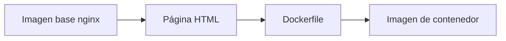
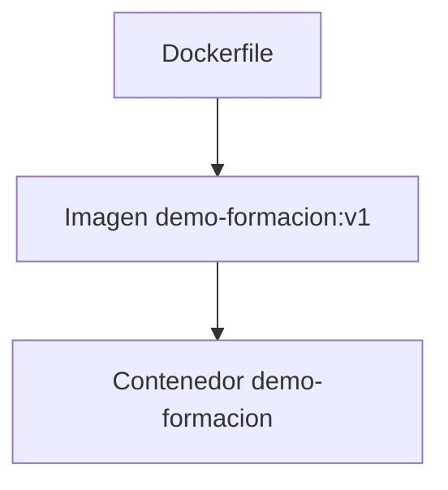
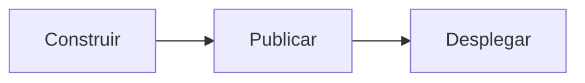
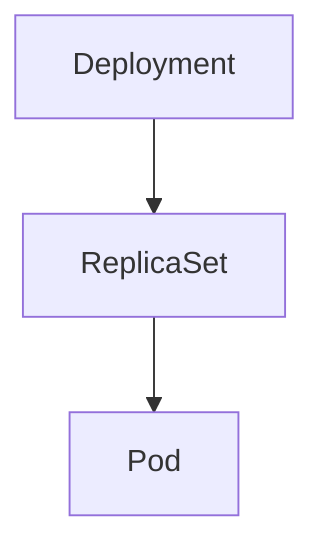
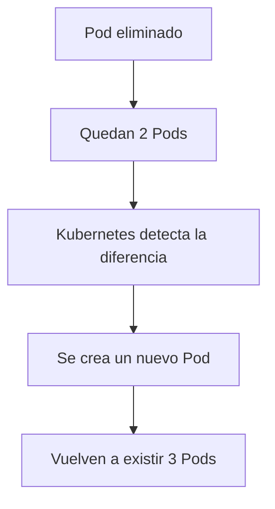
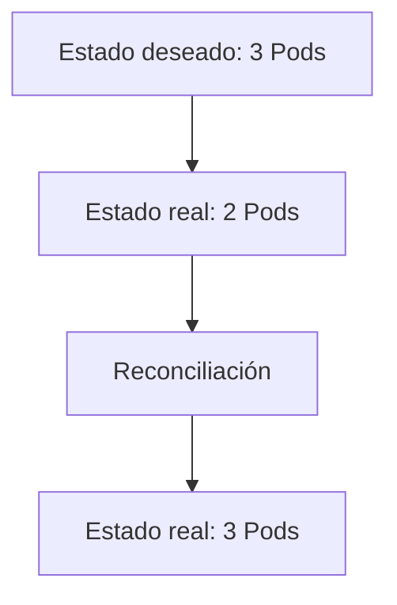
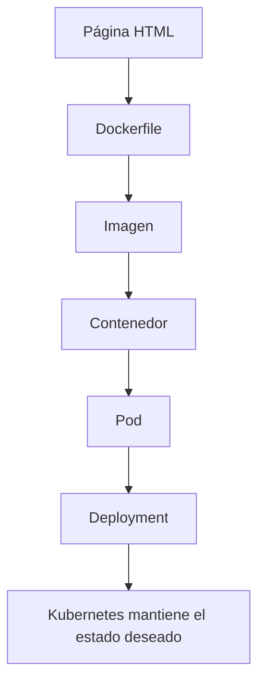

# 1.8 Práctica: de la imagen al clúster y comprobación de la reconciliación de Kubernetes

## Objetivos de aprendizaje

Al finalizar este apartado serás capaz de:

- Comprender el recorrido completo desde una aplicación hasta su ejecución en OpenShift.
- Relacionar los conceptos de imagen, contenedor, Pod y Deployment.
- Entender cómo una imagen construida localmente puede desplegarse en un clúster.
- Observar el funcionamiento práctico del estado deseado de Kubernetes.
- Comprobar cómo actúa el bucle de reconciliación cuando desaparece un Pod.
- Verificar que Kubernetes mantiene automáticamente el número de réplicas solicitado.

## Del Dockerfile al clúster

A lo largo de esta primera sesión hemos estudiado varios conceptos de forma separada:

- Imagen.
- Contenedor.
- Pod.
- Deployment.
- Estado deseado.
- Bucle de reconciliación.

Ahora vamos a unir todas las piezas en una demostración completa.

!!! tip "Objetivo de la práctica"

    El objetivo no es aprender a desarrollar aplicaciones, sino visualizar el recorrido completo desde una imagen hasta su ejecución dentro de OpenShift.

## Aplicación de ejemplo

```html
<h1>Curso OpenShift</h1>
<h2>Demostración de Kubernetes</h2>
<p>Mi primera imagen construida con Podman.</p>
```

Esta página no tiene ninguna lógica especial.

Su único objetivo es servir como contenido visible para comprobar que todo el proceso funciona correctamente.

## Construcción de la imagen

Para empaquetar la aplicación utilizaremos el siguiente Dockerfile:

```dockerfile
FROM nginx:latest
COPY demo-formacion.html /usr/share/nginx/html/index.html
EXPOSE 80
```

### Qué hace cada línea

- `FROM`: indica la imagen base.
- `COPY`: incorpora nuestra página HTML.
- `EXPOSE`: documenta el puerto utilizado.



## Demostración: construcción y ejecución local con Podman

### Construcción de la imagen

```bash
podman build -t demo-formacion:v1 .
```

Comprobar la imagen creada:

```bash
podman images
```

### Ejecución local

```bash
podman run -d --name demo-formacion -p 8080:80 demo-formacion:v1
```

```bash
podman ps
```

Acceso desde navegador:

```text
http://localhost:8080
```



## Publicación de la imagen en un registro

La imagen ha sido publicada previamente en:

```text
docker.io/ieftraining/demo-formacion:v1
```



!!! note "Una sola imagen"

    La misma imagen puede utilizarse en desarrollo, pruebas y OpenShift.

## Despliegue de la imagen en OpenShift

```bash
oc new-app docker.io/ieftraining/demo-formacion:v1
```

Comprobación de recursos:

```bash
oc get all
```



Además se crea un Service para proporcionar acceso estable a la aplicación.

## Comprobación del estado de la aplicación

```bash
oc get pods
```

```text
NAME READY STATUS
demo-formacion-7f6b7b8c6d-abcde 1/1 Running
```

```bash
oc get deployments
```

!!! tip "Comprobación visual"

    También puede verificarse el resultado desde la vista Topology de OpenShift.

# El experimento importante: comprobar la reconciliación

> Kubernetes trabaja continuamente para que el estado real coincida con el estado deseado.

## Paso 1. Verificar las réplicas actuales

```bash
oc get deployment demo-formacion
```

```text
NAME READY UP-TO-DATE AVAILABLE
demo-formacion 1/1 1 1
```

Estado deseado:

```text
1 réplica
```

## Paso 2. Escalar la aplicación

```bash
oc scale deployment/demo-formacion --replicas=3
```

```bash
oc get pods
```

```text
demo-formacion-xxxxx
demo-formacion-yyyyy
demo-formacion-zzzzz
```

Ahora el estado deseado es de 3 Pods.

## Paso 3. Eliminar un Pod manualmente

```bash
oc delete pod demo-formacion-xxxxx
```

El Deployment sigue definiendo tres réplicas como estado deseado.

## Paso 4. Observar qué ocurre

```bash
oc get pods
```



El nuevo Pod tendrá un nombre diferente al eliminado.

!!! tip "Idea fundamental"

    Kubernetes no recupera el Pod antiguo. Recupera el estado deseado.

## ¿Qué acabamos de demostrar?



Este mecanismo constituye la base de la recuperación automática ante muchos tipos de fallos.

## Relación con los conceptos estudiados



## Ideas clave para recordar

!!! tip "Resumen"

    - Una imagen puede construirse localmente con Podman y reutilizarse posteriormente en OpenShift.
    - La imagen utilizada en desarrollo y en OpenShift puede ser exactamente la misma.
    - Un Deployment define cómo debe ejecutarse una aplicación.
    - Kubernetes mantiene el número de réplicas solicitado por el Deployment.
    - Los Pods son recursos efímeros y pueden desaparecer en cualquier momento.
    - Eliminar un Pod no implica necesariamente que la aplicación deje de funcionar.
    - Kubernetes detecta desviaciones entre estado real y estado deseado.
    - El bucle de reconciliación es uno de los mecanismos fundamentales de Kubernetes.
    - OpenShift hereda este comportamiento porque utiliza Kubernetes como motor de orquestación.
