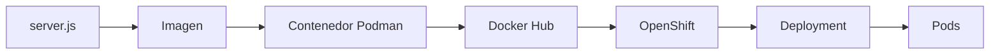
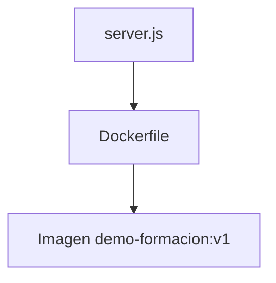
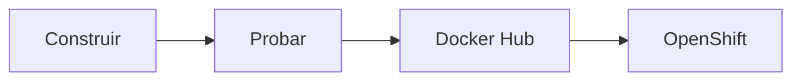
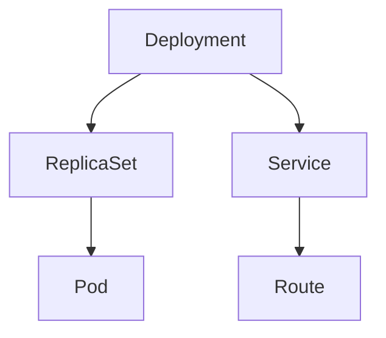
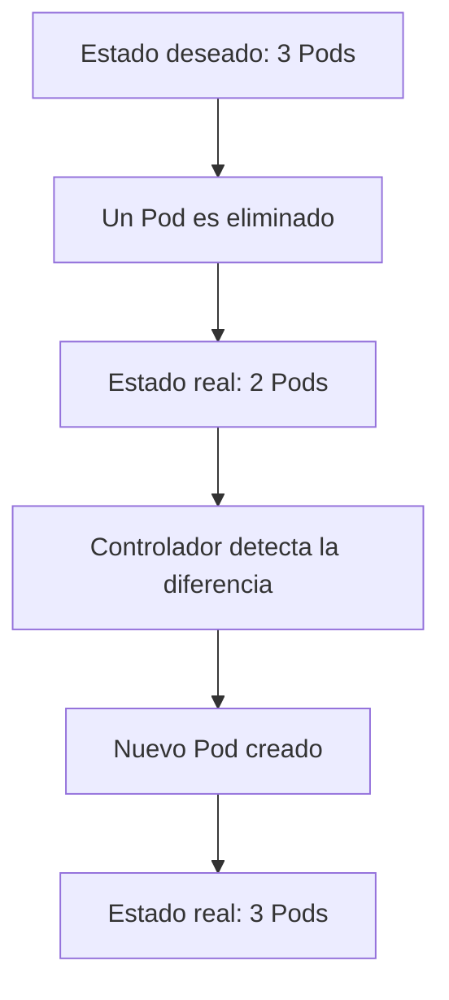
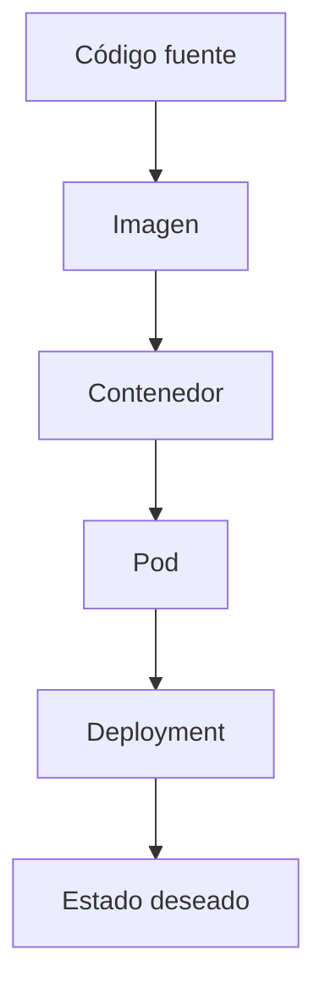

# 1.8 Práctica: de la imagen al clúster y comprobación de la reconciliación de Kubernetes

## Objetivos de aprendizaje

Al finalizar este apartado serás capaz de:

- Comprender el recorrido completo desde una aplicación hasta su ejecución en OpenShift.
- Relacionar los conceptos de imagen, contenedor, Pod y Deployment.
- Entender cómo una imagen construida localmente puede desplegarse en un clúster.
- Observar el funcionamiento práctico del estado deseado de Kubernetes.
- Comprobar cómo actúa el bucle de reconciliación cuando desaparece un Pod.
- Verificar que Kubernetes mantiene automáticamente el número de réplicas solicitado.

---

## Introducción

Durante esta primera sesión hemos estudiado distintos conceptos de forma independiente:

- Imágenes.
- Contenedores.
- Pods.
- Deployments.
- Estado deseado.
- Reconciliación.

Es momento de unir todas las piezas.

En esta práctica construiremos una imagen, la ejecutaremos localmente con Podman, la publicaremos en Docker Hub y finalmente la desplegaremos en OpenShift.



!!! note "Objetivo de esta práctica"

    El objetivo no es aprender Node.js ni desarrollo de aplicaciones.

    La aplicación utilizada es deliberadamente sencilla para centrar la atención en los conceptos fundamentales de contenedores, Kubernetes y OpenShift.

---

## Aplicación de ejemplo

Utilizaremos una aplicación web mínima desarrollada con Node.js.

### server.js

```javascript
const http = require('http');

const port = process.env.PORT || 8080;

http.createServer((req, res) => {

    res.writeHead(200, {
        'Content-Type': 'text/html; charset=utf-8'
    });

    res.end(`
    <html>
      <head>
        <meta charset="UTF-8">
        <title>Curso OpenShift</title>
      </head>
      <body>
        <h1>Curso OpenShift</h1>
        <h2>Mi primera aplicación desplegada en OpenShift</h2>
        <p>La misma imagen funciona en Podman y en OpenShift.</p>
      </body>
    </html>
    `);

}).listen(port);

console.log(`Servidor escuchando en puerto ${port}`);
```

La aplicación escucha en el puerto 8080 y devuelve una página HTML sencilla.

---

## Construcción de la imagen

### Dockerfile

```dockerfile
FROM registry.access.redhat.com/ubi9/nodejs-20

WORKDIR /opt/app-root/src

COPY server.js .

EXPOSE 8080

CMD ["node", "server.js"]
```

### ¿Qué hace cada línea?

- `FROM`: selecciona una imagen base con Node.js.
- `WORKDIR`: establece el directorio de trabajo.
- `COPY`: copia el código fuente al interior de la imagen.
- `EXPOSE`: documenta el puerto utilizado.
- `CMD`: define el proceso principal del contenedor.



---

## Demostración: construcción y ejecución local con Podman

### Construcción

```bash
podman build -t demo-formacion:v1 .
```

Verificar la imagen creada:

```bash
podman images
```

### Ejecución local

```bash
podman run -d --name demo-formacion -p 8080:8080 demo-formacion:v1
```

Comprobar el estado del contenedor:

```bash
podman ps
```

Consultar los registros:

```bash
podman logs demo-formacion
```

Resultado esperado:

```text
Servidor escuchando en puerto 8080
```

Acceder desde un navegador:

```text
http://localhost:8080
```

!!! tip "Imagen y contenedor"

    La imagen es una plantilla.

    El contenedor es una instancia en ejecución creada a partir de esa imagen.

---

## Publicación en Docker Hub

Etiquetar la imagen:

```bash
podman tag demo-formacion:v1 docker.io/ieftraining/demo-formacion:v1
```

Publicar la imagen:

```bash
podman push docker.io/ieftraining/demo-formacion:v1
```

Imagen utilizada durante esta práctica:

```text
docker.io/ieftraining/demo-formacion:v1
```

!!! warning "Una sola imagen"

    La misma imagen utilizada en Podman será utilizada posteriormente en OpenShift.

    No se reconstruye ni se modifica entre entornos.



---

## Despliegue en OpenShift

Crear la aplicación:

```bash
oc new-app docker.io/ieftraining/demo-formacion:v1
```

Comprobar los recursos creados:

```bash
oc get all
```

Crear una Route:

```bash
oc expose service demo-formacion
```

Consultar la URL generada:

```bash
oc get route
```



!!! note "Componentes creados automáticamente"

    OpenShift crea el Deployment, ReplicaSet, Pod y Service necesarios para ejecutar la aplicación.

---

## Comprobación del estado

```bash
oc get pods
```

```bash
oc get deployments
```

Verifica que el Pod se encuentra en estado:

```text
Running
```

En este momento la aplicación ya está ejecutándose dentro del clúster.

---

# El experimento importante: comprobar la reconciliación

Hasta ahora hemos hablado varias veces de una idea clave:

> Kubernetes trabaja continuamente para que el estado real coincida con el estado deseado.

Vamos a comprobarlo.

## Paso 1. Verificar las réplicas actuales

```bash
oc get deployment demo-formacion
```

Estado inicial:

```text
1 réplica
```

---

## Paso 2. Escalar la aplicación

```bash
oc scale deployment/demo-formacion --replicas=3
```

Comprobar:

```bash
oc get pods
```

Ahora el estado deseado es:

```text
3 Pods
```

---

## Paso 3. Eliminar un Pod manualmente

```bash
oc delete pod <nombre-del-pod>
```

---

## Paso 4. Observar la recuperación automática

```bash
oc get pods
```



Kubernetes detectará automáticamente la desviación y creará un nuevo Pod.

---

## ¿Qué acabamos de demostrar?

```text
Estado deseado: 3 Pods
        ↓
Estado real: 2 Pods
        ↓
Reconciliación
        ↓
Estado real: 3 Pods
```

!!! tip "Qué debes recordar"

    Kubernetes no trabaja gestionando servidores individuales.

    Kubernetes trabaja manteniendo continuamente el estado deseado definido en los objetos de la plataforma.

---

## Relación con los conceptos estudiados



Durante esta práctica hemos recorrido todos los niveles vistos hasta ahora.

---

## Ideas clave para recordar

- La misma imagen puede ejecutarse en Podman y en OpenShift.
- Una imagen se construye una sola vez y puede desplegarse en distintos entornos.
- Un Deployment define el estado deseado de la aplicación.
- Kubernetes mantiene automáticamente el número de réplicas solicitado.
- Los Pods son recursos efímeros.
- Eliminar un Pod no implica necesariamente que la aplicación deje de funcionar.
- Kubernetes detecta desviaciones entre estado real y estado deseado.
- El bucle de reconciliación es uno de los mecanismos fundamentales de Kubernetes.
- OpenShift hereda este comportamiento porque utiliza Kubernetes como motor de orquestación.
