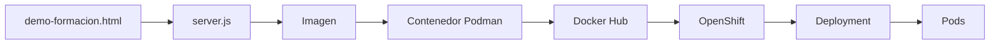
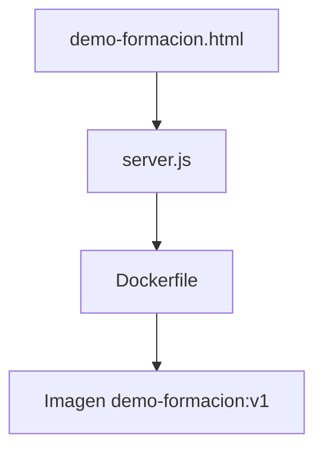
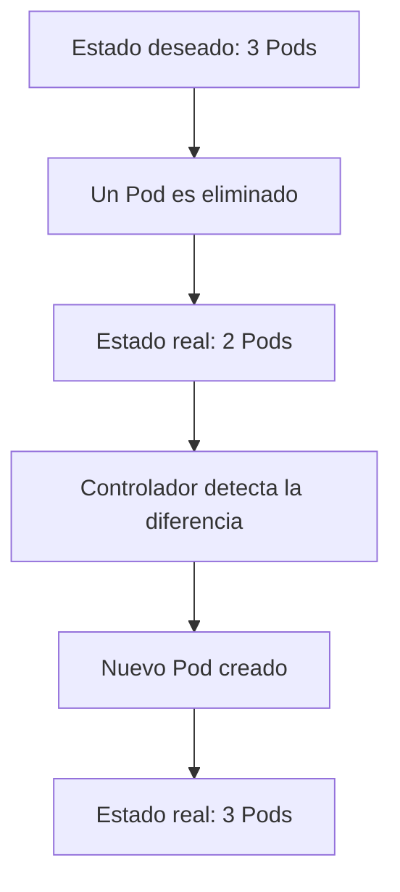

# 1.8 Práctica: de la imagen al clúster y comprobación de la reconciliación de Kubernetes

## Objetivos de aprendizaje

Al finalizar este apartado serás capaz de:

- Comprender el recorrido completo desde una aplicación hasta su ejecución en OpenShift.
- Relacionar los conceptos de imagen, contenedor, Pod y Deployment.
- Entender cómo una imagen construida localmente puede desplegarse en un clúster.
- Observar el funcionamiento práctico del estado deseado de Kubernetes.
- Comprobar cómo actúa el bucle de reconciliación cuando desaparece un Pod.
- Verificar que Kubernetes mantiene automáticamente el número de réplicas solicitado.

---

## Introducción

Durante esta primera sesión hemos estudiado distintos conceptos de forma independiente:

- Imágenes.
- Contenedores.
- Pods.
- Deployments.
- Estado deseado.
- Reconciliación.

Es momento de unir todas las piezas.

En esta práctica construiremos una imagen, la ejecutaremos localmente con Podman, la publicaremos en Docker Hub y finalmente la desplegaremos en OpenShift.



!!! note "Objetivo de esta práctica"

    El objetivo no es aprender Node.js ni desarrollo de aplicaciones.

    La aplicación utilizada es deliberadamente sencilla para centrar la atención en los conceptos fundamentales de contenedores, Kubernetes y OpenShift.

---

## Aplicación de ejemplo

### demo-formacion.html

```html
<!DOCTYPE html>
<html lang="es">
<head>
    <meta charset="UTF-8">
    <title>Curso OpenShift</title>
</head>
<body>
    <h1>Curso OpenShift</h1>

    <h2>Mi primera aplicación desplegada en OpenShift</h2>

    <p><strong>Versión v1</strong></p>

    <p>
        La misma imagen funciona en Podman y en OpenShift.
    </p>
</body>
</html>
```

### server.js

```javascript
const http = require('http');
const fs = require('fs');

const port = process.env.PORT || 8080;

http.createServer((req, res) => {
    res.writeHead(200, {
        'Content-Type': 'text/html; charset=utf-8'
    });

    const content = fs.readFileSync('index.html', 'utf8');
    res.end(content);
}).listen(port);

console.log(`Servidor escuchando en puerto ${port}`);
```

La aplicación escucha en el puerto 8080 y devuelve el contenido del fichero HTML.

---

## Construcción de la imagen

### Dockerfile

```dockerfile
FROM registry.access.redhat.com/ubi9/nodejs-20

WORKDIR /opt/app-root/src

COPY server.js .
COPY demo-formacion.html index.html

EXPOSE 8080

CMD ["node", "server.js"]
```

### ¿Qué hace cada línea?

- `FROM`: utiliza una imagen base UBI con Node.js.
- `WORKDIR`: establece el directorio de trabajo.
- `COPY server.js .`: copia la aplicación.
- `COPY demo-formacion.html index.html`: copia la página web y la renombra como `index.html`.
- `EXPOSE`: documenta el puerto utilizado.
- `CMD`: define el proceso principal del contenedor.



---

## Demostración: construcción y ejecución local con Podman

### Construcción

```bash
podman build -t demo-formacion:v1 .
```

### Ejecución local

```bash
podman run -d --name demo-formacion -p 8080:8080 demo-formacion:v1
```

Verificar:

```bash
podman ps
```

Consultar registros:

```bash
podman logs demo-formacion
```

Resultado esperado:

```text
Servidor escuchando en puerto 8080
```

Acceder desde un navegador:

```text
http://localhost:8080
```

!!! tip "Imagen y contenedor"

    La imagen es una plantilla.

    El contenedor es una instancia en ejecución creada a partir de esa imagen.

---

## Publicación en Docker Hub

```bash
podman tag demo-formacion:v1 docker.io/ieftraining/demo-formacion:v1
```

```bash
podman push docker.io/ieftraining/demo-formacion:v1
```

!!! warning "Una sola imagen"

    La misma imagen utilizada en Podman será utilizada posteriormente en OpenShift.

    No se reconstruye ni se modifica entre entornos.

---

## Despliegue en OpenShift

```bash
oc new-app docker.io/ieftraining/demo-formacion:v1
```

```bash
oc get all
```

Crear una Route:

```bash
oc expose service demo-formacion
```

```bash
oc get route
```

---

## Comprobación del estado

```bash
oc get pods
```

```bash
oc get deployments
```

Verificar estado `Running`.

---

# El experimento importante: comprobar la reconciliación

## Paso 1. Verificar las réplicas actuales

```bash
oc get deployment demo-formacion
```

## Paso 2. Escalar la aplicación

```bash
oc scale deployment/demo-formacion --replicas=3
```

```bash
oc get pods
```

## Paso 3. Eliminar un Pod

```bash
oc delete pod <nombre-del-pod>
```

## Paso 4. Observar la recuperación automática

```bash
oc get pods
```



---

## Ideas clave para recordar

- La misma imagen puede ejecutarse en Podman y en OpenShift.
- Una imagen se construye una sola vez y puede desplegarse en distintos entornos.
- Un Deployment define el estado deseado de la aplicación.
- Kubernetes mantiene automáticamente el número de réplicas solicitado.
- Los Pods son recursos efímeros.
- El bucle de reconciliación es uno de los mecanismos fundamentales de Kubernetes.
