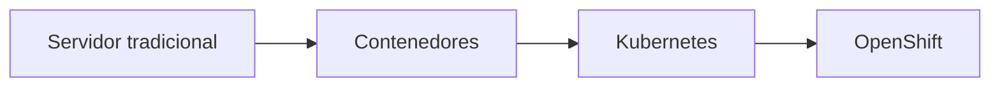
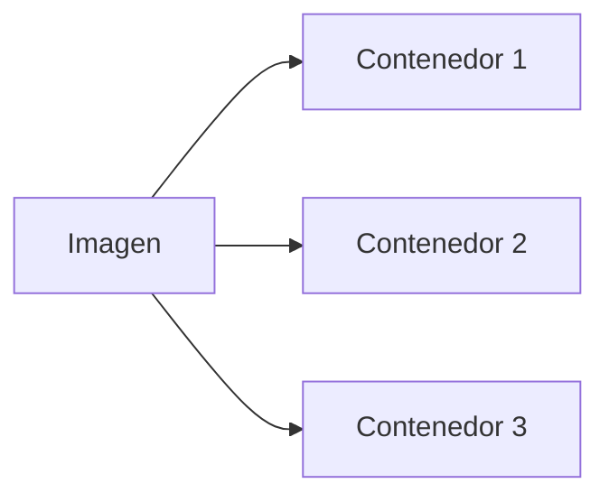
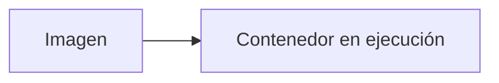
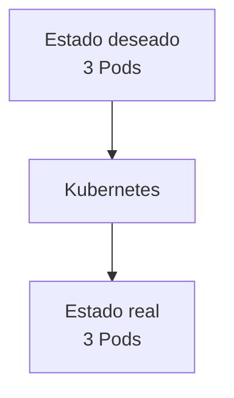
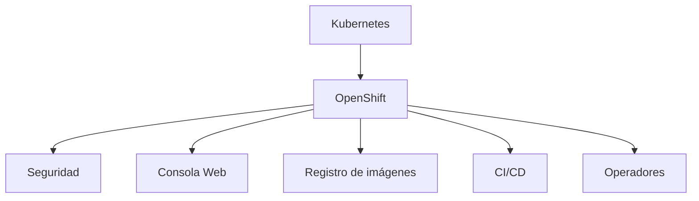
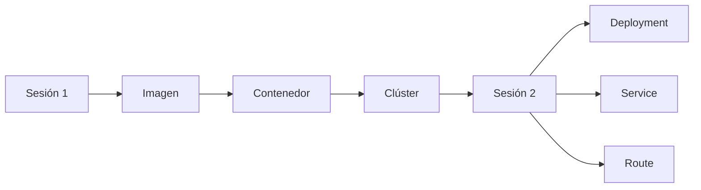
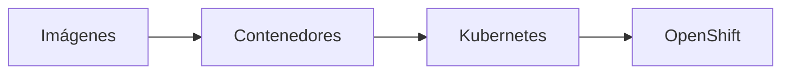

# 1.9 Cierre y qué veremos mañana

## Resumen de la sesión

A lo largo de esta primera jornada hemos construido los conceptos fundamentales necesarios para comprender OpenShift y Kubernetes. citeturn63search5

Hemos recorrido el camino completo desde la infraestructura tradicional hasta las plataformas cloud-native:

Durante la sesión hemos estudiado:

- Imágenes.
- Imágenes base.
- Contenedores.
- Dockerfile.
- Registros de imágenes.
- Construcción y ejecución de contenedores.
- Kubernetes.
- OpenShift.
- Arquitectura del clúster.
- Consola web.
- Cliente `oc`.
- Reconciliación continua.

También hemos conocido los principales componentes de un clúster OpenShift: citeturn63search5

- Control Plane.
- Workers.
- Infra.
- API Server.
- Operadores.
- Servicios internos.

!!! tip "Lo más importante"

    OpenShift se apoya en Kubernetes, y Kubernetes se apoya en el concepto de estado deseado y reconciliación continua.

## Preguntas que ya deberíamos saber responder

- ¿Qué es un contenedor?
- ¿Qué diferencia existe entre una imagen y un contenedor?
- ¿Cómo se construye una imagen?
- ¿Qué papel desempeña un Dockerfile?
- ¿Por qué Kubernetes necesita reconciliación continua?
- ¿Qué función tienen los distintos tipos de nodos dentro del clúster?

## Ideas clave para recordar

### Una imagen es una plantilla

La imagen contiene todo lo necesario para ejecutar una aplicación: citeturn63search5

- Código.
- Librerías.
- Dependencias.
- Configuración básica.

!!! note "Para recordar"

    La imagen no ejecuta nada por sí sola. Es una plantilla reutilizable.

### Un contenedor es una instancia en ejecución

Cuando arrancamos una imagen obtenemos un contenedor. citeturn63search5

### Kubernetes trabaja declarativamente

No describimos paso a paso cómo ejecutar una aplicación.

Indicamos el resultado esperado y Kubernetes se encarga de mantenerlo. citeturn63search5

### OpenShift es mucho más que Kubernetes

OpenShift añade capacidades adicionales orientadas a entornos empresariales. citeturn63search5

## Qué veremos mañana

En la siguiente sesión comenzaremos a trabajar con los recursos que se utilizan diariamente para desplegar aplicaciones en OpenShift. citeturn63search5

### Proyectos y espacios de trabajo

Aprenderemos cómo OpenShift organiza recursos y equipos mediante Projects (Namespaces). citeturn63search5

### Aplicaciones y carga de trabajo

Trabajaremos con:

- Pods.
- ReplicaSets.
- Deployments.

Y entenderemos la relación entre ellos. citeturn63search5

### Exposición de servicios

Estudiaremos:

- Services.
- Routes.
- Acceso interno.
- Acceso externo.

### Escalado y alta disponibilidad

Veremos cómo Kubernetes mantiene aplicaciones disponibles incluso ante incidencias. citeturn63search5

### Primeros despliegues reales

Comenzaremos a desplegar aplicaciones utilizando:

- Consola web.
- Cliente `oc`.

## Objetivo de la próxima sesión

!!! tip "Transición al mundo real"

    Si hoy hemos aprendido cómo funciona la plataforma, mañana aprenderemos a utilizarla para desplegar aplicaciones reales.

## Conclusión

La plataforma OpenShift puede parecer compleja inicialmente, pero realmente se apoya en un conjunto reducido de conceptos fundamentales. citeturn63search5

Comprender correctamente estos conceptos constituye la base sobre la que construiremos el resto del curso. citeturn63search5
