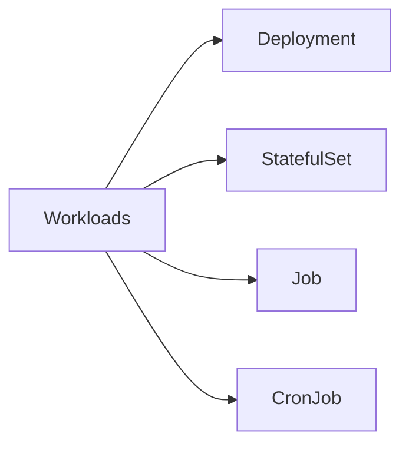
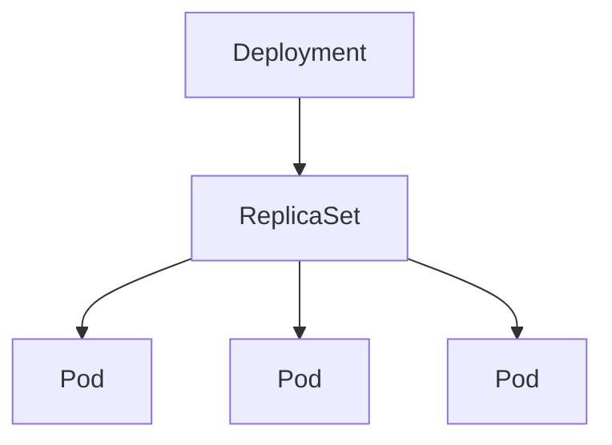
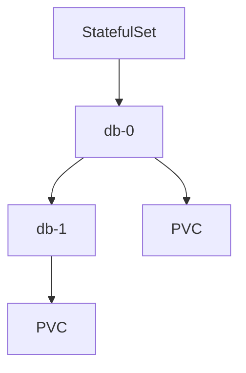
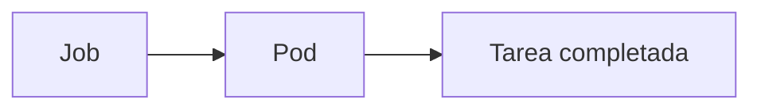
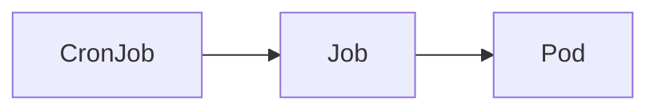
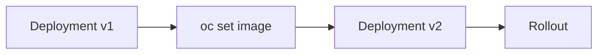
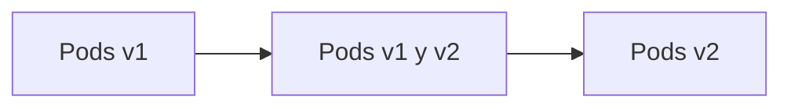
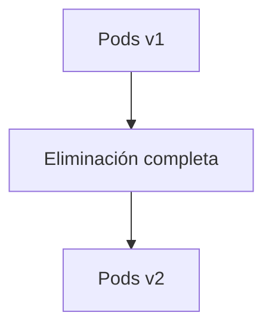
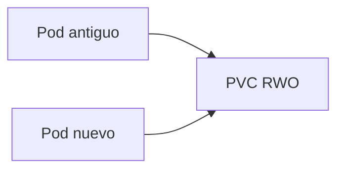
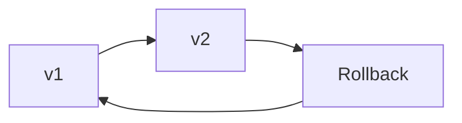

# 2.1 Cargas de trabajo: Deployment, StatefulSet, Job y CronJob

## Objetivos de aprendizaje

Al finalizar este apartado serás capaz de:

- Comprender qué es una carga de trabajo en Kubernetes y OpenShift.
- Identificar cuándo utilizar Deployment, StatefulSet, Job o CronJob.
- Entender las diferencias entre las estrategias RollingUpdate y Recreate.
- Comprender por qué determinadas aplicaciones con almacenamiento persistente suelen requerir una estrategia Recreate.
- Supervisar el estado de una actualización mediante `oc rollout status`.
- Consultar el historial de revisiones de un Deployment.
- Deshacer una actualización utilizando `oc rollout undo`.
- Conocer cómo se controla la retención de revisiones anteriores.

---

## ¿Qué es una carga de trabajo?

En los apartados anteriores hemos visto cómo OpenShift ejecuta aplicaciones mediante Pods. Sin embargo, en entornos reales rara vez trabajaremos creando Pods directamente.

Un Pod es una unidad de ejecución relativamente efímera. Si se elimina o falla, necesitaremos algún mecanismo que garantice su recuperación automática.

Para resolver este problema, Kubernetes proporciona distintos recursos denominados **cargas de trabajo** (*Workloads*), cuya función es crear, gestionar y supervisar Pods.



Cada tipo de carga de trabajo está pensado para un escenario diferente.

!!! tip "Idea clave"

    En Kubernetes normalmente no gestionamos Pods directamente. Gestionamos recursos que crean y mantienen Pods por nosotros.

---

## Del despliegue de una aplicación al Deployment

En la sesión anterior desplegamos nuestra primera aplicación en OpenShift.

Aunque el proceso de despliegue resultó sencillo, internamente OpenShift creó diversos recursos Kubernetes para ejecutar y mantener la aplicación.

Podemos comprobarlo mediante:

```bash
oc get deployment
```

Resultado esperado:

```text
NAME              READY   UP-TO-DATE   AVAILABLE   AGE
demo-formacion    1/1     1            1           5m
```

Entre los recursos creados encontraremos un **Deployment**, que será la carga de trabajo principal utilizada a lo largo del curso.

!!! note

    Muchas herramientas y asistentes de OpenShift generan Deployments automáticamente. Sin embargo, comprender su funcionamiento resulta esencial para administrar aplicaciones en entornos reales.

---

## Deployment: la carga de trabajo más utilizada

El recurso más habitual en OpenShift es **Deployment**.

Un Deployment permite definir cómo debe ejecutarse una aplicación y garantiza que exista siempre el número de réplicas configurado.

Entre otras funciones, un Deployment permite:

- Crear Pods automáticamente.
- Recuperar Pods que fallen.
- Escalar aplicaciones.
- Actualizar versiones.
- Realizar rollback a versiones anteriores.



La aplicación que desplegamos en la sesión anterior es un ejemplo típico de uso de Deployment.

A lo largo del curso, la mayoría de las aplicaciones que desplegaremos utilizarán este tipo de recurso, ya que proporciona los mecanismos necesarios para gestionar su ciclo de vida completo: despliegue, escalado, actualización y recuperación ante fallos.

Por este motivo, Deployment es la carga de trabajo más utilizada en OpenShift.

---

### Un primer manifiesto Deployment

Aunque OpenShift puede generar Deployments automáticamente, también es habitual definirlos mediante manifiestos YAML.

El siguiente ejemplo muestra un Deployment simplificado para nuestra aplicación de demostración:

```yaml
apiVersion: apps/v1
kind: Deployment
metadata:
  name: demo-formacion-yaml

spec:
  replicas: 1

  selector:
    matchLabels:
      app: demo-formacion-yaml

  template:
    metadata:
      labels:
        app: demo-formacion-yaml

    spec:
      containers:
      - name: demo-formacion
        image: docker.io/ieftraining/demo-formacion:v1

        ports:
        - containerPort: 8080
```

Por ahora basta con identificar algunos elementos importantes:

- `replicas`: número de Pods que deben mantenerse en ejecución.
- `image`: imagen utilizada para crear los Pods.
- `containerPort`: puerto expuesto por la aplicación.

!!! note

    Los Deployments generados automáticamente por OpenShift pueden incluir configuraciones adicionales, como ImageStreams o triggers de imagen. Para facilitar el aprendizaje utilizaremos inicialmente una definición simplificada.

---

### Desplegar el manifiesto

A continuación desplegaremos una segunda copia de la aplicación, gestionada completamente mediante manifiestos Kubernetes.

La forma concreta dependerá del entorno disponible.

Si trabajamos con manifiestos YAML, podremos aplicar el recurso mediante:

```bash
oc apply -f deployment.yaml
```

También es posible crear o importar el manifiesto directamente desde la consola web de OpenShift.

En ambos casos el resultado será el mismo: OpenShift creará un nuevo Deployment a partir de la definición proporcionada.

Comprobamos que el Deployment se ha creado correctamente:

```bash
oc get deployment
```

Resultado esperado:

```text
NAME                   READY   UP-TO-DATE   AVAILABLE
demo-formacion         1/1     1            1
demo-formacion-yaml    1/1     1            1
```

También podemos verificar la creación del Pod:

```bash
oc get pods
```

Ejemplo:

```text
demo-formacion-yaml-xxxxx-yyyyy   1/1   Running
```

El estado esperado es:

```text
Running
```

!!! note

    En este punto nos centraremos únicamente en la creación y ejecución del Pod. Más adelante estudiaremos cómo exponer la aplicación mediante Services y Routes para acceder a ella desde el exterior del clúster.

---

## StatefulSet: aplicaciones con estado

Algunas aplicaciones requieren algo más que simplemente ejecutar Pods.

Las bases de datos, por ejemplo, necesitan conservar información y mantener una identidad estable para cada instancia.

Para estos escenarios existe **StatefulSet**.

Sus características principales son:

- Identidad persistente para cada Pod.
- Nombres estables.
- Almacenamiento asociado a cada instancia.
- Arranque y parada ordenados.



Los StatefulSet suelen utilizarse para:

- PostgreSQL
- MySQL
- MongoDB
- Redis persistente

!!! note

    Una aplicación web convencional normalmente utilizará Deployment y no StatefulSet.

---

## Job y CronJob

No todas las tareas deben ejecutarse permanentemente.

Kubernetes proporciona recursos específicos para tareas temporales o planificadas.

### Job

Un Job ejecuta una tarea y finaliza cuando ésta termina correctamente.

Ejemplos habituales:

- Migraciones de bases de datos.
- Scripts administrativos.
- Procesos de importación.
- Generación de informes.



### CronJob

Un CronJob permite ejecutar Jobs de forma programada.

Su funcionamiento es equivalente al clásico servicio `cron` presente en sistemas Linux.

Ejemplos:

- Copias de seguridad nocturnas.
- Limpieza de registros.
- Sincronizaciones periódicas.
- Informes diarios.



---

## Actualización de aplicaciones

Supongamos ahora que hemos publicado una nueva versión de nuestra aplicación con la etiqueta `v2`.

Conceptualmente, la actualización consiste en sustituir la imagen utilizada por el Deployment.

Versión original:

```yaml
image: docker.io/ieftraining/demo-formacion:v1
```

Nueva versión:

```yaml
image: docker.io/ieftraining/demo-formacion:v2
```

### Aplicar los cambios al Deployment

Existen varias formas de actualizar un Deployment existente.

Si trabajamos con manifiestos YAML, podremos actualizar el recurso mediante:

```bash
oc apply -f deployment.yaml
```

También es posible editar el Deployment desde la consola web de OpenShift.

Sin embargo, para comprender mejor el proceso de actualización utilizaremos inicialmente un comando más directo:

```bash
oc set image deployment/demo-formacion-yaml \
  demo-formacion=docker.io/ieftraining/demo-formacion:v2
```

Este comando actualiza la imagen utilizada por el contenedor sin necesidad de modificar el manifiesto.

Podemos comprobar el cambio mediante:

```bash
oc describe deployment demo-formacion-yaml
```

o bien:

```bash
oc get deployment demo-formacion-yaml -o yaml
```

En todos los casos OpenShift detectará el cambio e iniciará un nuevo proceso de actualización.



!!! note

    Tanto una modificación realizada mediante consola web, mediante `oc set image` o mediante `oc apply` terminan produciendo el mismo resultado: una nueva revisión del Deployment y el inicio de un rollout.

Cuando OpenShift detecta este cambio, Kubernetes inicia automáticamente un proceso denominado **rollout**.

---

### RollingUpdate

RollingUpdate es la estrategia predeterminada de los Deployments.



Ventajas:

- Minimiza interrupciones.
- Permite actualizaciones graduales.
- Reduce el impacto sobre los usuarios.

---

### Recreate

La estrategia Recreate elimina primero la versión existente y posteriormente crea la nueva.



Esta estrategia provoca una interrupción temporal del servicio, pero evita que ambas versiones convivan simultáneamente.

---

## ¿Por qué un PVC RWO suele requerir Recreate?

Un volumen con modo de acceso:

```text
ReadWriteOnce (RWO)
```

solo puede ser utilizado en lectura y escritura por una única instancia.

Con RollingUpdate pueden coexistir temporalmente:

- El Pod antiguo.
- El Pod nuevo.



Esto puede provocar conflictos de acceso al almacenamiento.

Por este motivo suele utilizarse:

```yaml
strategy:
  type: Recreate
```

!!! warning "Aplicaciones con almacenamiento persistente"

    Cuando una aplicación comparte un único PVC RWO, Recreate suele ser la estrategia más segura.

---

## Supervisar un despliegue

```bash
oc rollout status deployment/demo-formacion-yaml
```

Ejemplo:

```text
deployment "demo-formacion-yaml" successfully rolled out
```

Este comando permite comprobar el progreso de una actualización.

---

## Historial de revisiones

```bash
oc rollout history deployment/demo-formacion-yaml
```

Ejemplo:

```text
REVISION  CHANGE-CAUSE
1         <none>
2         <none>
```

Cada revisión representa un estado anterior del Deployment.

---

## Deshacer una actualización

Si una nueva versión presenta problemas, Kubernetes permite volver rápidamente a una revisión anterior.

```bash
oc rollout undo deployment/demo-formacion-yaml
```

También es posible volver explícitamente a una revisión concreta:

```bash
oc rollout undo deployment/demo-formacion-yaml \
  --to-revision=1
```



Tras ejecutar el rollback:

```bash
oc rollout status deployment/demo-formacion-yaml
```

---

## ¿Cuántas revisiones conservar?

Los Deployments conservan información sobre revisiones anteriores para permitir operaciones de rollback.

```yaml
revisionHistoryLimit: 10
```

Por ejemplo:

```yaml
spec:
  revisionHistoryLimit: 10
```

Cuando se supera este límite, Kubernetes elimina automáticamente las revisiones más antiguas.

En la mayoría de entornos, conservar diez revisiones suele ser una configuración razonable.

---

## Ideas clave para recordar

!!! tip "Resumen"

    - Las cargas de trabajo crean y gestionan Pods.
    - Deployment es la carga de trabajo más utilizada en OpenShift.
    - Un Deployment puede definirse mediante manifiestos YAML.
    - StatefulSet se utiliza para aplicaciones con estado.
    - Job ejecuta tareas puntuales.
    - CronJob ejecuta tareas programadas.
    - RollingUpdate es la estrategia de actualización predeterminada.
    - Recreate suele emplearse con PVC RWO.
    - `oc rollout status` permite supervisar una actualización.
    - `oc rollout history` permite consultar revisiones anteriores.
    - `oc rollout undo` permite volver rápidamente a una versión estable.
    - `revisionHistoryLimit` controla cuántas revisiones conserva Kubernetes.
