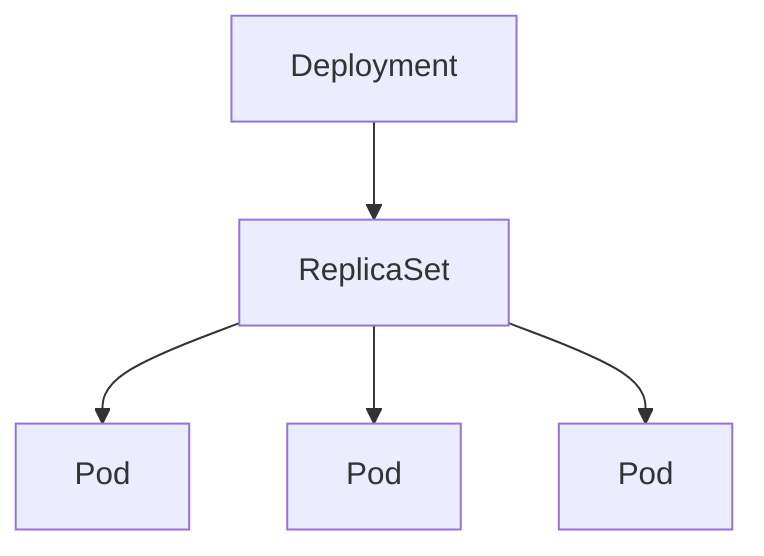
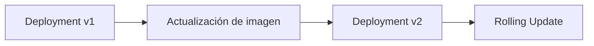
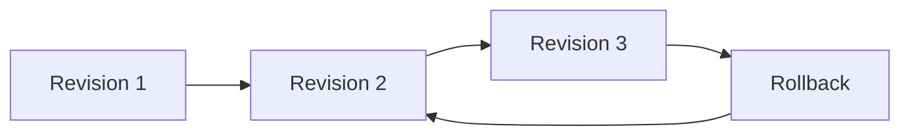

# 2.1 Cargas de trabajo

## Objetivos de aprendizaje

Al finalizar este apartado serás capaz de:

- Comprender qué es una carga de trabajo en Kubernetes y OpenShift.
- Identificar cuándo utilizar Deployment, StatefulSet, Job o CronJob.
- Entender las diferencias entre RollingUpdate y Recreate.
- Supervisar y gestionar actualizaciones de aplicaciones.
- Consultar el historial de revisiones y realizar rollbacks.

!!! note "Aplicación utilizada durante la sesión"

    Durante esta práctica utilizaremos la aplicación demo-formacion.

    - v1: despliegue inicial.
    - v2: actualización y rollback.
    - v3: utilizada posteriormente para demostrar probes, recursos y operación de aplicaciones.

## ¿Qué es una carga de trabajo?

Las cargas de trabajo (Workloads) son los recursos de Kubernetes encargados de crear, mantener y gestionar Pods.

En lugar de crear Pods manualmente, normalmente trabajaremos con recursos de nivel superior como Deployment, StatefulSet, Job o CronJob.

## Deployment

Deployment es la carga de trabajo más utilizada en OpenShift.

Permite:

- Crear Pods automáticamente.
- Mantener el número deseado de réplicas.
- Actualizar versiones de una aplicación.
- Escalar horizontalmente.
- Realizar rollbacks.

!!! tip "Deployment: recurso principal"

    La mayoría de aplicaciones modernas desplegadas en OpenShift utilizan Deployment como carga de trabajo principal.

### Arquitectura interna



### Manifiesto inicial

```yaml
apiVersion: apps/v1
kind: Deployment
metadata:
  name: demo-formacion-yaml
spec:
  replicas: 1
  selector:
    matchLabels:
      app: demo-formacion-yaml
  template:
    metadata:
      labels:
        app: demo-formacion-yaml
    spec:
      containers:
      - name: demo-formacion
        image: docker.io/ieftraining/demo-formacion:v1
        imagePullPolicy: Always
        ports:
        - containerPort: 8080
```

### Creando el Deployment

#### Opción 1: mediante YAML

```bash
oc apply -f deployment.yaml
```

#### Opción 2: desde línea de comandos

```bash
oc create deployment demo-formacion-yaml   --image=docker.io/ieftraining/demo-formacion:v1
```

```bash
oc set port deployment/demo-formacion-yaml   --container-port=8080
```

#### Opción 3: desde la consola web

1. Acceder a **Developer**.
2. Seleccionar **Add**.
3. Elegir **Container Image**.
4. Introducir la imagen.
5. Crear el Deployment.

### Verificando el despliegue

```bash
oc get deployment
oc get pods
```

## Actualización de aplicaciones

Versión actual:

```yaml
image: docker.io/ieftraining/demo-formacion:v1
```

Nueva versión:

```yaml
image: docker.io/ieftraining/demo-formacion:v2
```

### Registrando la causa del cambio

```bash
oc annotate deployment/demo-formacion-yaml   kubernetes.io/change-cause="Actualizacion a v2. Nueva version de la aplicacion para demostracion de rollouts y rollbacks."   --overwrite
```

### Actualizando la imagen

#### Opción 1: mediante YAML

Modificar:

```yaml
image: docker.io/ieftraining/demo-formacion:v2
```

Aplicar:

```bash
oc apply -f deployment.yaml
```

#### Opción 2: desde línea de comandos

```bash
oc set image deployment/demo-formacion-yaml   demo-formacion=docker.io/ieftraining/demo-formacion:v2
```

#### Opción 3: desde la consola web

1. Abrir el Deployment.
2. Actions → Edit Deployment.
3. Modificar la imagen.
4. Guardar cambios.

### ¿Qué ocurre internamente?



### Verificando la actualización

```bash
oc rollout status deployment/demo-formacion-yaml
```

## Estrategias de despliegue

### RollingUpdate

Es la estrategia predeterminada.

!!! tip "Estrategia predeterminada"

    RollingUpdate sustituye Pods de forma gradual minimizando el impacto sobre los usuarios.

### Recreate

```yaml
strategy:
  type: Recreate
```

!!! warning "Posible interrupción del servicio"

    Recreate elimina primero los Pods antiguos antes de crear los nuevos.

### ¿Por qué un PVC RWO suele requerir Recreate?

Cuando una aplicación utiliza un volumen ReadWriteOnce, normalmente un único Pod puede montarlo simultáneamente.

Por este motivo muchas aplicaciones con almacenamiento persistente utilizan la estrategia Recreate.

## StatefulSet

Los StatefulSet están diseñados para aplicaciones con estado.

### ¿Cuándo utilizar StatefulSet?

Son adecuados cuando se necesita:

- Identidad estable.
- Almacenamiento persistente.
- Arranque ordenado.
- Parada ordenada.

Ejemplos:

- PostgreSQL
- MySQL
- MongoDB
- Elasticsearch
- RabbitMQ

!!! note "Aplicaciones con estado"

    Bases de datos y sistemas de mensajería suelen desplegarse mediante StatefulSet.

## Job

Un Job ejecuta una tarea puntual y finaliza cuando ésta termina correctamente.

```yaml
apiVersion: batch/v1
kind: Job
metadata:
  name: ejemplo-job
spec:
  template:
    spec:
      containers:
      - name: tarea
        image: busybox
        command: ["echo","Hola OpenShift"]
      restartPolicy: Never
```

Casos de uso:

- Migraciones.
- ETL.
- Generación de informes.
- Automatizaciones.

## CronJob

Un CronJob ejecuta Jobs de forma programada.

```yaml
apiVersion: batch/v1
kind: CronJob
metadata:
  name: ejemplo-cronjob
spec:
  schedule: "*/5 * * * *"
  jobTemplate:
    spec:
      template:
        spec:
          containers:
          - name: tarea
            image: busybox
            command: ["date"]
          restartPolicy: Never
```

Casos de uso:

- Backups.
- Limpieza de logs.
- Informes periódicos.
- Sincronizaciones programadas.

## Comandos de operación habituales

```bash
oc get deployment
oc get rs
oc get pods
oc describe deployment demo-formacion-yaml
oc rollout status deployment/demo-formacion-yaml
oc rollout history deployment/demo-formacion-yaml
```

## Historial de revisiones

```bash
oc rollout history deployment/demo-formacion-yaml
```

Resultado de ejemplo:

```text
REVISION  CHANGE-CAUSE
1  Despliegue inicial de la aplicación v1
2  Actualizacion a v2. Nueva version de la aplicacion para demostracion de rollouts y rollbacks.
3  Actualizacion a v3. Incorpora endpoints /version, /live y /ready para demostracion de probes.
```

## Rollback



Ejecutar rollback:

```bash
oc rollout undo deployment/demo-formacion-yaml
```

!!! note

    Un rollback restaura la configuración almacenada en la revisión seleccionada.

## Conservación del historial

```yaml
spec:
  revisionHistoryLimit: 10
```

## Resumen

- Deployment es la carga de trabajo principal.
- StatefulSet está orientado a aplicaciones con estado.
- Job ejecuta tareas puntuales.
- CronJob ejecuta tareas programadas.
- Los rollouts permiten actualizar aplicaciones.
- Los rollbacks permiten volver a una revisión estable.
