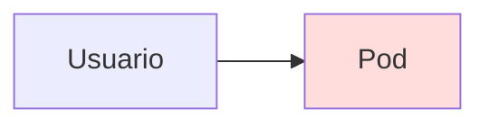
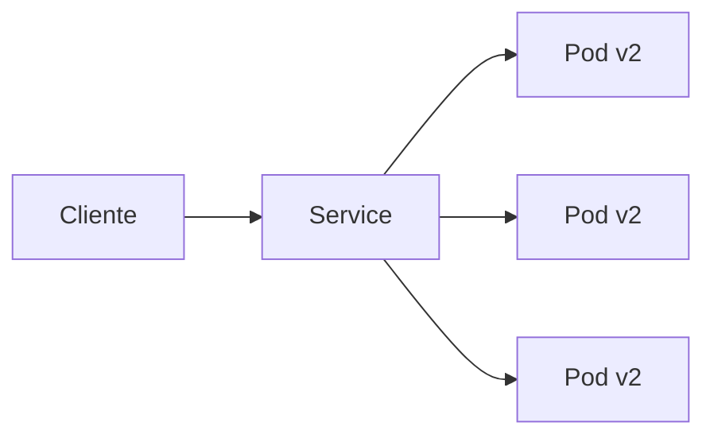
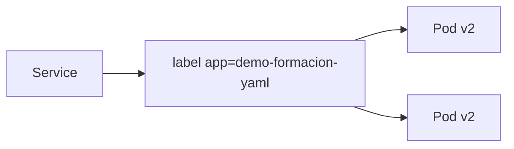
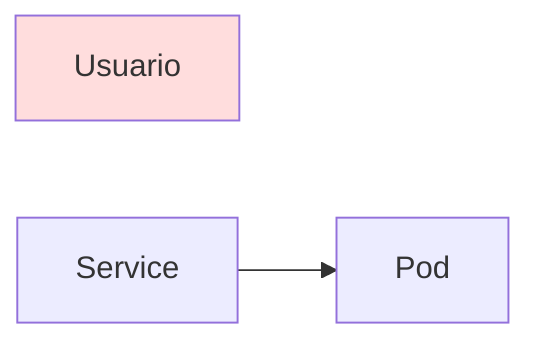
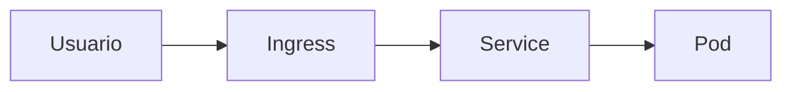
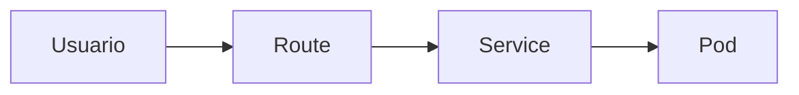
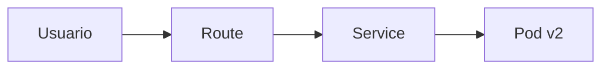
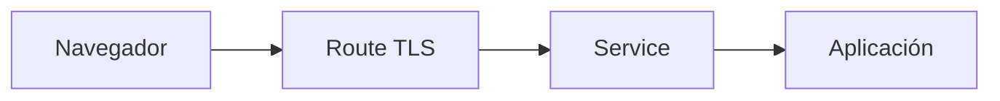
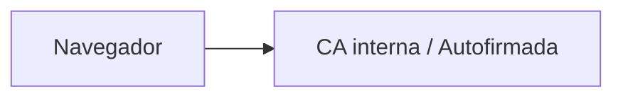

# 2.2 Exponer aplicaciones: Service y Route

## Objetivos de aprendizaje

Al finalizar este apartado serás capaz de:

- Comprender por qué un Pod no debe exponerse directamente a los usuarios.
- Entender la función de un Service dentro de Kubernetes.
- Comprender la diferencia entre Service y Route.
- Entender la diferencia entre Route e Ingress.
- Conocer las terminaciones TLS más habituales.
- Identificar por qué un navegador puede mostrar advertencias relacionadas con certificados.
- Publicar una aplicación mediante un Service y una Route.
- Acceder a una aplicación desde una URL externa.

---

## Del Pod al usuario

En el apartado anterior desplegamos nuestra aplicación y demostramos el flujo de actualización hacia la versión `v2`.

Podemos comprobar que la nueva revisión de la aplicación se encuentra en ejecución:

```bash
oc get pods
```

Ejemplo de resultado esperado:

```text
NAME                         READY   STATUS
demo-formacion-yaml-xxxxx    1/1     Running
```

Sin embargo, aunque la aplicación esté funcionando correctamente con la versión actualizada, todavía existe un problema importante:

**Los usuarios no tienen forma de acceder a ella desde fuera del clúster.**

Además, los Pods son recursos efímeros. Si un Pod falla o si actualizamos la imagen del Deployment a una nueva versión, Kubernetes eliminará los Pods antiguos y creará otros nuevos con direcciones IP internas totalmente diferentes.



Si el acceso dependiera directamente de la IP de un Pod concreto, cualquier actualización o sustitución rompería la conectividad de los usuarios.

Por este motivo, Kubernetes introduce una capa intermedia denominada **Service**.

---

## Service: un punto de acceso estable

Un Service proporciona un mecanismo estable para acceder a una aplicación independientemente de las actualizaciones de imagen o del número de Pods concretos que la estén ejecutando en cada momento.

En lugar de conectarse directamente a un Pod, los clientes se conectan al Service.



De esta forma:

- Los Pods pueden actualizarse de versión o recrearse automáticamente.
- Las direcciones IP internas de los Pods pueden cambiar.
- El Service mantiene un punto de acceso y un nombre DNS estables dentro del clúster.

!!! tip "Idea clave"

    Un Service no ejecuta aplicaciones.

    Su función consiste en localizar los Pods que forman parte de una aplicación (independientemente de su versión) y dirigir las peticiones hacia ellos.

---

### ¿Cómo sabe el Service a qué Pods enviar el tráfico?

La asociación se realiza mediante etiquetas (*labels*) y selectores (*selectors*).

En el manifiesto del Deployment definimos la etiqueta:

```yaml
labels:
  app: demo-formacion-yaml
```

El Service utilizará un selector con el mismo valor:

```yaml
selector:
  app: demo-formacion-yaml
```

Gracias a esta coincidencia de etiquetas, aunque actualicemos la versión de la imagen en el Deployment (de `v1` a `v2` o posteriores), los nuevos Pods mantendrán la misma etiqueta y el Service continuará redirigiendo el tráfico hacia ellos automáticamente.



!!! note

    Si el selector del Service no coincide exactamente con las etiquetas definidas en la plantilla del Pod dentro del Deployment, el Service existirá, pero no tendrá ningún destino al que enviar las peticiones.

---

## Crear el Service para la aplicación

Nuestra aplicación de formación escucha internamente en el puerto `8080`.

Podemos crear un Service que exponga la aplicación dentro del clúster mediante el siguiente manifiesto YAML:

```yaml
apiVersion: v1
kind: Service
metadata:
  name: demo-formacion-yaml
spec:
  selector:
    app: demo-formacion-yaml
  ports:
    - protocol: TCP
      port: 80
      targetPort: 8080
```

Observa tres elementos importantes:

- `selector`: identifica los Pods asociados al Service mediante sus etiquetas.
- `port`: puerto expuesto internamente por el Service (puerto 80).
- `targetPort`: puerto real en el que escucha el contenedor dentro del Pod (puerto 8080).

### Desplegando el Service

#### Opción 1: mediante YAML

Si disponemos del archivo manifiesto:

```bash
oc apply -f service.yaml
```

#### Opción 2: desde línea de comandos

También es posible exponer el Deployment directamente generando un Service automático:

```bash
oc expose deployment/demo-formacion-yaml --port=80 --target-port=8080
```

#### Opción 3: desde la consola web

- Abrir el apartado **Networking → Services**.
- Seleccionar **Create Service**.
- Pegar o configurar el manifiesto YAML y guardar los cambios.

#### Comprobando el estado del Service

Podemos verificar la creación del punto de acceso estable con:

```bash
oc get svc
```

Resultado esperado:

```text
NAME                   TYPE        CLUSTER-IP    EXTERNAL-IP   PORT(S)   AGE
demo-formacion-yaml    ClusterIP   172.30.x.x    <none>        80/TCP    1m
```

La aplicación ya dispone de una IP virtual interna y un punto de acceso estable dentro del clúster.

!!! note

    Kubernetes dispone de distintos tipos de Service para distintos escenarios. En OpenShift el flujo estándar para publicar aplicaciones HTTP/HTTPS hacia el exterior se basa en la combinación **Service + Route**.

---

## El problema del acceso externo

Aunque ya disponemos de un Service, la aplicación sigue siendo accesible únicamente dentro de la red interna del clúster de OpenShift.

Necesitamos un mecanismo que permita publicar la aplicación para que los usuarios puedan consumirla desde un navegador web externo.



Aquí es donde entra en juego la **Route**.

---

## Route frente a Ingress

En Kubernetes estándar existe un recurso denominado **Ingress** cuya función es publicar aplicaciones HTTP y HTTPS hacia el exterior.



OpenShift incorpora una funcionalidad equivalente y más avanzada denominada **Route**.



Ambos recursos persiguen el mismo objetivo: **permitir que una aplicación sea accesible desde fuera del clúster.**

La principal diferencia es que:

- **Ingress** forma parte del API estándar de Kubernetes.
- **Route** es un recurso nativo e integrado de OpenShift que incluye gestión simplificada de dominios DNS y TLS.

!!! tip "¿Qué utilizaremos en el curso?"

    Trabajaremos con Routes por ser la herramienta nativa de OpenShift para la publicación de aplicaciones web.

---

## Crear una Route

Una Route siempre apunta a un Service (el cual a su vez dirige el tráfico a los Pods). No se conecta nunca directamente con los Pods.

Podemos definir la Route mediante un manifiesto YAML:

```yaml
apiVersion: route.openshift.io/v1
kind: Route
metadata:
  name: demo-formacion-yaml
spec:
  to:
    kind: Service
    name: demo-formacion-yaml
```

### Desplegando la Route

#### Opción 1: mediante YAML

```bash
oc apply -f route.yaml
```

#### Opción 2: desde línea de comandos

Podemos crear la Route rápidamente a partir del Service existente:

```bash
oc expose service/demo-formacion-yaml
```

#### Opción 3: desde la consola web

- Abrir el Service `demo-formacion-yaml`.
- En la esquina superior seleccionar **Actions → Create Route**.
- Revisar la configuración y guardar.

#### Comprobando la URL generada

Podemos consultar la URL pública asignada automáticamente por el Ingress Router de OpenShift:

```bash
oc get route
```

Resultado esperado:

```text
NAME                   HOST/PORT                                  SERVICES              PORT   TERMINATION   WILDCARD
demo-formacion-yaml    demo-formacion-yaml.apps.cluster.domain    demo-formacion-yaml   8080                 None
```

El flujo completo de conectividad pasa a ser el siguiente:



A partir de este momento, cualquier actualización sobre la aplicación en el Deployment será completamente transparente para los usuarios que accedan a través de la URL de la Route.

---

## TLS y HTTPS

En entornos de producción es imprescindible que las aplicaciones se publiquen mediante conexiones cifradas HTTPS.

OpenShift permite que la propia Route gestione el cifrado TLS sin necesidad de modificar el código de la aplicación.

Conceptualmente, el flujo de cifrado es:



OpenShift soporta tres modos principales de terminación TLS en las Routes:

### Edge

La conexión HTTPS finaliza en la Route (Ingress Router). El tráfico entre la Route y el Pod viaja en HTTP sin cifrar por la red interna del clúster.

```text
Navegador -- HTTPS --> Route -- HTTP --> Aplicación
```

Es la modalidad más habitual, eficiente y sencilla de configurar.

### Passthrough

La Route reenvía las peticiones cifradas directamente al Pod sin descifrarlas.

```text
Navegador -- HTTPS --> Aplicación
```

La gestión de los certificados y el descifrado recae por completo sobre la propia aplicación.

### Re-encrypt

La conexión se descifra en la Route para inspección o enrutamiento y se vuelve a cifrar antes de enviarla al Pod.

```text
Navegador -- HTTPS --> Route -- HTTPS --> Aplicación
```

Se utiliza en entornos que exigen cifrado estricto de extremo a extremo (*End-to-End Encryption*).

!!! note

    Para la mayoría de los laboratorios y ejercicios de este curso utilizaremos la terminación de tipo **Edge**.

---

## Cuando el navegador no confía en el certificado

En entornos de formación, laboratorios o redes corporativas privadas es habitual observar advertencias en el navegador al acceder a la URL HTTPS:

```text
La conexión no es privada
```

o bien:

```text
El certificado no es de confianza (NET::ERR_CERT_AUTHORITY_INVALID)
```

En la mayoría de los casos esto no indica que la aplicación o el despliegue en OpenShift hayan fallado.

La causa habitual es que el clúster utiliza certificados autofirmados (*self-signed*) o emitidos por una Autoridad de Certificación (CA) interna de la organización que el navegador del usuario no tiene registrada en su almacén de confianza.



Esta situación es completamente habitual en:

- Entornos de laboratorio y aprendizaje.
- Plataformas de desarrollo y staging.
- Redes corporativas tras proxies o cortafuegos.

!!! warning "Aviso sobre certificados"

    Una advertencia de certificado en el navegador no implica un fallo en el Deployment, Service o Route. Indica únicamente que el cliente no puede validar la entidad emisora del certificado TLS de la plataforma.

---

## Ideas clave para recordar

!!! tip "Resumen"

    - Un Pod no debe exponerse directamente a los usuarios debido a su naturaleza efímera.
    - Un Service proporciona un punto de acceso de red y nombre DNS estable dentro del clúster.
    - Los Services localizan los Pods activos mediante el uso de etiquetas (`labels`) y selectores (`selectors`).
    - Las actualizaciones de versión en los Deployments no afectan al Service ni a la Route.
    - Una Route es el recurso nativo de OpenShift que publica un Service hacia el exterior del clúster.
    - El flujo de tráfico completo es: **Usuario → Route → Service → Pod**.
    - La terminación TLS en la Route permite ofrecer HTTPS de forma centralizada sin modificar la aplicación.
    - Las advertencias de certificado en el navegador suelen deberse al uso de CAs internas o autofirmadas en el clúster.