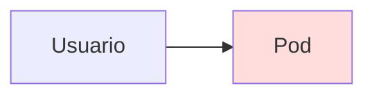
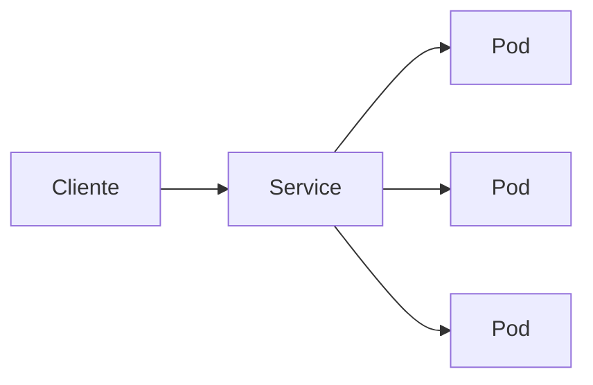
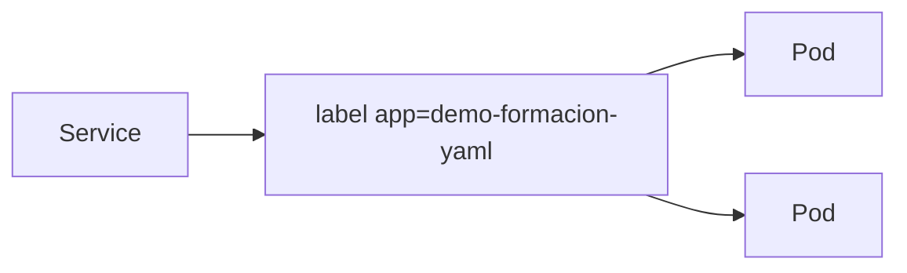
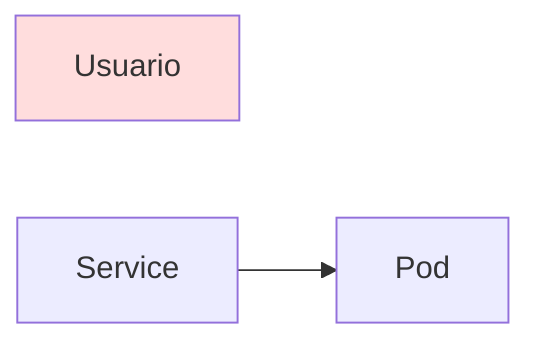
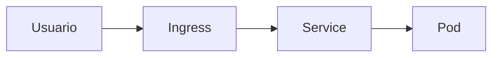
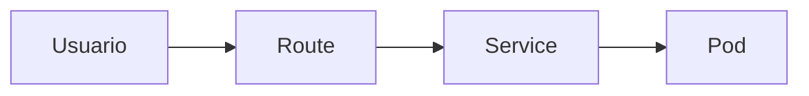
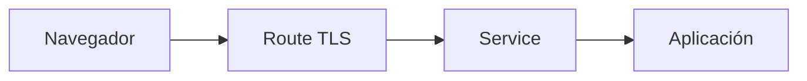
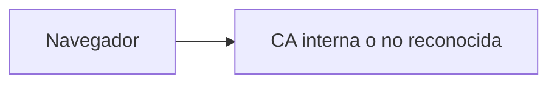

# 2.2 Exponer aplicaciones: Service y Route

## Objetivos de aprendizaje

Al finalizar este apartado serás capaz de:

- Comprender por qué un Pod no debe exponerse directamente a los usuarios.
- Entender la función de un Service dentro de Kubernetes.
- Comprender la diferencia entre Service y Route.
- Entender la diferencia entre Route e Ingress.
- Conocer las terminaciones TLS más habituales.
- Identificar por qué un navegador puede mostrar advertencias relacionadas con certificados.
- Publicar una aplicación mediante un Service y una Route.
- Acceder a una aplicación desde una URL externa.

## Del Pod al usuario

En el apartado anterior desplegamos una aplicación utilizando un Deployment.

Podemos comprobar que el Pod está en ejecución:

```bash
oc get pods
```

Ejemplo:

```text
NAME                         READY   STATUS
demo-formacion-yaml-xxxxx    1/1     Running
```

Sin embargo, aunque la aplicación esté funcionando, todavía existe un problema importante:

**los usuarios no tienen forma de acceder a ella desde fuera del clúster.**

Además, los Pods son recursos efímeros. Si un Pod deja de estar disponible, Kubernetes creará automáticamente otro para mantener el estado deseado definido en el Deployment.



Si el acceso dependiera directamente de un Pod concreto, cualquier sustitución podría afectar a la conectividad.

Por este motivo Kubernetes introduce una capa intermedia denominada **Service**.

## Service: un punto de acceso estable

Un Service proporciona un mecanismo estable para acceder a una aplicación independientemente de los Pods concretos que la estén ejecutando en cada momento.

En lugar de conectarse directamente a un Pod, los clientes se conectan al Service.



De esta forma:

- Los Pods pueden recrearse automáticamente.
- Las direcciones IP internas pueden cambiar.
- El Service mantiene un punto de acceso estable.

!!! tip "Idea clave"

    Un Service no ejecuta aplicaciones.

    Su función consiste en localizar los Pods que forman parte de una aplicación y dirigir las peticiones hacia ellos.

### ¿Cómo sabe el Service a qué Pods enviar el tráfico?

La asociación se realiza mediante etiquetas (*labels*) y selectores (*selectors*).

En el Deployment utilizado anteriormente definimos la etiqueta:

```yaml
labels:
  app: demo-formacion-yaml
```

El Service utilizará un selector con el mismo valor:

```yaml
selector:
  app: demo-formacion-yaml
```

Gracias a esta coincidencia, Kubernetes sabe qué Pods pertenecen a la aplicación.



!!! note

    Si el selector no coincide con las etiquetas de los Pods, el Service existirá, pero no tendrá ningún destino al que enviar las peticiones.

## Crear el Service para la aplicación

Nuestra aplicación escucha en el puerto 8080.

Podemos crear un Service mediante el siguiente manifiesto:

```yaml
apiVersion: v1
kind: Service
metadata:
  name: demo-formacion-yaml
spec:
  selector:
    app: demo-formacion-yaml
  ports:
    - protocol: TCP
      port: 80
      targetPort: 8080
```

Observa tres elementos importantes:

- `selector`: identifica los Pods asociados al Service.
- `port`: puerto ofrecido por el Service.
- `targetPort`: puerto real utilizado por el contenedor.

Una vez definido el recurso, podemos crearlo tanto desde la línea de comandos como desde la consola web de OpenShift.

En esta formación utilizaremos ambos enfoques según el contexto y las capacidades disponibles en cada entorno.

Si disponemos de acceso al fichero YAML y a la línea de comandos, podríamos utilizar:

```bash
oc apply -f service.yaml
```

También es posible crear el Service desde la consola web de OpenShift mediante el editor YAML integrado o las opciones de administración correspondientes.

Podemos comprobar el resultado con:

```bash
oc get svc
```

Ejemplo:

```text
NAME                   TYPE        CLUSTER-IP
demo-formacion-yaml    ClusterIP   172.30.x.x
```

La aplicación ya dispone de un punto de acceso estable dentro del clúster.

!!! note

    Kubernetes dispone de distintos tipos de Service para distintos escenarios de conectividad.

    En esta formación nos centraremos en el flujo más habitual en OpenShift: Service + Route.

## El problema del acceso externo

Aunque ya disponemos de un Service, la aplicación sigue siendo accesible únicamente desde el interior del clúster.

Necesitamos un mecanismo que permita publicar la aplicación para que pueda ser consumida desde un navegador.



Aquí es donde entra en juego la **Route**.

## Route frente a Ingress

En Kubernetes existe un recurso denominado **Ingress** cuya función es publicar aplicaciones HTTP y HTTPS.



OpenShift incorpora una funcionalidad equivalente denominada **Route**.



Ambos recursos persiguen el mismo objetivo:

**permitir que una aplicación sea accesible desde fuera del clúster.**

La principal diferencia es que:

- Ingress forma parte del ecosistema Kubernetes.
- Route es una funcionalidad nativa de OpenShift.

!!! tip "¿Qué utilizaremos en el curso?"

    Trabajaremos con Routes porque forman parte de OpenShift y proporcionan una forma sencilla y directa de publicar aplicaciones web.

## Crear una Route

Una Route siempre apunta a un Service.

No se conecta directamente con los Pods.

```yaml
apiVersion: route.openshift.io/v1
kind: Route
metadata:
  name: demo-formacion-yaml
spec:
  to:
    kind: Service
    name: demo-formacion-yaml
```

Una vez definido el recurso, podemos crearlo tanto desde la línea de comandos como desde la consola web de OpenShift.

En esta formación utilizaremos ambos enfoques según el contexto y las capacidades disponibles en cada entorno.

Si disponemos de acceso al fichero YAML y a la línea de comandos, podríamos utilizar:

```bash
oc apply -f route.yaml
```

También es posible crear la Route desde la consola web de OpenShift mediante el editor YAML integrado o las opciones de administración correspondientes.

Podemos comprobar el resultado con:

```bash
oc get route
```

Ejemplo:

```text
NAME                   HOST/PORT
demo-formacion-yaml    demo-formacion.apps.cluster.ejemplo.com
```

El flujo completo pasa a ser:


A partir de este momento la aplicación puede abrirse desde un navegador utilizando la URL publicada por la Route.

## TLS y HTTPS

En entornos reales es habitual que las aplicaciones se publiquen mediante HTTPS.

OpenShift permite que la Route gestione el cifrado TLS.

Conceptualmente, el flujo sería:



OpenShift soporta varios modos de terminación TLS.

### Edge

La conexión HTTPS finaliza en la Route.

```text
Navegador -- HTTPS --> Route -- HTTP --> Aplicación
```

Es la modalidad más habitual y sencilla.

### Passthrough

La Route reenvía el tráfico cifrado sin descifrarlo.

```text
Navegador -- HTTPS --> Aplicación
```

La gestión del certificado recae sobre la propia aplicación.

### Re-encrypt

La conexión permanece cifrada en ambos tramos.

```text
Navegador -- HTTPS --> Route -- HTTPS --> Aplicación
```

Se utiliza cuando se necesita cifrado de extremo a extremo.

!!! note

    Para la mayoría de aplicaciones utilizadas en esta formación bastará con conocer el funcionamiento general de TLS y las Routes.

## Cuando el navegador no confía en el certificado

En algunos laboratorios o entornos corporativos es posible que aparezca un aviso similar a:

```text
La conexión no es privada
```

o

```text
El certificado no es de confianza
```

En muchos casos esto no significa que la aplicación esté funcionando incorrectamente.

La causa habitual es que el certificado utilizado ha sido emitido por una Autoridad de Certificación (CA) que el navegador no reconoce como confiable.



Esta situación es frecuente en:

- Entornos de laboratorio.
- Plataformas de desarrollo.
- Infraestructuras internas corporativas.

!!! warning

    Una advertencia relacionada con certificados no implica necesariamente que exista un problema en la aplicación.

    Habitualmente indica que el navegador no puede validar la entidad que emitió el certificado utilizado por la plataforma.

## Ideas clave para recordar

!!! tip "Resumen"

    - Un Pod no debe exponerse directamente a los usuarios.
    - Un Service proporciona un punto de acceso estable a una aplicación.
    - Los Services localizan Pods mediante etiquetas y selectores.
    - Una Route publica un Service hacia el exterior.
    - OpenShift utiliza Routes como mecanismo nativo de publicación.
    - El flujo habitual es Usuario → Route → Service → Pod.
    - TLS permite proteger las comunicaciones mediante HTTPS.
    - Un aviso del navegador suele indicar un problema de confianza con la CA del certificado y no necesariamente un fallo de la aplicación.