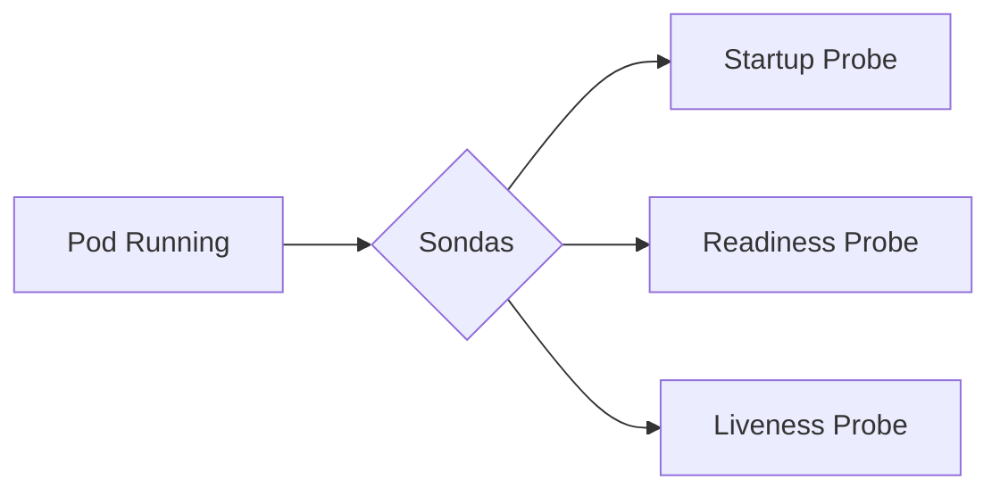
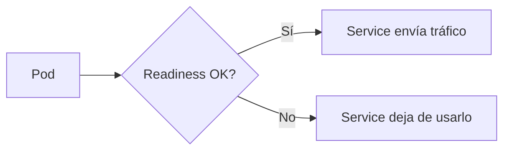
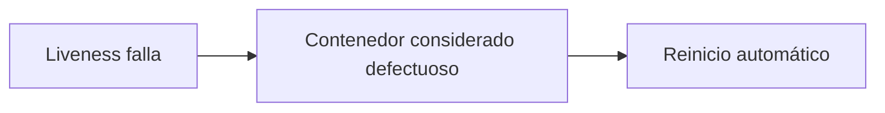
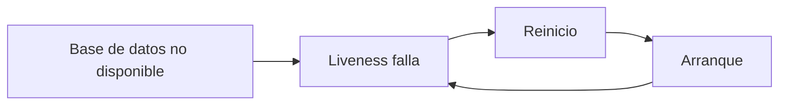
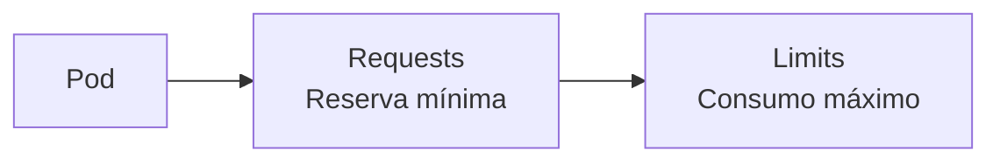
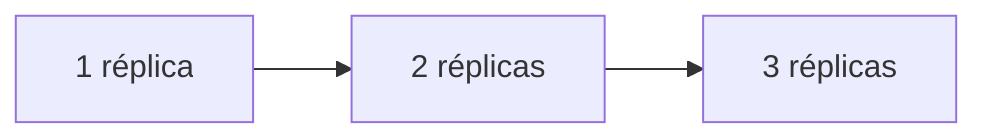
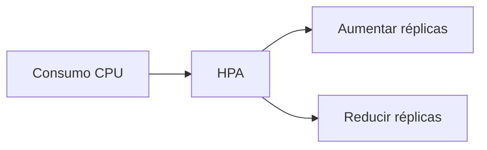
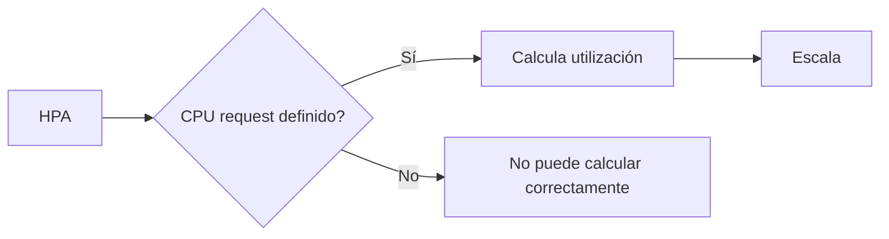

# 2.2 Salud, recursos y escalado de aplicaciones

### Objetivos de aprendizaje

Al finalizar este apartado serás capaz de:

- Comprender la diferencia entre las sondas `readiness`, `liveness` y `startup`.
- Identificar el error habitual de utilizar `liveness` y `readiness` como si fueran equivalentes.
- Entender cómo Kubernetes determina si una aplicación está preparada para recibir tráfico.
- Comprender qué son los `requests` y los `limits`.
- Conocer las clases de calidad de servicio (QoS) aplicadas a los Pods.
- Escalar aplicaciones manualmente aumentando o reduciendo réplicas.
- Comprender el funcionamiento básico del Horizontal Pod Autoscaler (HPA).
- Entender por qué el autoescalado depende de una correcta definición de recursos.

## La aplicación está ejecutándose... ¿pero realmente está disponible?

En apartados anteriores hemos visto cómo Kubernetes mantiene el estado deseado de una aplicación.

Sin embargo, que un Pod aparezca como `Running` no significa necesariamente que la aplicación funcione correctamente.

Por ejemplo:

- El proceso puede haberse iniciado correctamente pero todavía estar cargando datos.
- La aplicación puede seguir arrancando internamente.
- Puede responder con errores aunque el proceso siga vivo.
- Puede encontrarse bloqueada sin llegar a finalizar.

Para resolver estas situaciones Kubernetes utiliza distintos mecanismos de comprobación de estado denominados **sondas** (_Probes_).



Cada una tiene un objetivo diferente.

!!! tip "Idea clave"

    Las tres sondas comprueban aspectos distintos de la aplicación. Utilizar una donde corresponde otra es una de las causas más habituales de comportamientos inesperados en Kubernetes.

---

## Startup Probe: ¿ha terminado de arrancar?

La sonda `startup` se utiliza para aplicaciones cuyo arranque puede requerir bastante tiempo.

Mientras esta comprobación siga fallando, Kubernetes asume que la aplicación continúa iniciándose y no ejecutará las comprobaciones de `liveness`.

```text
Aplicación arranca
        ↓
Startup Probe falla
        ↓
Kubernetes espera
        ↓
Startup Probe correcta
        ↓
Comienzan readiness y liveness
```

Resulta especialmente útil en:

- Aplicaciones Java de gran tamaño.
- Sistemas que ejecutan migraciones al arrancar.
- Aplicaciones que cargan modelos o grandes volúmenes de datos.
- Productos corporativos con tiempos de inicialización elevados.

Sin esta sonda, Kubernetes podría interpretar erróneamente que la aplicación está fallando y reiniciarla continuamente antes de completar el arranque.

---

## Readiness Probe: ¿puede recibir tráfico?

La sonda `readiness` responde a una pregunta muy concreta:

> ¿Está la aplicación preparada para atender peticiones?

Si la respuesta es negativa:

- El Pod continúa ejecutándose.
- No se reinicia.
- Kubernetes deja temporalmente de enviar tráfico hacia él.



Este comportamiento es fundamental durante:

- Arranques lentos.
- Actualizaciones.
- Dependencias externas temporales.
- Períodos de mantenimiento.

Por ejemplo, una aplicación puede haberse iniciado pero no haber establecido todavía conexión con una base de datos.

En ese caso:

- El proceso está vivo.
- No es necesario reiniciarlo.
- Pero tampoco debe recibir tráfico.

La sonda `readiness` permite reflejar exactamente esa situación.

---

## Liveness Probe: ¿sigue funcionando?

La sonda `liveness` responde a otra pregunta distinta:

> ¿La aplicación continúa funcionando correctamente o está bloqueada?

Si la comprobación falla:

- Kubernetes considera que el contenedor está defectuoso.
- El contenedor es reiniciado automáticamente.



Casos típicos:

- Deadlocks.
- Aplicaciones bloqueadas.
- Procesos que dejan de responder.
- Situaciones de corrupción interna recuperables mediante reinicio.

---

## El error más habitual: confundir readiness y liveness

Muchos problemas operativos tienen origen en una configuración incorrecta de estas dos sondas.

Veamos una situación frecuente.

Supongamos que una aplicación depende de una base de datos.

Si la base de datos deja de responder temporalmente:

- La aplicación sigue ejecutándose.
- Puede recuperar la conectividad unos segundos después.
- Reiniciarla no resolverá el problema.

En este escenario lo correcto es:

```text
Readiness = Error
Liveness  = Correcta
```

Así el Pod deja de recibir tráfico mientras espera recuperar la conexión.

Si configuramos esta comprobación como `liveness`:

```text
Liveness = Error
```

Kubernetes reiniciará continuamente la aplicación.



El resultado es peor que el problema original.

!!! warning "Error muy habitual"

    Readiness controla si una aplicación puede recibir tráfico.

    Liveness controla si una aplicación debe reiniciarse.

    No son intercambiables.

---

## Definición de sondas en un Deployment

Un manifiesto puede incluir varias sondas simultáneamente.

```yaml
apiVersion: apps/v1
kind: Deployment
metadata:
  name: demo-formacion-yaml
spec:
  replicas: 1
  selector:
    matchLabels:
      app: demo-formacion-yaml
  template:
    metadata:
      labels:
        app: demo-formacion-yaml
    spec:
      containers:
      - name: demo-formacion
        image: docker.io/ieftraining/demo-formacion:v1
        ports:
        - containerPort: 8080

        readinessProbe:
          httpGet:
            path: /
            port: 8080

        livenessProbe:
          httpGet:
            path: /
            port: 8080

        startupProbe:
          httpGet:
            path: /
            port: 8080
          failureThreshold: 30
          periodSeconds: 10
```

Por ahora no es necesario memorizar todos los parámetros.

Lo importante es comprender qué función cumple cada sonda.

### Buenas prácticas al definir sondas

El ejemplo anterior muestra las tres sondas configuradas simultáneamente. Aunque no todas las aplicaciones necesitan siempre los tres tipos, esta aproximación representa una práctica habitual en entornos productivos.

De forma general:

- Utiliza `readiness` para controlar cuándo una aplicación está preparada para recibir tráfico.
- Utiliza `liveness` únicamente para detectar situaciones de bloqueo o fallo de las que sea posible recuperarse mediante un reinicio.
- Utiliza `startup` cuando el tiempo de arranque pueda superar los umbrales normales de `liveness`.

Una configuración adecuada de las sondas mejora la disponibilidad de las aplicaciones, reduce reinicios innecesarios y facilita despliegues más seguros durante actualizaciones y tareas de mantenimiento.

!!! tip "Recomendación"

    Cuando una aplicación presenta problemas de disponibilidad, revisa primero la configuración de las sondas. Un porcentaje significativo de incidencias en Kubernetes está relacionado con una definición incorrecta de `readiness` o `liveness`.

---

## Recursos: requests y limits

Además de mantener aplicaciones funcionando, Kubernetes debe repartir los recursos físicos disponibles entre todos los Pods del clúster.

Para ello utiliza dos conceptos fundamentales:

- `requests`
- `limits`

### Requests

Un `request` representa la cantidad mínima de recursos que el planificador reserva para un Pod.

Ejemplo:

```yaml
resources:
  requests:
    cpu: "100m"
    memory: "128Mi"
```

Interpretación:

- 100 milicores de CPU.
- 128 MiB de memoria.

Cuando Kubernetes decide dónde ejecutar un Pod, utiliza estos valores para comprobar si existe capacidad disponible.

### Limits

Un `limit` representa el consumo máximo permitido.

```yaml
resources:
  limits:
    cpu: "500m"
    memory: "512Mi"
```

Si la aplicación intenta superar dichos límites:

- La CPU será limitada.
- El exceso de memoria puede provocar la finalización del contenedor.

---

## Requests y limits en la práctica



Un ejemplo razonable para una aplicación pequeña podría ser:

```yaml
resources:
  requests:
    cpu: "100m"
    memory: "128Mi"
  limits:
    cpu: "500m"
    memory: "512Mi"
```

Esto significa:

- Kubernetes reserva recursos equivalentes a 100m y 128Mi.
- La aplicación puede crecer hasta 500m y 512Mi.
- Otros Pods pueden utilizar los recursos sobrantes mientras no sean necesarios.

---

## Clases de calidad de servicio (QoS)

Kubernetes clasifica los Pods según la precisión con la que se definan sus recursos.

### BestEffort

No existen `requests` ni `limits`.

```yaml
resources: {}
```

Es la categoría menos prioritaria.

### Burstable

Existen `requests`, `limits` o ambos, pero no son idénticos.

```yaml
resources:
  requests:
    memory: "128Mi"
  limits:
    memory: "512Mi"
```

Es la situación más habitual.

### Guaranteed

Los `requests` y los `limits` son iguales.

```yaml
resources:
  requests:
    memory: "512Mi"
    cpu: "500m"
  limits:
    memory: "512Mi"
    cpu: "500m"
```

Proporciona la mayor garantía de recursos.

!!! note

    No todas las aplicaciones necesitan QoS Guaranteed. En muchos entornos corporativos la mayoría de cargas de trabajo utilizan QoS Burstable.

### Buenas prácticas para definir recursos

Aunque Kubernetes permite ejecutar Pods sin declarar recursos, en entornos corporativos es recomendable definir siempre valores de `requests` y `limits`.

Esto proporciona varias ventajas:

- Permite al planificador distribuir mejor las cargas de trabajo.
- Evita consumos inesperados de CPU y memoria.
- Facilita el uso de mecanismos de autoescalado.
- Reduce problemas de convivencia entre aplicaciones.

Como regla general:

- Evita la clase QoS `BestEffort` salvo en pruebas puntuales.
- Utiliza habitualmente QoS `Burstable` para aplicaciones de propósito general.
- Reserva QoS `Guaranteed` para servicios especialmente críticos o con requisitos estrictos de rendimiento.

!!! note

    Definir recursos realistas es un proceso iterativo. Es habitual comenzar con valores conservadores y ajustarlos posteriormente a partir de métricas observadas en explotación.

---

## Escalado manual

Hasta ahora nuestros ejemplos han utilizado una única réplica.

```yaml
spec:
  replicas: 1
```

Sin embargo, una de las principales ventajas de Kubernetes es poder aumentar o reducir la cantidad de Pods de manera sencilla.



Podemos modificar el número de réplicas mediante:

```bash
oc scale deployment/demo-formacion-yaml \
  --replicas=3
```

Comprobamos el resultado:

```bash
oc get pods
```

Ejemplo:

```text
demo-formacion-yaml-xxx1   Running
demo-formacion-yaml-xxx2   Running
demo-formacion-yaml-xxx3   Running
```

El Deployment detecta el nuevo estado deseado y crea automáticamente los Pods adicionales.

---

## ¿Qué es el Horizontal Pod Autoscaler?

Escalar manualmente funciona correctamente cuando conocemos de antemano la carga esperada.

En entornos reales esto no siempre sucede.

Para automatizar el proceso existe el **Horizontal Pod Autoscaler (HPA)**.

Su función es aumentar o reducir réplicas según métricas observadas.

La más utilizada es el consumo de CPU.



Ejemplo conceptual:

```text
CPU baja  → 2 Pods
CPU media → 4 Pods
CPU alta  → 8 Pods
```

De esta forma la aplicación puede adaptarse automáticamente a la demanda.

---

## ¿Por qué el HPA necesita requests?

Aquí aparece uno de los errores más frecuentes cuando se comienza a trabajar con Kubernetes.

El HPA no utiliza directamente el valor absoluto de CPU consumida.

Lo que evalúa es el porcentaje de utilización respecto al `request` definido.

Por ejemplo:

```yaml
requests:
  cpu: "100m"
```

Si un contenedor consume:

```text
50m
```

Su utilización será:

```text
50%
```

Pero si el `request` no existe:

```yaml
resources: {}
```

Kubernetes no dispone de una referencia válida para calcular el porcentaje de utilización.

Como consecuencia, el autoescalado no puede funcionar correctamente.



!!! warning "Regla práctica"

    Si quieres utilizar HPA, define siempre requests de CPU de forma coherente.

    Un autoescalado basado en CPU sin requests correctamente configurados suele producir resultados incorrectos o no funcionar como se espera.

!!! note

    En este curso nos centraremos en comprender cómo funciona el escalado automático y su relación con los `requests`. En entornos reales, la definición de políticas de autoescalado suele requerir un estudio detallado del comportamiento de las aplicaciones y de sus métricas de consumo.

---

## Consultar recursos definidos

Podemos examinar los recursos configurados en un Deployment mediante:

```bash
oc describe deployment demo-formacion-yaml
```

También es posible revisar el manifiesto completo:

```bash
oc get deployment demo-formacion-yaml -o yaml
```

Estas dos herramientas serán las más utilizadas para verificar:

- Réplicas configuradas.
- Requests de CPU y memoria.
- Limits de CPU y memoria.
- Sondas de salud.
- Estrategias de despliegue.

## Ideas clave para recordar

!!! tip "Resumen"

    - Un Pod en estado Running no implica que la aplicación esté lista para recibir tráfico.
    - Startup controla el arranque inicial.
    - Readiness controla si el Pod debe recibir tráfico.
    - Liveness controla si el contenedor debe reiniciarse.
    - Requests representan la reserva mínima de recursos.
    - Limits representan el consumo máximo permitido.
    - Kubernetes clasifica los Pods mediante QoS BestEffort, Burstable y Guaranteed.
    - Un Deployment puede escalarse aumentando o reduciendo réplicas.
    - El HPA automatiza el escalado en función de métricas.
    - El autoescalado depende de que los requests estén correctamente definidos.