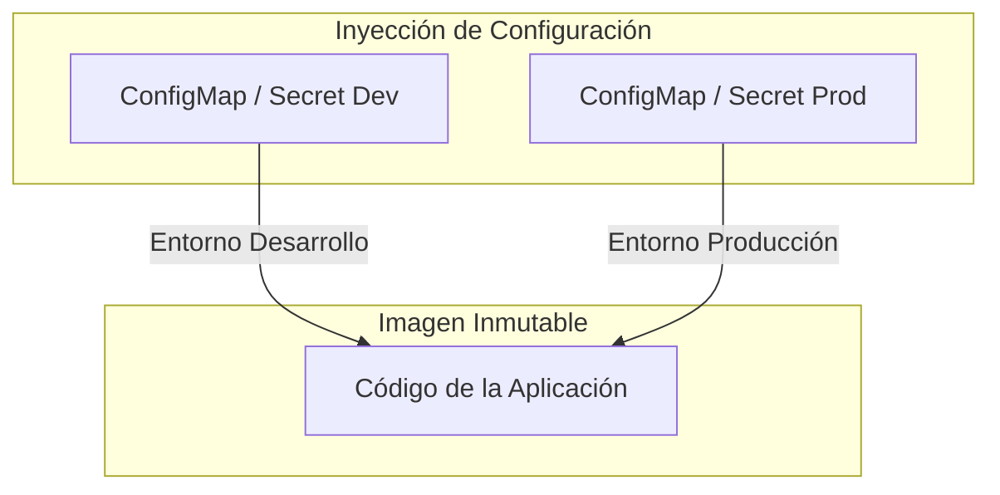
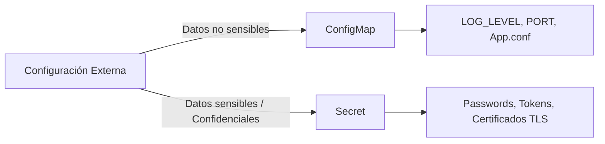
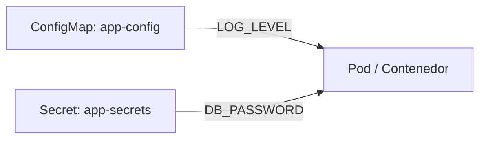
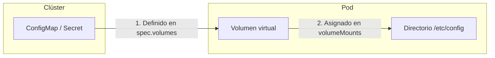

# 2.4 Configuración fuera de la imagen: ConfigMaps y Secrets

## Objetivos de aprendizaje

Al finalizar este apartado serás capaz de:

- Comprender la importancia de desacoplar la configuración del código y de las imágenes de contenedor.
- Identificar cuándo utilizar un **ConfigMap** y cuándo utilizar un **Secret**.
- Crear ConfigMaps y Secrets mediante CLI y manifiestos YAML.
- Inyectar datos de configuración como variables de entorno y consumirlos desde la aplicación.
- Entender el concepto de volumen y cómo montar ConfigMaps y Secrets en el sistema de ficheros del contenedor.
- Comprobar la actualización en tiempo real (*hot-reload*) al modificar volúmenes.

---

## Desacoplar la configuración de la imagen

Uno de los principios fundamentales en el desarrollo y despliegue de aplicaciones modernas en contenedores es la **separación estricta entre el código y la configuración**.

Una imagen de contenedor debe ser un artefacto **inmutable y agnóstico del entorno**. La misma imagen debe poder ejecutarse en entornos de desarrollo, pruebas o producción sin necesidad de volver a compilarla o modificar sus capas internas.



Si guardamos parámetros como cadenas de conexión a bases de datos, claves API, URLs de servicios externos o niveles de traza (*LOG_LEVEL*) dentro de la imagen, nos enfrentamos a graves inconvenientes:

- **Riesgo de seguridad:** Credenciales o contraseñas expuestas en registros de imágenes (*registries*) o en repositorios de código.
- **Falta de flexibilidad:** Necesidad de reconstruir la imagen cada vez que cambia un parámetro de configuración.
- **Incompatibilidad con la promoción de artefactos:** Se rompe la regla de "construir una vez y promover el mismo artefacto a todos los entornos".

Para resolver esto, Kubernetes y OpenShift proporcionan dos recursos nativos: **ConfigMaps** y **Secrets**.

---

## ConfigMaps frente a Secrets

Aunque ambos recursos se utilizan para almacenar datos de configuración en forma de pares clave-valor o archivos completos, están orientados a diferentes tipos de información:



### ConfigMap

Está diseñado para almacenar **datos de configuración no sensibles** en texto plano.

Ejemplos típicos:
- Niveles de log (`LOG_LEVEL: debug`).
- URLs de endpoints y servicios auxiliares.
- Archivos de configuración de servidores web (ej. `nginx.conf`, `application.properties`).
- Variables de entorno generales de la aplicación.

### Secret

Está diseñado para almacenar **información sensible y confidencial**.

Ejemplos típicos:
- Contraseñas y credenciales de acceso a bases de datos.
- Claves privadas y certificados TLS/SSL.
- Tokens de autenticación API o llaves de cifrado.
- Archivos de claves SSH o `.dockercfg`.

| Característica | ConfigMap | Secret |
| :--- | :--- | :--- |
| **Tipo de datos** | Configuración no sensible | Datos confidenciales o sensibles |
| **Formato en manifiesto** | Texto plano (`data`) | Codificado en Base64 (`data`) o texto plano (`stringData`) |
| **Uso principal** | Ajustar comportamiento de la app | Proteger credenciales y accesos |
| **Montaje en Pod** | Variable de entorno / Volumen | Variable de entorno / Volumen |

---

## Creación de ConfigMaps y Secrets

Tanto los ConfigMaps como los Secrets se pueden crear directamente desde la herramienta de línea de comandos `oc` o aplicando manifiestos YAML.

### Opción 1: Mediante la CLI `oc`

Podemos crear un ConfigMap definiendo los pares clave-valor que necesita nuestra aplicación mediante el parámetro `--from-literal`:

```bash
oc create configmap app-config \
  --from-literal=LOG_LEVEL=info \
  --from-literal=APP_COLOR=blue \
  --from-literal=APP_TITLE="Entorno de Formacion OpenShift"
```

En este comando, cada `--from-literal` guarda una pareja de datos **`CLAVE=VALOR`**:
- `LOG_LEVEL` es la **clave** y `"info"` es su **valor**.
- `APP_COLOR` es la **clave** y `"blue"` es su **valor**.
- `APP_TITLE` es la **clave** y `"Entorno de Formacion OpenShift"` es su **valor**.

De la misma forma, creamos un Secret asignando también sus pares clave-valor confidenciales:

```bash
oc create secret generic app-secrets \
  --from-literal=DB_USER=admin_user \
  --from-literal=DB_PASSWORD=SuperSecretPass123!
```

### Opción 2: Mediante manifiestos YAML

También podemos definir estos recursos mediante archivos YAML.

#### ConfigMap (`configmap.yaml`)

```yaml
apiVersion: v1
kind: ConfigMap
metadata:
  name: app-config
data:
  LOG_LEVEL: "info"
  APP_COLOR: "blue"
  APP_TITLE: "Entorno de Formacion OpenShift"
```

#### Secret (`secret.yaml`)

```yaml
apiVersion: v1
kind: Secret
metadata:
  name: app-secrets
type: Opaque
stringData:
  DB_USER: "admin_user"
  DB_PASSWORD: "PasswordSeguro2026"
```

Aplicamos los manifiestos:

```bash
oc apply -f configmap.yaml
oc apply -f secret.yaml
```

### Comprobación de los recursos

Verificamos la creación de ambos objetos en el proyecto:

```bash
oc get configmap app-config
oc get secret app-secrets
```

---

## Inyección como variables de entorno

La forma más habitual de consumir datos de un ConfigMap o Secret es inyectándolos como **variables de entorno** dentro de los contenedores.



### ¿Cómo se conectan los objetos con el Deployment?

Para inyectar estos datos en los contenedores, utilizamos la sección `env` dentro de la especificación del contenedor en el Deployment.

Cada variable se define con un nombre interno (el que leerá la aplicación) y hace referencia a la clave del ConfigMap o Secret mediante `valueFrom`:

- **Para ConfigMaps (`configMapKeyRef`):**
  - `name`: Nombre del ConfigMap existente (`app-config`).
  - `key`: Nombre de la clave guardada dentro del ConfigMap (`LOG_LEVEL` o `APP_COLOR`).
- **Para Secrets (`secretKeyRef`):**
  - `name`: Nombre del Secret existente (`app-secrets`).
  - `key`: Nombre de la clave confidencial guardada en el Secret (`DB_PASSWORD`).

### Actualización del Deployment (`deployment.yaml`)

Modificamos la definición del Deployment para añadir el bloque `env` asociando claves de nuestro ConfigMap y Secret:

```yaml
apiVersion: apps/v1
kind: Deployment
metadata:
  name: demo-formacion-yaml
  annotations:
    kubernetes.io/change-cause: "Inyeccion de ConfigMap y Secret como variables de entorno"
spec:
  replicas: 1
  selector:
    matchLabels:
      app: demo-formacion-yaml
  template:
    metadata:
      labels:
        app: demo-formacion-yaml
    spec:
      containers:
      - name: demo-formacion
        image: docker.io/ieftraining/demo-formacion:v3
        imagePullPolicy: Always
        ports:
        - containerPort: 8080
        env:
        - name: LOG_LEVEL
          valueFrom:
            configMapKeyRef:
              name: app-config
              key: LOG_LEVEL
        - name: APP_COLOR
          valueFrom:
            configMapKeyRef:
              name: app-config
              key: APP_COLOR
        - name: DB_PASSWORD
          valueFrom:
            secretKeyRef:
              name: app-secrets
              key: DB_PASSWORD
```

Aplicamos los cambios:

```bash
oc apply -f deployment.yaml
```

### Verificación de las variables

Comprobamos que las variables están disponibles dentro del Pod en ejecución:

```bash
oc exec deployment/demo-formacion-yaml -- env | grep -E "LOG_LEVEL|APP_COLOR|DB_PASSWORD"
```

Resultado esperado:

```text
LOG_LEVEL=info
APP_COLOR=blue
DB_PASSWORD=PasswordSeguro2026
```

!!! warning "Comportamiento de las variables de entorno"

    Si cambias el valor de un ConfigMap o Secret en el clúster, **las variables de entorno de los Pods en ejecución NO cambian automáticamente**.

    Las variables de entorno solo se cargan cuando se inicia el proceso. Para aplicar un cambio en variables de entorno es necesario reiniciar el Pod:
    ```bash
    oc rollout restart deployment/demo-formacion-yaml
    ```

---

## Montar ConfigMaps y Secrets como volúmenes

Cuando la configuración consiste en archivos completos (como `nginx.conf`, `application.properties` o certificados) o cuando necesitamos actualización en caliente sin reiniciar el Pod, la alternativa a las variables de entorno es utilizar **volúmenes de archivos**.

### ¿Qué es un volumen en Kubernetes?

Un **volumen** es un directorio accesible para los contenedores dentro de un Pod. A diferencia del almacenamiento efímero del propio contenedor, los volúmenes permiten adjuntar recursos externos (como un disco persistente, un directorio temporal o, en este caso, un objeto de configuración).

Para montar un ConfigMap o Secret como un volumen en nuestra aplicación intervienen dos partes dentro del manifiesto:

1. **`spec.volumes` (a nivel de Pod):** Declara la fuente del volumen y le asigna un nombre dentro del Pod.
   - `name`: Nombre identificativo del volumen (ej. `config-volume`).
   - `configMap` / `secret`: Indica el objeto del clúster que provee los datos.
2. **`spec.containers.volumeMounts` (a nivel de contenedor):** Define en qué directorio interno del contenedor se va a publicar ese volumen.
   - `name`: Debe coincidir exactamente con el nombre definido en `volumes`.
   - `mountPath`: Ruta dentro del sistema de archivos del contenedor donde se crearán los archivos (`/etc/config` o `/etc/secrets`).



### Actualización del Deployment con Volúmenes (`deployment.yaml`)

Añadimos la sección `volumes` al Pod y la asociamos con `volumeMounts` en el contenedor:

```yaml
apiVersion: apps/v1
kind: Deployment
metadata:
  name: demo-formacion-yaml
  annotations:
    kubernetes.io/change-cause: "Montaje de ConfigMap y Secret como volumenes de archivos"
spec:
  replicas: 1
  selector:
    matchLabels:
      app: demo-formacion-yaml
  template:
    metadata:
      labels:
        app: demo-formacion-yaml
    spec:
      containers:
      - name: demo-formacion
        image: docker.io/ieftraining/demo-formacion:v3
        imagePullPolicy: Always
        ports:
        - containerPort: 8080
        volumeMounts:
        - name: config-volume
          mountPath: /etc/config
          readOnly: true
        - name: secret-volume
          mountPath: /etc/secrets
          readOnly: true
      volumes:
      - name: config-volume
        configMap:
          name: app-config
      - name: secret-volume
        secret:
          secretName: app-secrets
```

Aplicamos la configuración:

```bash
oc apply -f deployment.yaml
```

### Verificación de los archivos en el contenedor

Cada clave dentro del ConfigMap o Secret se convierte en un archivo independiente dentro de la ruta de montaje:

```bash
oc exec deployment/demo-formacion-yaml -- ls -l /etc/config
```

Resultado esperado:

```text
lrwxrwxrwx 1 root root 16 Oct  8 10:00 APP_COLOR -> ..data/APP_COLOR
lrwxrwxrwx 1 root root 16 Oct  8 10:00 LOG_LEVEL -> ..data/LOG_LEVEL
```

Consultamos el contenido del archivo:

```bash
oc exec deployment/demo-formacion-yaml -- cat /etc/config/APP_COLOR
```

Resultado:

```text
blue
```

---

## Actualización de configuración en tiempo real (*Hot-reload*)

A diferencia de las variables de entorno, cuando un ConfigMap o Secret está montado como volumen, **Kubernetes actualiza de forma automática el contenido de los archivos en el contenedor**.

### 1. Modificar el ConfigMap en caliente

Cambiamos el valor de `APP_COLOR` directamente en el clúster:

```bash
oc patch configmap app-config -p '{"data":{"APP_COLOR":"green"}}'
```

### 2. Comprobar la actualización sin reiniciar el Pod

Transcurridos unos segundos (habitualmente entre 10 y 30 segundos), volvemos a consultar el archivo dentro del contenedor:

```bash
oc exec deployment/demo-formacion-yaml -- cat /etc/config/APP_COLOR
```

Resultado esperado:

```text
green
```

El contenido se ha actualizado a `green` **sin reiniciar el Pod ni interrumpir el servicio**.

---

## Ideas clave para recordar

!!! tip "Resumen"

    - La configuración debe separarse siempre del código y de la imagen para garantizar artefactos inmutables.
    - **ConfigMap** almacena datos de configuración generales no sensibles.
    - **Secret** almacena credenciales y datos confidenciales.
    - Las **variables de entorno** son sencillas de usar, pero requieren reiniciar el Pod si los valores cambian.
    - Un **volumen** es un directorio accesible por el contenedor; al montar un ConfigMap o Secret como volumen, sus claves se proyectan como archivos.
    - Los **volúmenes de configuración** se actualizan automáticamente (*hot-reload*) en el contenedor sin reiniciar el Pod.