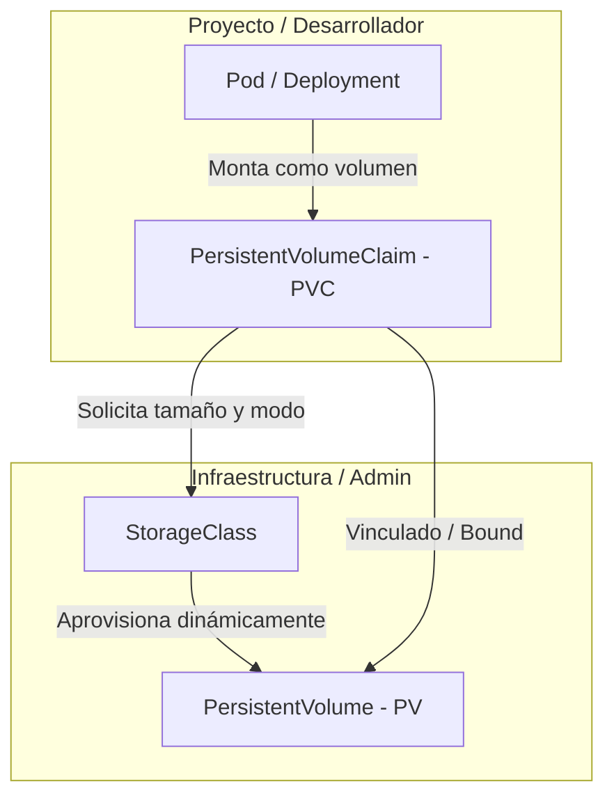
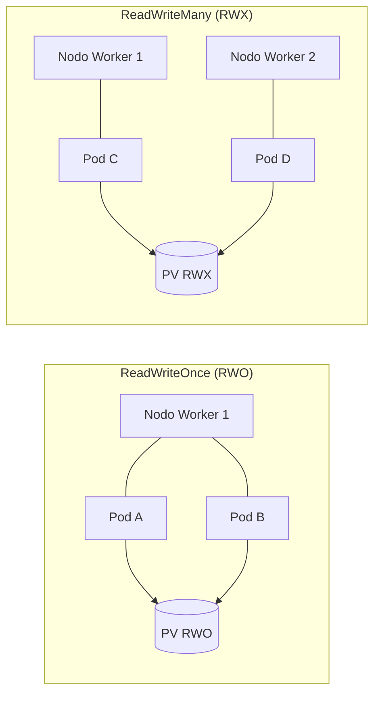
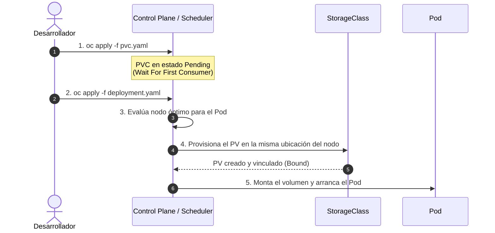
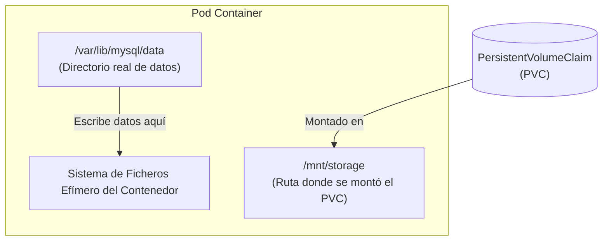
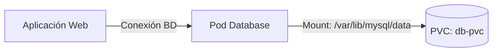

# 2.5 Almacenamiento persistente: PV, PVC y StorageClass

## Objetivos de aprendizaje

Al finalizar este apartado serás capaz de:

- Comprender la necesidad de almacenar información persistente en un entorno de contenedores efímeros.
- Diferenciar las responsabilidades de los recursos **PersistentVolume (PV)**, **PersistentVolumeClaim (PVC)** y **StorageClass**.
- Conocer los distintos modos de acceso al almacenamiento (`ReadWriteOnce`, `ReadWriteMany`, `ReadOnlyMany`) y su comportamiento cuando existen múltiples réplicas o se realizan actualizaciones de tipo `RollingUpdate`.
- Entender cómo funciona la provisión estática frente a la provisión dinámica y el papel del aprovisionamiento manual en protocolos tradicionales como NFS.
- Comprender el comportamiento de la política de vinculación `WaitForFirstConsumer`.
- Identificar y corregir el problema habitual de montar un PVC en una ruta distinta a la de los datos reales de la aplicación.
- Añadir almacenamiento persistente a un despliegue de base de datos, simular un fallo en el Pod y comprobar la persistencia de la información.

---

## Conceptos fundamentales: PV, PVC y StorageClass

En Kubernetes y OpenShift, el ciclo de vida de los contenedores es efímero por naturaleza. Cuando un Pod se reinicia, se escala hacia abajo o se desplaza a otro nodo worker, cualquier dato escrito en su sistema de archivos local se destruye. Para aquellas aplicaciones que requieren conservar información a lo largo del tiempo (bases de datos, gestores documentales, repositorios de archivos), la plataforma proporciona una abstracción de almacenamiento persistente desacoplada del ciclo de vida del contenedor.

La gestión de almacenamiento en OpenShift separa las responsabilidades de infraestructura (administración de discos) de las necesidades de desarrollo (consumo de almacenamiento) mediante tres recursos principales:



### PersistentVolume (PV)
Es la representación de un recurso de almacenamiento físico o de red dentro del clúster. Algunos ejemplos habituales son:
* Volúmenes de infraestructura cloud (AWS EBS, Azure Disk, Google Persistent Disk).
* Almacenamiento en entornos virtualizados corporativos (volúmenes **vSphere First Class Disk / VMware CNS**).
* Discos o almacenamiento en red tradicional (LUNs de SAN, recursos compartidos NFS o volúmenes Ceph/OCS).

Es un recurso a nivel de clúster (no pertenece a ningún namespace en particular) y es administrado por el equipo de operaciones o provisionado automáticamente por el clúster.

### PersistentVolumeClaim (PVC)
Es la solicitud o petición de almacenamiento realizada por un usuario o aplicación dentro de un namespace concreto.
* Es un recurso de ámbito de proyecto (namespace).
* Especifica los requerimientos necesarios: tamaño (ej. `1Gi`) y modo de acceso (ej. `ReadWriteOnce`).
* Funciona de forma análoga a un Pod: así como un Pod consume recursos de CPU y memoria del nodo, un PVC consume un PV del almacenamiento disponible.

### StorageClass (SC)
Es el mecanismo que permite la **provisión dinámica** de almacenamiento. Define el tipo de almacenamiento (SSD de alto rendimiento, vSphere Datastore, almacenamiento en red, etc.) y el *provisioner* encargado de interactuar con la infraestructura subyacente para crear el volumen físico bajo demanda cuando un desarrollador crea un PVC.

!!! tip "Provisión estática vs. Provisión dinámica (El caso de NFS)"
    Hoy en día, en entornos Cloud o virtualizados con VMware vSphere, los `StorageClass` permiten que la provisión sea **completamente dinámica**: creas un `PVC` y la plataforma crea el volumen `PV` automáticamente en la cabina o nube.

    Sin embargo, en protocolos de red tradicionales como **NFS**, la provisión suele ser **estática**: no existe una API nativa en el servidor NFS para crear carpetas/exportaciones bajo demanda. En estos casos, un administrador de almacenamiento debe crear previamente las carpetas NFS y definir manualmente los objetos `PersistentVolume` (PV) en el clúster antes de que los desarrolladores puedan vincular sus `PVC`.

---

## Modos de acceso al almacenamiento

Al solicitar un PVC, se debe especificar cómo se conectará el volumen a las cargas de trabajo. OpenShift admite tres modos de acceso principales:

| Modo de acceso | Nombre en manifiesto | Descripción | Casos de uso típicos |
| :--- | :--- | :--- | :--- |
| **ReadWriteOnce** | `ReadWriteOnce` (RWO) | El volumen puede ser montado en modo lectura-escritura por los Pods de **un único nodo worker**. | Bases de datos (PostgreSQL, MySQL), caches locales. |
| **ReadWriteMany** | `ReadWriteMany` (RWX) | El volumen puede ser montado en modo lectura-escritura por **múltiples Pods simultáneamente**, incluso en distintos nodos. | CMS multinstancia (WordPress), repositorios compartidos (NFS/CephFS). |
| **ReadOnlyMany** | `ReadOnlyMany` (ROX) | El volumen puede ser montado en modo solo lectura por **múltiples Pods** distribuidos en varios nodos. | Servidores web compartiendo contenido estático, distribución de binarios/modelos de IA. |



### ¿Qué ocurre si tengo una base de datos con `replicas: 3` y almacenamiento RWO?

Una duda habitual surge al escalar una base de datos o aplicación con un PVC `ReadWriteOnce` (RWO):

1. **Si los 3 Pods caen en el mismo nodo worker:** RWO permite que varios Pods monten el volumen siempre que **estén ejecutándose en el mismo nodo**. Sin embargo, esto provocaría un problema crítico a nivel de aplicación: tres instancias de MySQL intentando escribir concurrentemente en el mismo directorio de datos corruptores de archivos y bloqueos de tablas.
2. **Si el *scheduler* intenta ubicar las réplicas en distintos nodos:** El segundo y tercer Pod quedarán en estado **`Pending`** con el error `Multi-Attach error for volume`. La infraestructura bloquea el montaje porque el disco ya está asignado al primer nodo.

!!! tip "¿Cómo se gestiona el escalado de bases de datos?"
    * Para bases de datos con réplicas (como un clúster MySQL/PostgreSQL con lectura/escritura separada), **no se utiliza un único Deployment compartiendo un PVC RWO**.
    * En su lugar, se utiliza un **`StatefulSet`**. El `StatefulSet` utiliza una plantilla llamada `volumeClaimTemplates` que genera **un PVC RWO independiente e individual para cada réplica** (`data-db-0`, `data-db-1`, `data-db-2`), permitiendo la replicación a nivel de motor de base de datos.

!!! warning "Relación con las estrategias de despliegue"
    Si un `Deployment` usa un solo PVC RWO y la estrategia `RollingUpdate`, el proceso de actualización se bloqueará: el Pod nuevo intentará arrancar en otro nodo antes de destruir el antiguo y no podrá montar el volumen. Para despliegues con un único PVC RWO se debe configurar la estrategia `Recreate`.

---

## El comportamiento `WaitForFirstConsumer`

En entornos con provisión dinámica de almacenamiento en la nube o en zonas de disponibilidad distribuidas, la creación inmediata del volumen físico puede ser un problema.

Cuando un `StorageClass` utiliza la política de vinculación `volumeBindingMode: WaitForFirstConsumer`, ocurre lo siguiente:

1. El usuario crea el `PVC`.
2. Kubernetes **no asigna ni provisiona el volumen físico inmediatamente**; el PVC permanece en estado `Pending`.
3. Kubernetes espera a que se cree un `Pod` que haga referencia a ese `PVC`.
4. El *scheduler* analiza en qué nodo/zona del clúster conviene ejecutar ese Pod según sus recursos disponibles (CPU, Memoria, tolerancias).
5. Una vez elegido el nodo destino, la plataforma crea y conecta el volumen físico exactamente en la misma zona o cabina accesible por dicho nodo.
6. El PVC pasa al estado `Bound` y el Pod arranca correctamente.



!!! note "¿Por qué es importante este comportamiento?"
    Evita que un volumen se provisione en la Zona de Disponibilidad A cuando el Pod que lo necesita termina agendado en la Zona de Disponibilidad B debido a restricciones de capacidad, lo que provocaría fallos de montaje por incompatibilidad geográfica.

---

## Errores habituales: El PVC montado en la ruta incorrecta

Uno de los errores más comunes al añadir almacenamiento persistente a una aplicación o base de datos es montar el volumen en un directorio distinto del que la aplicación realmente utiliza para guardar sus datos.

### ¿Qué sucede en este escenario?



1. La aplicación (ej. una base de datos MySQL) arranca y escribe su información interna en la ruta estandarizada del proceso (por ejemplo `/var/lib/mysql/data`).
2. El desarrollador configura un `PVC` y lo monta dentro del contenedor en `/mnt/storage` pensando que con ello la aplicación ya es persistente.
3. Todo parece funcionar correctamente de inicio.
4. Cuando el Pod se borra o se reinicia, **se pierden los datos**.

### Diagnóstico de la causa raíz
Al no coincidir la ruta de datos real de la imagen del contenedor con el `mountPath` del PVC, la aplicación estuvo escribiendo los datos en el almacenamiento efímero del propio Pod y no dentro del volumen persistente externo.

!!! warning "Comprobación clave antes de montar un volumen"
    Inspecciona siempre la documentación de la imagen del contenedor o revisa las variables de entorno de la imagen (`DATADIR`, `PGDATA`, `MYSQL_DATA_DIR`, etc.) para asegurarte de que el `mountPath` dentro del `volumeMounts` apunta con precisión milimétrica a la ruta de datos activa.

---

## Práctica N4: Añadir almacenamiento persistente a una base de datos y verificar la persistencia

A lo largo de las sesiones anteriores hemos gestionado componentes de nuestra arquitectura. Ahora le añadiremos una base de datos con almacenamiento persistente montado en la ruta de datos correcta, guardaremos datos, eliminaremos el Pod de la base de datos y verificaremos que la información sobrevive.



### Paso 1: Explorar los StorageClasses disponibles en el clúster

Antes de solicitar un PVC, consultamos las clases de almacenamiento disponibles en el clúster de OpenShift:

```bash
oc get storageclass
```

Resultado esperado:
```text
NAME                         PROVISIONER                             RECLAIMPOLICY   VOLUMEBINDINGMODE      ALLOWVOLUMEEXPANSION   AGE
gp3-csi (default)            topolvm.io                              Delete          WaitForFirstConsumer   true                   30d
```

### Paso 2: Crear la solicitud de volumen (PVC)

Crearemos un archivo denominado `db-pvc.yaml` especificando una petición de 1 GiB de almacenamiento con modo de acceso `ReadWriteOnce`.

```yaml
apiVersion: v1
kind: PersistentVolumeClaim
metadata:
  name: db-pvc
spec:
  accessModes:
    - ReadWriteOnce
  resources:
    requests:
      storage: 1Gi
```

Aplicamos el manifiesto en nuestro proyecto:

```bash
oc apply -f db-pvc.yaml
```

Verificamos el estado del PVC:

```bash
oc get pvc db-pvc
```

Resultado esperado:
```text
NAME     STATUS    VOLUME   CAPACITY   ACCESS MODES   STORAGECLASS   AGE
db-pvc   Pending                                      gp3-csi        5s
```

!!! note "Análisis del estado Pending"
    El estado `Pending` es el comportamiento esperado en clases de almacenamiento configuradas con `WaitForFirstConsumer`. Permanecerá en este estado hasta que despleguemos el Pod que utilizará este volumen.

---

### Paso 3: Desplegar la base de datos montando el PVC en la ruta correcta de datos

A continuación crearemos un despliegue de base de datos MySQL. Esta imagen almacena sus tablas y datos dentro del directorio `/var/lib/mysql/data`.

Guardamos la definición en el archivo `db-deployment.yaml`:

```yaml
apiVersion: apps/v1
kind: Deployment
metadata:
  name: db-mysql
  labels:
    app: db-mysql
spec:
  replicas: 1
  strategy:
    type: Recreate
  selector:
    matchLabels:
      app: db-mysql
  template:
    metadata:
      labels:
        app: db-mysql
    spec:
      containers:
      - name: mysql
        image: registry.redhat.io/rhel9/mysql-80:latest
        env:
        - name: MYSQL_USER
          value: "user_curso"
        - name: MYSQL_PASSWORD
          value: "password123"
        - name: MYSQL_DATABASE
          value: "mibase"
        ports:
        - containerPort: 3306
          name: mysql
        volumeMounts:
        - name: db-data
          mountPath: /var/lib/mysql/data
      volumes:
      - name: db-data
        persistentVolumeClaim:
          claimName: db-pvc
```

Aplicamos el manifiesto:

```bash
oc apply -f db-deployment.yaml
```

---

### Paso 4: Comprobar la vinculación del PVC y la creación del PV

Una vez creado el Pod, la plataforma evalúa la solicitud y aprovisiona el volumen físico. Comprobamos de nuevo el PVC:

```bash
oc get pvc db-pvc
```

Resultado esperado:
```text
NAME     STATUS   VOLUME                                     CAPACITY   ACCESS MODES   STORAGECLASS   AGE
db-pvc   Bound    pvc-8f2a1b9c-4d3e-4f5a-9b1c-2d3e4f5a6b7c   1Gi        RWO            gp3-csi        1m
```

Observamos que el PVC ha cambiado a estado **`Bound`** y se le ha asignado dinámicamente un `PersistentVolume` (`pvc-8f