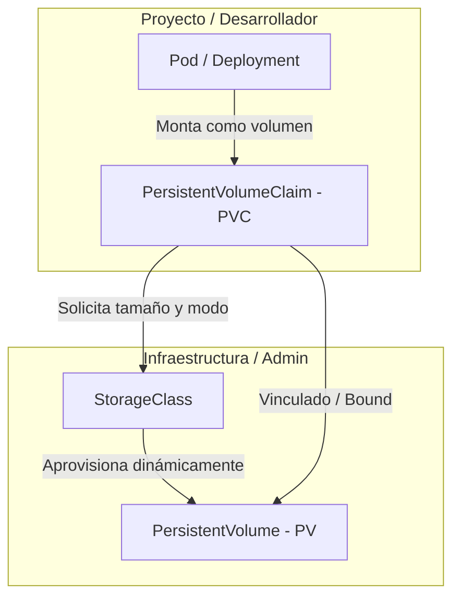
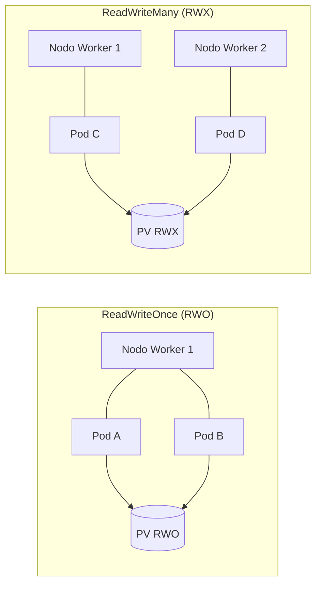

# 2.5 Almacenamiento persistente: PV, PVC y StorageClass

## Objetivos de aprendizaje

Al finalizar este apartado serás capaz de:

- Comprender la necesidad de almacenar información persistente en un entorno de contenedores efímeros.
- Diferenciar las responsabilidades de los recursos **PersistentVolume (PV)**, **PersistentVolumeClaim (PVC)** y **StorageClass**.
- Conocer los distintos modos de acceso al almacenamiento (`ReadWriteOnce`, `ReadWriteMany`, `ReadOnlyMany`) y sus limitaciones según la tecnología del `StorageClass`.
- Entender la diferencia entre provisión dinámica y provisión estática/manual (como en el caso de NFS).
- Comprender el comportamiento de la política de vinculación `WaitForFirstConsumer`.
- Identificar y prevenir el error habitual de montar un PVC en una ruta distinta a la de los datos reales de la aplicación.
- Añadir almacenamiento persistente a una base de datos mediante la práctica paso a paso, simular la eliminación del Pod y verificar la persistencia de la información.

---

## Conceptos fundamentales: PV, PVC y StorageClass

En Kubernetes y OpenShift, el ciclo de vida de los contenedores es efímero por naturaleza. Cuando un Pod se reinicia, se escala hacia abajo o se desplaza a otro nodo worker, cualquier dato escrito en su sistema de archivos local se destruye. Para aquellas aplicaciones que requieren conservar información a lo largo del tiempo (bases de datos, gestores documentales, repositorios de archivos), la plataforma proporciona una abstracción de almacenamiento persistente desacoplada del ciclo de vida del contenedor.

La gestión de almacenamiento en OpenShift separa las responsabilidades de infraestructura (administración de discos) de las necesidades de desarrollo (consumo de almacenamiento) mediante tres recursos principales:

### PersistentVolume (PV)
Es la representación de un recurso de almacenamiento físico o de red dentro del clúster. Algunos ejemplos habituales son:

* Volúmenes de infraestructura cloud (AWS EBS, Azure Disk, Google Persistent Disk).
* Almacenamiento en entornos virtualizados corporativos (volúmenes **vSphere First Class Disk / VMware CNS**).
* Discos o almacenamiento en red tradicional (LUNs de SAN, recursos compartidos NFS o volúmenes Ceph/ODF).

Es un recurso a nivel de clúster (no pertenece a ningún namespace en particular) y es administrado por el equipo de operaciones o provisionado automáticamente por el clúster.

### PersistentVolumeClaim (PVC)
Es la solicitud o petición de almacenamiento realizada por un usuario o aplicación dentro de un namespace concreto.

* Es un recurso de ámbito de proyecto (namespace).
* Especifica los requerimientos necesarios: tamaño (ej. `1Gi`) y modo de acceso (ej. `ReadWriteOnce` o `ReadWriteMany`).
* Funciona de forma análoga a un Pod: así como un Pod consume recursos de CPU y memoria del nodo, un PVC consume un PV del almacenamiento disponible.

### StorageClass (SC)
Es el mecanismo que permite la **provisión dinámica** de almacenamiento. Define el tipo de almacenamiento (SSD de alto rendimiento, vSphere Datastore, almacenamiento en red, etc.) y el *provisioner* encargado de interactuar con la infraestructura subyacente para crear el volumen físico bajo demanda cuando un desarrollador crea un PVC.

!!! tip "Provisión estática vs. Provisión dinámica (El caso de NFS)"
    Hoy en día, en entornos Cloud o virtualizados con VMware vSphere, los `StorageClass` permiten que la provisión sea **completamente dinámica**: creas un `PVC` y la plataforma crea el volumen `PV` automáticamente en la cabina o nube.

    Sin embargo, en protocolos de red tradicionales como **NFS**, la provisión suele ser **estática**: no existe una API nativa en el servidor NFS para crear carpetas/exportaciones bajo demanda. En estos casos, un administrador de almacenamiento debe crear previamente las carpetas NFS y definir manualmente los objetos `PersistentVolume` (PV) en el clúster antes de que los desarrolladores puedan vincular sus `PVC`.

---

## Modos de acceso al almacenamiento

Al solicitar un PVC, se debe especificar cómo se conectará el volumen a las cargas de trabajo. OpenShift admite tres modos de acceso principales:

| Modo de acceso | Nombre en manifiesto | Descripción | Casos de uso típicos |
| :--- | :--- | :--- | :--- |
| **ReadWriteOnce** | `ReadWriteOnce` (RWO) | El volumen puede ser montado en modo lectura-escritura por los Pods de **un único nodo worker**. | Bases de datos (PostgreSQL, MySQL), caches locales. |
| **ReadWriteMany** | `ReadWriteMany` (RWX) | El volumen puede ser montado en modo lectura-escritura por **múltiples Pods simultáneamente**, incluso en distintos nodos. | CMS multinstancia (WordPress), repositorios compartidos (NFS/CephFS). |
| **ReadOnlyMany** | `ReadOnlyMany` (ROX) | El volumen puede ser montado en modo solo lectura por **múltiples Pods** distribuidos en varios nodos. | Servidores web compartiendo contenido estático, distribución de binarios/modelos de IA. |

!!! warning "Limitación física del StorageClass según el modo de acceso"
    El hecho de que puedas solicitar `ReadWriteMany` (RWX) en el YAML de un PVC no garantiza que el clúster pueda aprovisionarlo. El modo de acceso está **estrictamente condicionado por la tecnología de almacenamiento subyacente**:

    * **StorageClasses basados en Bloques (AWS EBS, Azure Disk, vSphere FCD):** Solo admiten **RWO**. Si solicitas un PVC RWX sobre estas clases, se quedará indefinidamente en estado `Pending` con un error de provisión.
    * **StorageClasses basados en Sistemas de Archivos / Red (NFS, AWS EFS, CephFS, OpenShift Data Foundation):** Admiten **RWO y RWX**.

### ¿Qué ocurre si mi recurso utiliza un PVC RWO y escala o se ubica en distintos nodos?

Cualquier carga de trabajo que consuma un PVC con almacenamiento `ReadWriteOnce` (RWO) está sujeta a restricciones de programación y concurrencia:

1. **RWO no limita por Pod, sino por Nodo:** Varios Pods situados en el **mismo nodo worker** pueden montar el mismo volumen RWO. Sin embargo, en bases de datos esto genera un problema grave a nivel de aplicación: múltiples instancias intentando escribir concurrentemente en los mismos archivos provocan corrupciones y bloqueos de ficheros.
2. **Conflicto en múltiples nodos:** Si el *scheduler* ubica instancias de la aplicación en nodos distintos intentando reutilizar el mismo PVC RWO, los nuevos Pods quedarán en estado **`Pending`** con el error `Multi-Attach error for volume`, ya que la infraestructura bloquea la conexión del disco a más de un nodo físico a la vez.

!!! tip "¿Cómo se gestiona el escalado en aplicaciones con estado?"
    * Para desplegar aplicaciones o bases de datos con réplicas utilizando almacenamiento RWO, **no se utiliza un solo Deployment compartiendo un PVC**.
    * En su lugar, se utiliza un **`StatefulSet`**. El `StatefulSet` utiliza una plantilla (`volumeClaimTemplates`) que aprovisiona **un PVC RWO independiente e individual para cada réplica** (`data-db-0`, `data-db-1`, `data-db-2`), permitiendo que cada Pod tenga su propio volumen dedicado sin conflictos.

---

## El comportamiento `WaitForFirstConsumer`

En muchos clústeres de OpenShift, las clases de almacenamiento están configuradas con la política de vinculación retrasada `volumeBindingMode: WaitForFirstConsumer`.

Cuando esta opción está activa, ocurre el siguiente flujo:

1. El usuario crea el `PVC