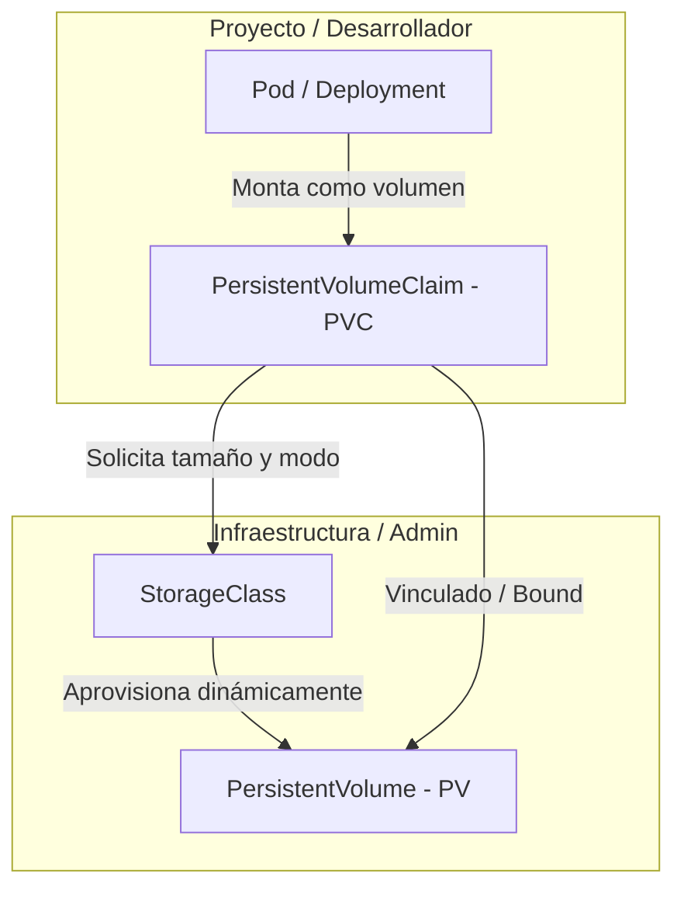
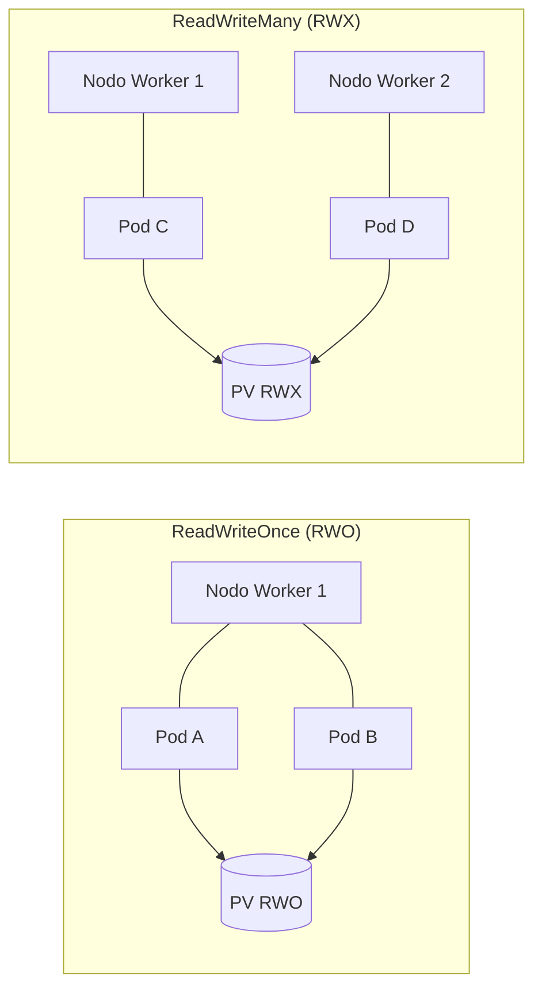
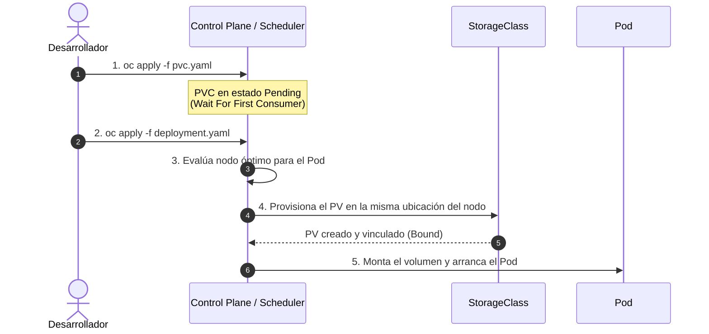
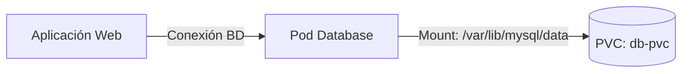

# 2.5 Almacenamiento persistente: PV, PVC y StorageClass

## Objetivos de aprendizaje

Al finalizar este apartado serás capaz de:

- Comprender la necesidad de almacenar información persistente en un entorno de contenedores efímeros[cite: 1].
- Diferenciar las responsabilidades de los recursos **PersistentVolume (PV)**, **PersistentVolumeClaim (PVC)** y **StorageClass**[cite: 1].
- Conocer los distintos modos de acceso al almacenamiento (`ReadWriteOnce`, `ReadWriteMany`, `ReadOnlyMany`) y su impacto en las estrategias de despliegue[cite: 1, 3].
- Comprender el comportamiento de la política de vinculación `WaitForFirstConsumer`[cite: 1].
- Identificar y diagnosticar el problema habitual de montar un PVC en una ruta distinta a la de los datos reales del contenedor[cite: 1].
- Añadir almacenamiento persistente a un despliegue de base de datos, simular un fallo en el Pod y comprobar la persistencia de la información[cite: 1].

---

## Conceptos fundamentales: PV, PVC y StorageClass

En Kubernetes y OpenShift, el ciclo de vida de los contenedores es efímero por naturaleza[cite: 1]. Cuando un Pod se reinicia, se escala hacia abajo o se desplaza a otro nodo worker, cualquier dato escrito en su sistema de archivos local se destruye[cite: 1]. Para aquellas aplicaciones que requieren conservar información a lo largo del tiempo (bases de datos, gestores documentales, repositorios de archivos), la plataforma proporciona una abstracción de almacenamiento persistente desacoplada del ciclo de vida del contenedor[cite: 1].

La gestión de almacenamiento en OpenShift separa las responsabilidades de infraestructura (administración de discos) de las necesidades de desarrollo (consumo de almacenamiento) mediante tres recursos principales[cite: 1]:



### PersistentVolume (PV)
Es la representación de un recurso de almacenamiento físico o de red dentro del clúster (por ejemplo, un volumen AWS EBS, un disco Azure Disk, una LUN de SAN o un recurso compartido NFS)[cite: 1]. 
* Es un recurso a nivel de clúster (no pertenece a ningún namespace en particular)[cite: 1].
* Es administrado por el equipo de operaciones o provisionado automáticamente por el clúster[cite: 1].

### PersistentVolumeClaim (PVC)
Es la solicitud o petición de almacenamiento realizada por un usuario o aplicación dentro de un namespace concreto[cite: 1].
* Es un recurso de ámbito de proyecto (namespace)[cite: 1].
* Especifica los requerimientos necesarios: tamaño (ej. `1Gi`) y modo de acceso (ej. `ReadWriteOnce`)[cite: 1].
* Funciona de forma análoga a un Pod: así como un Pod consume recursos de CPU y memoria del nodo, un PVC consume un PV del almacenamiento disponible[cite: 1].

### StorageClass (SC)
Es el mecanismo que permite la **provisión dinámica** de almacenamiento[cite: 1]. Define el tipo de almacenamiento (SSD de alto rendimiento, disco magnético estándar, almacenamiento en red, etc.) y el *provisioner* encargado de hablar con la infraestructura subyacente para crear el volumen físico bajo demanda cuando un desarrollador crea un PVC[cite: 1].

!!! tip "Provisión estática vs. Provisión dinámica"
    En los inicios de Kubernetes, los administradores debían crear previamente los `PersistentVolume` a mano (provisión estática)[cite: 1]. Hoy en día, gracias a los `StorageClass`, la provisión es completamente dinámica: cuando creas un `PVC`, el clúster habla con la infraestructura cloud o de almacenamiento local y crea el `PV` automáticamente[cite: 1].

---

## Modos de acceso al almacenamiento

Al solicitar un PVC, se debe especificar cómo se conectará el volumen a las cargas de trabajo[cite: 1]. OpenShift admite tres modos de acceso principales[cite: 1]:

| Modo de acceso | Nombre en manifiesto | Descripción | Casos de uso típicos |
| :--- | :--- | :--- | :--- |
| **ReadWriteOnce** | `ReadWriteOnce` (RWO) | El volumen puede ser montado en modo lectura-escritura por los Pods de **un único nodo worker**[cite: 1, 3]. | Bases de datos (PostgreSQL, MySQL), caches locales[cite: 1, 3]. |
| **ReadWriteMany** | `ReadWriteMany` (RWX) | El volumen puede ser montado en modo lectura-escritura por **múltiples Pods simultáneamente**, incluso en distintos nodos[cite: 1]. | CMS multinstancia (WordPress), repositorios compartidos (NFS/CephFS)[cite: 1]. |
| **ReadOnlyMany** | `ReadOnlyMany` (ROX) | El volumen puede ser montado en modo solo lectura por **múltiples Pods** distribuidos en varios nodos[cite: 1]. | Servidores web compartiendo contenido estático, distribución de binarios/modelos de IA[cite: 1]. |



!!! warning "Relación con las estrategias de despliegue"
    Tal y como se vio en el apartado 2.1, si un `Deployment` utiliza almacenamiento `ReadWriteOnce` (RWO) y tiene la estrategia de despliegue configurada en `RollingUpdate`, el proceso de actualización puede bloquearse: el Pod nuevo no podrá arrancar en un nodo diferente porque el almacenamiento está asignado al Pod antiguo[cite: 1, 3]. Por este motivo, la gran mayoría de las cargas con PVC RWO requieren el uso de la estrategia `Recreate`[cite: 1, 3].

---

## El comportamiento `WaitForFirstConsumer`

En entornos con provisión dinámica de almacenamiento en la nube o en zonas de disponibilidad distribuidas, la creación inmediata del volumen físico puede ser un problema[cite: 1].

Cuando un `StorageClass` utiliza la política de vinculación `volumeBindingMode: WaitForFirstConsumer`, ocurre lo siguiente[cite: 1]:

1. El usuario crea el `PVC`[cite: 1].
2. Kubernetes **no asigna ni provisiona el volumen físico inmediatamente**; el PVC permanece en estado `Pending`[cite: 1].
3. Kubernetes espera a que se cree un `Pod` que haga referencia a ese `PVC`[cite: 1].
4. El *scheduler* analiza en qué nodo/zona del clúster conviene ejecutar ese Pod según sus recursos disponibles (CPU, Memoria, tolerancias)[cite: 1].
5. Una vez elegido el nodo destino, la plataforma crea y conecta el volumen físico exactamente en la misma zona o cabina accesible por dicho nodo[cite: 1].
6. El PVC pasa al estado `Bound` y el Pod arranca correctamente[cite: 1].



!!! note "¿Por qué es importante este comportamiento?"
    Evita que un volumen se provisione en la Zona de Disponibilidad A cuando el Pod que lo necesita termina agendado en la Zona de Disponibilidad B debido a restricciones de capacidad, lo que provocaría fallos de montaje por incompatibilidad geográfica[cite: 1].

---

## Errores habituales: El PVC montado en la ruta incorrecta

Uno de los errores más comunes al añadir almacenamiento persistente a una aplicación o base de datos es montar el volumen en un directorio distinto del que la aplicación realmente utiliza para guardar sus datos[cite: 1].

### ¿Qué sucede en este escenario?

```mermaid
flowchart TD
    subgraph Pod Container
        FS[/]
        DataDir[/var/lib/mysql/data<br/>Directorio real de datos]
        WrongMount[/mnt/storage<br/>Ruta donde se montó el PVC]
    end

    PVC[(PVC Persistente)]
    PVC == Montado en ==> WrongMount
    DataDir -. Escribe datos aquí .-> FS
```

1. La aplicación (ej. una base de datos MySQL) arranca y escribe su información interna en la ruta estandarizada del proceso (por ejemplo `/var/lib/mysql/data`)[cite: 1].
2. El desarrollador configura un `PVC` y lo monta dentro del contenedor en `/mnt/storage` pensando que con ello la aplicación ya es persistente[cite: 1].
3. Todo parece funcionar correctamente de inicio[cite: 1].
4. Cuando el Pod se borra o se reinicia, **se pierden los datos**[cite: 1].

### Diagnóstico de la causa raíz
Al no coincidir la ruta de datos real de la imagen del contenedor con el `mountPath` del PVC, la aplicación estuvo escribiendo los datos en el almacenamiento efímero del propio Pod y no dentro del volumen persistente externo[cite: 1].

!!! warning "Comprobación clave antes de montar un volumen"
    Inspecciona siempre la documentación de la imagen del contenedor o revisa las variables de entorno de la imagen (`DATADIR`, `PGDATA`, `MYSQL_DATA_DIR`, etc.) para asegurarte de que el `mountPath` dentro del `volumeMounts` apunta con precisión milimétrica a la ruta de datos activa[cite: 1].

---

## Práctica N4: Añadir almacenamiento persistente a una base de datos y verificar la persistencia

A lo largo de las sesiones anteriores hemos gestionado componentes de nuestra arquitectura[cite: 2]. Ahora le añadiremos una base de datos con almacenamiento persistente montado en la ruta de datos correcta, guardaremos datos, eliminaremos el Pod de la base de datos y verificaremos que la información sobrevive[cite: 1].



### Paso 1: Explorar los StorageClasses disponibles en el clúster

Antes de solicitar un PVC, consultamos las clases de almacenamiento disponibles en el clúster de OpenShift[cite: 1]:

```bash
oc get storageclass
```

Resultado esperado:
```text
NAME                         PROVISIONER                             RECLAIMPOLICY   VOLUMEBINDINGMODE      ALLOWVOLUMEEXPANSION   AGE
gp3-csi (default)            topolvm.io                              Delete          WaitForFirstConsumer   true                   30d
```

### Paso 2: Crear la solicitud de volumen (PVC)

Crearemos un archivo denominado `db-pvc.yaml` especificando una petición de 1 GiB de almacenamiento con modo de acceso `ReadWriteOnce`[cite: 1].

```yaml
apiVersion: v1
kind: PersistentVolumeClaim
metadata:
  name: db-pvc
spec:
  accessModes:
    - ReadWriteOnce
  resources:
    requests:
      storage: 1Gi
```

Aplicamos el manifiesto en nuestro proyecto[cite: 1]:

```bash
oc apply -f db-pvc.yaml
```

Verificamos el estado del PVC[cite: 1]:

```bash
oc get pvc db-pvc
```

Resultado esperado:
```text
NAME     STATUS    VOLUME   CAPACITY   ACCESS MODES   STORAGECLASS   AGE
db-pvc   Pending                                      gp3-csi        5s
```

!!! note "Análisis del estado Pending"
    El estado `Pending` es el comportamiento esperado en clases de almacenamiento configuradas con `WaitForFirstConsumer`[cite: 1]. Permanecerá en este estado hasta que despleguemos el Pod que utilizará este volumen[cite: 1].

---

### Paso 3: Desplegar la base de datos montando el PVC en la ruta correcta de datos

A continuación crearemos un despliegue de base de datos MySQL[cite: 1]. Esta imagen almacena sus tablas y datos dentro del directorio `/var/lib/mysql/data`[cite: 1].

Guardamos la definición en el archivo `db-deployment.yaml`[cite: 1]:

```yaml
apiVersion: apps/v1
kind: Deployment
metadata:
  name: db-mysql
  labels:
    app: db-mysql
spec:
  replicas: 1
  strategy:
    type: Recreate
  selector:
    matchLabels:
      app: db-mysql
  template:
    metadata:
      labels:
        app: db-mysql
    spec:
      containers:
      - name: mysql
        image: registry.redhat.io/rhel9/mysql-80:latest
        env:
        - name: MYSQL_USER
          value: "user_curso"
        - name: MYSQL_PASSWORD
          value: "password123"
        - name: MYSQL_DATABASE
          value: "mibase"
        ports:
        - containerPort: 3306
          name: mysql
        volumeMounts:
        - name: db-data
          mountPath: /var/lib/mysql/data
      volumes:
      - name: db-data
        persistentVolumeClaim:
          claimName: db-pvc
```

Aplicamos el manifiesto[cite: 1]:

```bash
oc apply -f db-deployment.yaml
```

---

### Paso 4: Comprobar la vinculación del PVC y la creación del PV

Una vez creado el Pod, la plataforma evalúa la solicitud y aprovisiona el volumen físico[cite: 1]. Comprobamos de nuevo el PVC[cite: 1]:

```bash
oc get pvc db-pvc
```

Resultado esperado:
```text
NAME     STATUS   VOLUME                                     CAPACITY   ACCESS MODES   STORAGECLASS   AGE
db-pvc   Bound    pvc-8f2a1b9c-4d3e-4f5a-9b1c-2d3e4f5a6b7c   1Gi        RWO            gp3-csi        1m
```

Observamos que el PVC ha cambiado a estado **`Bound`** y se le ha asignado dinámicamente un `PersistentVolume` (`pvc-8f2a1b9c...`)[cite: 1].

---

### Paso 5: Insertar datos de prueba en la base de datos

Obtenemos el nombre del Pod de la base de datos en ejecución[cite: 1]:

```bash
oc get pods -l app=db-mysql
```

Resultado esperado:
```text
NAME                        READY   STATUS    RESTARTS   AGE
db-mysql-7c85885c49-x2b8z   1/1     Running   0          45s
```

Accedemos mediante `oc exec` al cliente MySQL dentro del Pod y creamos una tabla con un registro de prueba[cite: 1, 2]:

```bash
oc exec deployment/db-mysql -- mysql -u user_curso -ppassword123 mibase -e \
  "CREATE TABLE notas (id INT AUTO_INCREMENT PRIMARY KEY, texto VARCHAR(255)); \
   INSERT INTO notas (texto) VALUES ('Dato persistente introducido en la prueba N4');"
```

Verificamos que el registro ha sido insertado correctamente[cite: 1]:

```bash
oc exec deployment/db-mysql -- mysql -u user_curso -ppassword123 mibase -e \
  "SELECT * FROM notas;"
```

Resultado esperado:
```text
+----+----------------------------------------------+
| id | texto                                        |
+----+----------------------------------------------+
|  1 | Dato persistente introducido en la prueba N4 |
+----+----------------------------------------------+
```

---

### Paso 6: Prueba de destrucción y verificación de la persistencia

Para demostrar el concepto de almacenamiento persistente, forzaremos la eliminación del Pod activo simulando un fallo de hardware en el nodo o una caída del contenedor[cite: 1].

Eliminamos el Pod de la base de datos de manera explícita[cite: 1]:

```bash
oc delete pod -l app=db-mysql
```

Resultado esperado:
```text
pod "db-mysql-7c85885c49-x2b8z" deleted
```

El controlador del `Deployment` detectará de inmediato la ausencia del Pod y creará automáticamente una nueva instancia de sustitución[cite: 1]. Esperamos unos segundos a que el nuevo Pod alcance el estado `Running`[cite: 1]:

```bash
oc get pods -l app=db-mysql -w
```

Resultado esperado:
```text
NAME                        READY   STATUS    RESTARTS   AGE
db-mysql-7c85885c49-k9w7p   1/1     Running   0          12s
```

Verificamos que el nuevo Pod (con un nombre e identificador completamente diferente) ha vuelto a montar el PVC existente y que la información guardada antes del borrado continúa intacta[cite: 1]:

```bash
oc exec deployment/db-mysql -- mysql -u user_curso -ppassword123 mibase -e \
  "SELECT * FROM notas;"
```

Criterio de aceptación:
```text
+----+----------------------------------------------+
| id | texto                                        |
+----+----------------------------------------------+
|  1 | Dato persistente introducido en la prueba N4 |
+----+----------------------------------------------+
```

El registro permanece intacto en la base de datos[cite: 1]. Los datos han sobrevivido a la destrucción completa del Pod gracias a que el PVC estaba montado correctamente en la ruta `/var/lib/mysql/data