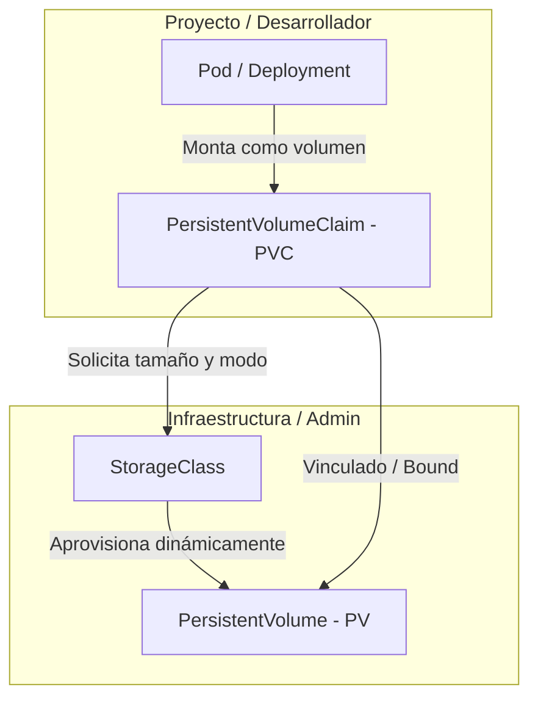
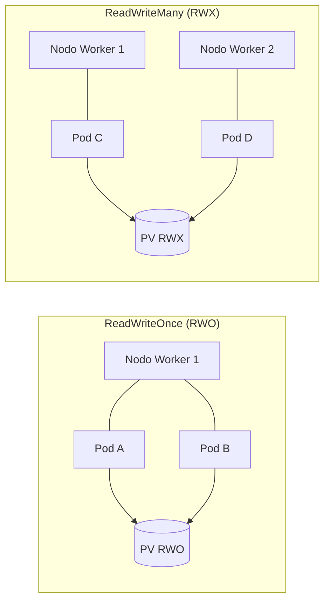
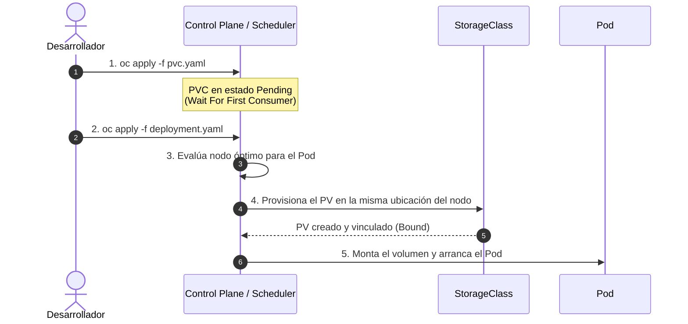
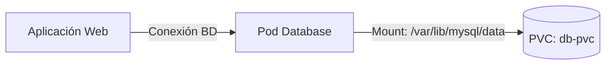

# 2.5 Almacenamiento persistente: PV, PVC y StorageClass

## Objetivos de aprendizaje

Al finalizar este apartado serás capaz de:

- Comprender la necesidad de almacenar información persistente en un entorno de contenedores efímeros.
- Diferenciar las responsabilidades de los recursos **PersistentVolume (PV)**, **PersistentVolumeClaim (PVC)** y **StorageClass**.
- Conocer los distintos modos de acceso al almacenamiento (`ReadWriteOnce`, `ReadWriteMany`, `ReadOnlyMany`) y sus limitaciones según la tecnología del `StorageClass`.
- Entender la diferencia entre provisión dinámica y provisión estática/manual (como en el caso de NFS).
- Comprender el comportamiento de la política de vinculación `WaitForFirstConsumer`.
- Identificar y prevenir el error habitual de montar un PVC en una ruta distinta a la de los datos reales de la aplicación.
- Añadir almacenamiento persistente a una base de datos mediante la práctica N4, simular la eliminación del Pod y verificar la persistencia de la información.

---

## Conceptos fundamentales: PV, PVC y StorageClass

En Kubernetes y OpenShift, el ciclo de vida de los contenedores es efímero por naturaleza. Cuando un Pod se reinicia, se escala hacia abajo o se desplaza a otro nodo worker, cualquier dato escrito en su sistema de archivos local se destruye. Para aquellas aplicaciones que requieren conservar información a lo largo del tiempo (bases de datos, gestores documentales, repositorios de archivos), la plataforma proporciona una abstracción de almacenamiento persistente desacoplada del ciclo de vida del contenedor.

La gestión de almacenamiento en OpenShift separa las responsabilidades de infraestructura (administración de discos) de las necesidades de desarrollo (consumo de almacenamiento) mediante tres recursos principales:



### PersistentVolume (PV)
Es la representación de un recurso de almacenamiento físico o de red dentro del clúster. Algunos ejemplos habituales son:

* Volúmenes de infraestructura cloud (AWS EBS, Azure Disk, Google Persistent Disk).
* Almacenamiento en entornos virtualizados corporativos (volúmenes **vSphere First Class Disk / VMware CNS**).
* Discos o almacenamiento en red tradicional (LUNs de SAN, recursos compartidos NFS o volúmenes Ceph/ODF).

Es un recurso a nivel de clúster (no pertenece a ningún namespace en particular) y es administrado por el equipo de operaciones o provisionado automáticamente por el clúster.

### PersistentVolumeClaim (PVC)
Es la solicitud o petición de almacenamiento realizada por un usuario o aplicación dentro de un namespace concreto.

* Es un recurso de ámbito de proyecto (namespace).
* Especifica los requerimientos necesarios: tamaño (ej. `1Gi`) y modo de acceso (ej. `ReadWriteOnce`).
* Funciona de forma análoga a un Pod: así como un Pod consume recursos de CPU y memoria del nodo, un PVC consume un PV del almacenamiento disponible.

### StorageClass (SC)
Es el mecanismo que permite la **provisión dinámica** de almacenamiento. Define el tipo de almacenamiento (SSD de alto rendimiento, vSphere Datastore, almacenamiento en red, etc.) y el *provisioner* encargado de interactuar con la infraestructura subyacente para crear el volumen físico bajo demanda cuando un desarrollador crea un PVC.

!!! tip "Provisión estática vs. Provisión dinámica (El caso de NFS)"
    Hoy en día, en entornos Cloud o virtualizados con VMware vSphere, los `StorageClass` permiten que la provisión sea **completamente dinámica**: creas un `PVC` y la plataforma crea el volumen `PV` automáticamente en la cabina o nube.

    Sin embargo, en protocolos de red tradicionales como **NFS**, la provisión suele ser **estática**: no existe una API nativa en el servidor NFS para crear carpetas/exportaciones bajo demanda. En estos casos, un administrador de almacenamiento debe crear previamente las carpetas NFS y definir manualmente los objetos `PersistentVolume` (PV) en el clúster antes de que los desarrolladores puedan vincular sus `PVC`.

---

## Modos de acceso al almacenamiento

Al solicitar un PVC, se debe especificar cómo se conectará el volumen a las cargas de trabajo. OpenShift admite tres modos de acceso principales:

| Modo de acceso | Nombre en manifiesto | Descripción | Casos de uso típicos |
| :--- | :--- | :--- | :--- |
| **ReadWriteOnce** | `ReadWriteOnce` (RWO) | El volumen puede ser montado en modo lectura-escritura por los Pods de **un único nodo worker**. | Bases de datos (PostgreSQL, MySQL), caches locales. |
| **ReadWriteMany** | `ReadWriteMany` (RWX) | El volumen puede ser montado en modo lectura-escritura por **múltiples Pods simultáneamente**, incluso en distintos nodos. | CMS multinstancia (WordPress), repositorios compartidos (NFS/CephFS). |
| **ReadOnlyMany** | `ReadOnlyMany` (ROX) | El volumen puede ser montado en modo solo lectura por **múltiples Pods** distribuidos en varios nodos. | Servidores web compartiendo contenido estático, distribución de binarios/modelos de IA. |



!!! warning "Limitación física del StorageClass según el modo de acceso"
    El hecho de que puedas solicitar `ReadWriteMany` (RWX) en el YAML de un PVC no garantiza que el clúster pueda aprovisionarlo. El modo de acceso está **estrictamente condicionado por la tecnología de almacenamiento subyacente**:

    * **StorageClasses basados en Bloques (AWS EBS, Azure Disk, vSphere FCD):** Solo admiten **RWO**. Si solicitas un PVC RWX sobre estas clases, se quedará indefinidamente en estado `Pending` con un error de provisión.
    * **StorageClasses basados en Sistemas de Archivos / Red (NFS, CephFS, OpenShift Data Foundation):** Admiten **RWO y RWX**.

### ¿Qué ocurre si mi recurso utiliza un PVC RWO y escala o se ubica en distintos nodos?

Cualquier carga de trabajo que consuma un PVC con almacenamiento `ReadWriteOnce` (RWO) está sujeta a restricciones de programación y concurrencia:

1. **RWO no limita por Pod, sino por Nodo:** Varios Pods situados en el **mismo nodo worker** pueden montar el mismo volumen RWO. Sin embargo, en bases de datos o aplicaciones con estado esto genera un problema grave a nivel de aplicación: múltiples instancias intentando escribir concurrentemente en los mismos archivos provocal corrupciones y bloqueos de ficheros.
2. **Conflicto en múltiples nodos:** Si el *scheduler* ubica instancias de la aplicación en nodos distintos intentando reutilizar el mismo PVC RWO, los nuevos Pods quedarán en estado **`Pending`** con el error `Multi-Attach error for volume`, ya que la infraestructura bloquea la conexión del disco a más de un nodo físico a la vez.

!!! tip "¿Cómo se gestiona el escalado en aplicaciones con estado?"
    * Para desplegar aplicaciones o bases de datos con réplicas utilizando almacenamiento RWO, **no se utiliza un solo Deployment compartiendo un PVC**.
    * En su lugar, se utiliza un **`StatefulSet`**. El `StatefulSet` utiliza una plantilla (`volumeClaimTemplates`) que aprovisiona **un PVC RWO independiente e individual para cada réplica** (`data-db-0`, `data-db-1`, `data-db-2`), permitiendo que cada Pod tenga su propio volumen dedicado sin conflictos.

---

## El comportamiento `WaitForFirstConsumer`

En entornos con provisión dinámica de almacenamiento en la nube o en zonas de disponibilidad distribuidas, la creación inmediata del volumen físico puede ser un problema.

Cuando un `StorageClass` utiliza la política de vinculación `volumeBindingMode: WaitForFirstConsumer`, ocurre lo siguiente:

1. El usuario crea el `PVC`.
2. Kubernetes **no asigna ni provisiona el volumen físico inmediatamente**; el PVC permanece en estado `Pending`.
3. Kubernetes espera a que se cree un `Pod` que haga referencia a ese `PVC`.
4. El *scheduler* analiza en qué nodo/zona del clúster conviene ejecutar ese Pod según sus recursos disponibles (CPU, Memoria, tolerancias).
5. Una vez elegido el nodo destino, la plataforma crea y conecta el volumen físico exactamente en la misma zona o cabina accesible por dicho nodo.
6. El PVC pasa al estado `Bound` y el Pod arranca correctamente.



!!! note "¿Por qué es importante este comportamiento?"
    Evita que un volumen se provisione en la Zona de Disponibilidad A cuando el Pod que lo necesita termina agendado en la Zona de Disponibilidad B debido a restricciones de capacidad, lo que provocaría fallos de montaje por incompatibilidad geográfica.

---

## Práctica N4: Añadir almacenamiento persistente a una base de datos y verificar la persistencia

A lo largo de las sesiones anteriores hemos gestionado componentes de nuestra arquitectura. Ahora le añadiremos una base de datos MySQL con almacenamiento persistente, guardaremos información, eliminaremos el Pod de la base de datos y verificaremos que los datos sobreviven.



### Paso 1: Explorar los StorageClasses disponibles en el clúster

Antes de solicitar un PVC, consultamos las clases de almacenamiento disponibles en el clúster de OpenShift:

```bash
oc get storageclass
```

Resultado esperado:
```text
NAME                         PROVISIONER                             RECLAIMPOLICY   VOLUMEBINDINGMODE      ALLOWVOLUMEEXPANSION   AGE
gp3-csi (default)            topolvm.io                              Delete          WaitForFirstConsumer   true                   30d
```

---

### Paso 2: Crear la solicitud de volumen (PVC)

Crearemos un archivo denominado `db-pvc.yaml` especificando una petición de 1 GiB de almacenamiento con modo de acceso `ReadWriteOnce`.

```yaml
apiVersion: v1
kind: PersistentVolumeClaim
metadata:
  name: db-pvc
spec:
  accessModes:
    - ReadWriteOnce
  resources:
    requests:
      storage: 1Gi
```

Aplicamos el manifiesto en nuestro proyecto:

```bash
oc apply -f db-pvc.yaml
```

Verificamos el estado del PVC:

```bash
oc get pvc db-pvc
```

Resultado esperado:
```text
NAME     STATUS    VOLUME   CAPACITY   ACCESS MODES   STORAGECLASS   AGE
db-pvc   Pending                                      gp3-csi        5s
```

!!! note "Análisis del estado Pending"
    El estado `Pending` es el comportamiento esperado en clases de almacenamiento configuradas con `WaitForFirstConsumer`. Permanecerá en este estado hasta que despleguemos el Pod que utilizará este volumen.

---

### Paso 3: Desplegar la base de datos montando el PVC en la ruta correcta

!!! warning "Punto crítico: El riesgo del PVC montado en la ruta incorrecta"
    Uno de los errores más comunes en Kubernetes es montar el PVC en un directorio distinto al que la aplicación realmente utiliza para escribir sus datos.

    ```mermaid
    flowchart TD
        subgraph Pod ["Pod Container"]
            FS["Sistema de Ficheros Efímero del Contenedor"]
            DataDir["/var/lib/mysql/data<br/>(Directorio real de datos)"]
            WrongMount["/mnt/storage<br/>(Ruta errónea de montaje)"]
        end

        PVC[("PersistentVolumeClaim (PVC)")]
        PVC -->|Montado en| WrongMount
        DataDir -->|Escribe datos aquí| FS
    ```

    * Si la base de datos escribe en `/var/lib/mysql/data` pero montamos el PVC en `/mnt/storage`, la aplicación funcionará de inicio, pero **estará escribiendo en el sistema efímero del Pod**. Al reiniciar o eliminar el Pod, **los datos se perderán**.
    * Siempre debes revisar la documentación de la imagen o sus variables de entorno (`DATADIR`, `PGDATA`, `MYSQL_DATA_DIR`) para ajustar el `mountPath` exactamente a la ruta activa.

Para nuestra imagen oficial (`registry.redhat.io/rhel9/mysql-80:latest`), la ruta interna de datos es `/var/lib/mysql/data`.

Guardamos la definición del despliegue en el archivo `db-deployment.yaml`:

```yaml
apiVersion: apps/v1
kind: Deployment
metadata:
  name: db-mysql
  labels:
    app: db-mysql
spec:
  replicas: 1
  strategy:
    type: Recreate
  selector:
    matchLabels:
      app: db-mysql
  template:
    metadata:
      labels:
        app: db-mysql
    spec:
      containers:
      - name: mysql
        image: registry.redhat.io/rhel9/mysql-80:latest
        env:
        - name: MYSQL_USER
          value: "user_curso"
        - name: MYSQL_PASSWORD
          value: "password123"
        - name: MYSQL_DATABASE
          value: "mibase"
        ports:
        - containerPort: 3306
          name: mysql
        volumeMounts:
        - name: db-data
          mountPath: /var/lib/mysql/data
      volumes:
      - name: db-data
        persistentVolumeClaim:
          claimName: db-pvc
```

Aplicamos el manifiesto:

```bash
oc apply -f db-deployment.yaml
```

---

### Paso 4: Comprobar la vinculación del PVC y la creación del PV

Una vez creado el Pod, la plataforma evalúa la solicitud y aprovisiona el volumen físico. Comprobamos de nuevo el PVC:

```bash
oc get pvc db-pvc
```

Resultado esperado:
```text
NAME     STATUS   VOLUME                                     CAPACITY   ACCESS MODES   STORAGECLASS   AGE
db-pvc   Bound    pvc-8f2a1b9c-4d3e-4f5a-9b1c-2d3e4f5a6b7c   1Gi        RWO            gp3-csi        1m
```

Observamos que el PVC ha cambiado a estado **`Bound`** y se le ha asignado dinámicamente un `PersistentVolume` (`pvc-8f2a1b9c...`).

---

### Paso 5: Insertar datos de prueba en la base de datos

Obtenemos el nombre del Pod de la base de datos en ejecución:

```bash
oc get pods -l app=db-mysql
```

Resultado esperado:
```text
NAME                        READY   STATUS    RESTARTS   AGE
db-mysql-7c85885c49-x2b8z   1/1     Running   0          45s
```

Accedemos mediante `oc exec` al cliente MySQL dentro del Pod y creamos una tabla con un registro de prueba:

```bash
oc exec deployment/db-mysql -- mysql -u user_curso -ppassword123 mibase -e \
  "CREATE TABLE notas (id INT AUTO_INCREMENT PRIMARY KEY, texto VARCHAR(255)); \
   INSERT INTO notas (texto) VALUES ('Dato persistente introducido en la prueba N4');"
```

Verificamos que el registro ha sido insertado correctamente:

```bash
oc exec deployment/db-mysql -- mysql -u user_curso -ppassword123 mibase -e \
  "SELECT * FROM notas;"
```

Resultado esperado:
```text
+----+----------------------------------------------+
| id | texto                                        |
+----+----------------------------------------------+
|  1 | Dato persistente introducido en la prueba N4 |
+----+----------------------------------------------+
```

---

### Paso 6: Prueba de destrucción y verificación de la persistencia

Para demostrar el concepto de almacenamiento persistente, forzaremos la eliminación del Pod activo simulando un fallo de hardware en el nodo o una caída del contenedor.

Eliminamos el Pod de la base de datos de manera explícita:

```bash
oc delete pod -l app=db-mysql
```

Resultado esperado:
```text
pod "db-mysql-7c85885c49-x2b8z" deleted
```

El controlador del `Deployment` detectará de inmediato la ausencia del Pod y creará automáticamente una nueva instancia de sustitución. Esperamos unos segundos a que el nuevo Pod alcance el estado `Running`:

```bash
oc get pods -l app=db-mysql -w
```

Resultado esperado:
```text
NAME                        READY   STATUS    RESTARTS   AGE
db-mysql-7c85885c49-k9w7p   1/1     Running   0          12s
```

Verificamos que el nuevo Pod (con un nombre e identificador completamente diferente) ha vuelto a montar el PVC existente y que la información guardada antes del borrado continúa intacta:

```bash
oc exec deployment/db-mysql -- mysql -u user_curso -ppassword123 mibase -e \
  "SELECT * FROM notas;"
```

Resultado esperado:
```text
+----+----------------------------------------------+
| id | texto                                        |
+----+----------------------------------------------+
|  1 | Dato persistente introducido en la prueba N4 |
+----+----------------------------------------------+
```

El registro permanece intacto en la base de datos. Los datos han sobrevivido a la destrucción completa del Pod gracias a que el PVC estaba montado correctamente en la ruta `/var/lib/mysql/data`.

---

## Ideas clave para recordar

!!! tip "Resumen"
    * Los **Pods son efímeros**; los datos almacenados en su sistema de archivos local se destruyen al reiniciarse o destruirse el contenedor.
    * Un **PersistentVolumeClaim (PVC)** es la solicitud de almacenamiento efectuada desde el espacio de nombres del desarrollador.
    * Un **PersistentVolume (PV)** es la representación física/red del disco gestionada por la plataforma.
    * Un **StorageClass (SC)** define los parámetros de provisión dinámica del almacenamiento (disponible en clouds y vSphere, mientras que soluciones como NFS suelen requerir provisión estática/manual).
    * El **modo de acceso** (RWO, RWX) está limitado por la infraestructura subyacente del `StorageClass`. Los discos de bloque (AWS EBS, vSphere) solo permiten RWO.
    * Para escalar aplicaciones o bases de datos multinstancia con almacenamiento RWO se utiliza **StatefulSet** con un PVC por cada réplica.
    * La política **`WaitForFirstConsumer`** retrasa la provisión física del volumen hasta que un Pod es agendado, garantizando que el almacenamiento y el nodo se encuentren en la misma ubicación geográfica/infraestructura.
    * Asegúrate siempre de que el parámetro `mountPath` coincida exactamente con la **ruta de datos real de la aplicación**. Si el PVC se monta en la ruta equivocada, los datos se escribirán en el almacenamiento efímero local del Pod y se perderán.