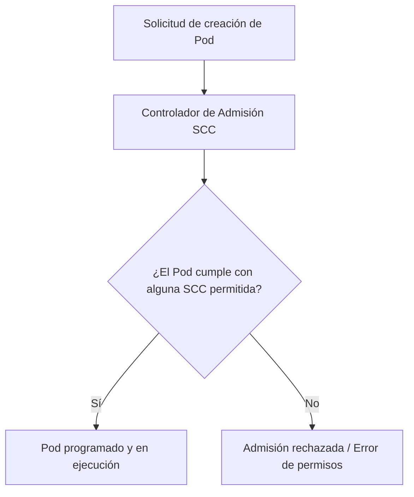
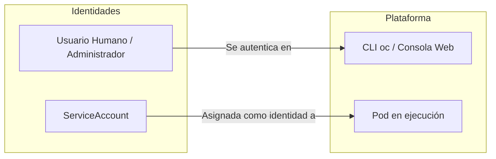
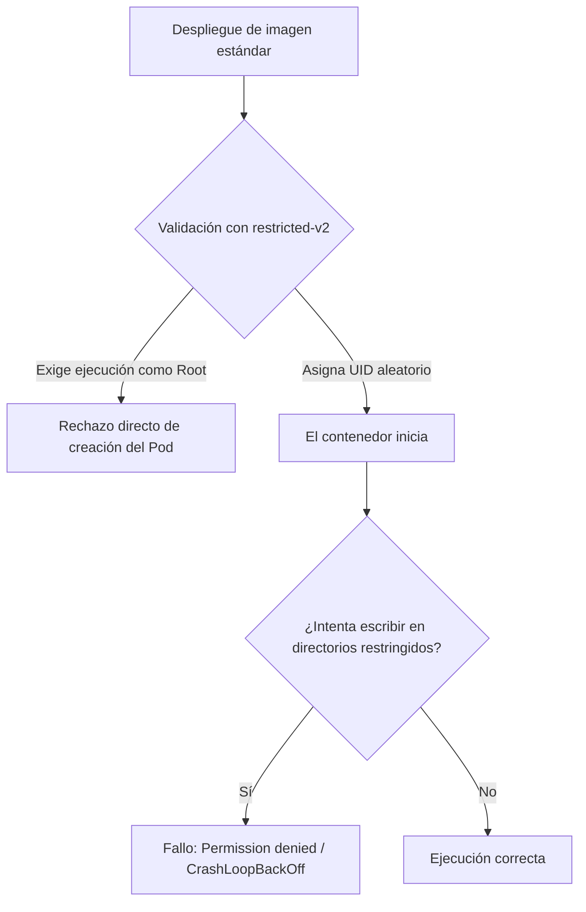
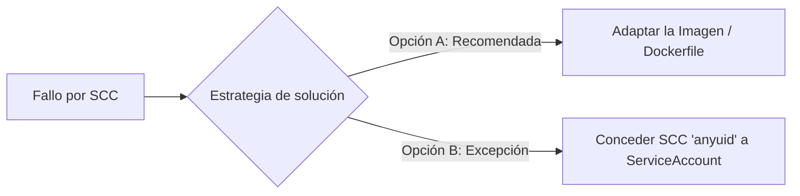

# 2.6 Políticas de seguridad de la plataforma (SCC)

#### Objetivos de aprendizaje

Al finalizar este apartado serás capaz de:

* Comprender qué es una Security Context Constraint (SCC) y por qué OpenShift la utiliza para garantizar la seguridad del clúster.
* Conocer el catálogo de SCCs predefinidas que incluye OpenShift por defecto.
* Identificar las restricciones de la política predeterminada `restricted-v2`: asignación arbitraria de UID, uso del grupo 0 y bloqueo de escalada de privilegios.
* Entender qué es una **ServiceAccount** (Cuenta de Servicio) y cuál es su papel como identidad de los Pods dentro del clúster.
* Evaluar las estrategias de solución ante un rechazo por SCC: adaptar la imagen (`Dockerfile`) o aplicar la política `anyuid`.
* Diagnosticar y resolver un bloqueo de seguridad aplicando la SCC `anyuid` de forma segura mediante una ServiceAccount dedicada.

---

## ¿Qué es una Security Context Constraint (SCC)?

En Kubernetes estándar, los contenedores pueden ejecutarse con permisos elevados si la imagen o el manifiesto no especifican restricciones. En cambio, **OpenShift prioriza la seguridad por defecto** utilizando las **Security Context Constraints (SCC)**.

Una SCC es un recurso de nivel de clúster que funciona como un mecanismo de admisión: define las condiciones de seguridad que un Pod debe cumplir para que la plataforma admita su creación y le permita ejecutarse.



### Controles principales de una SCC

* **ID de usuario (UID):** Define con qué usuario del sistema operativo dentro del contenedor se ejecutará el proceso.
* **Privilegios de superusuario:** Controla si el contenedor puede ejecutarse como `root` (UID 0) o solicitar capacidades avanzadas del Kernel Linux.
* **Permisos de volúmenes y sistema de archivos:** Asigna qué grupos (`FSGroup` / GID) tienen acceso a los volúmenes montados.
* **Escalada de privilegios:** Impide la ejecución de procesos que intenten elevar sus permisos (`allowPrivilegeEscalation: false`).

---

## Catálogo de SCCs predefinidas en OpenShift

OpenShift incluye de fábrica un conjunto de SCCs creadas con distintos niveles de permisividad para adaptarse a diversos tipos de cargas de trabajo. Entre las más destacadas se encuentran:

* **`restricted-v2` / `restricted`:** La política predeterminada y más estricta para proyectos de usuario. Obliga a usar UIDs aleatorios y prohíbe la ejecución como `root`.
* **`anyuid`:** Una política intermedia que relaja únicamente la regla del ID de usuario, autorizando al contenedor a ejecutarse con el UID declarado en la imagen (incluido UID 0 / `root`).
* **`hostmount-nodes` / `nonroot`:** Políticas orientadas a cargas de trabajo que requieren montar almacenamiento del host o UIDs no-root fijos específicos.
* **`privileged`:** La política con mayores privilegios del sistema. Desactiva casi todas las restricciones de seguridad y se reserva exclusivamente para componentes de infraestructura de la plataforma.

!!! note "Visualización de SCCs en el clúster"
    En entornos con permisos de administración de clúster, se puede consultar el listado completo mediante el comando `oc get scc`. En entornos limitados para estudiantes (como OpenShift Developer Sandbox), la consulta global de SCCs puede estar restringida por permisos, pero las políticas `restricted-v2` y `anyuid` siguen estando presentes e integradas en la plataforma.

---

## La política predeterminada: `restricted-v2`

En todos los proyectos de usuario en OpenShift, la plataforma aplica por defecto la SCC **`restricted-v2`** a todas las cargas de trabajo.

Esta SCC impone tres reglas esenciales:

1. **UID arbitrario (Non-Root obligatorio):** Aunque la imagen tenga configurado `USER root` en su `Dockerfile`, OpenShift ignora esa instrucción y le asigna un UID aleatorio único dentro de un rango reservado para ese proyecto (por ejemplo, UID `1000650000`).
2. **Permisos para el Grupo 0 (`root` group):** Para que una imagen funcione con un UID dinámico aleatorio, sus directorios de trabajo y carpetas temporales (`/tmp`, `/var/run`) deben pertenecer al grupo **GID 0 (`root`)** y tener permisos de lectura y escritura para ese grupo.
3. **Bloqueo de privilegios:** Desactiva cualquier intento de ejecutar binarios con permisos `sudo` o SUID.

!!! note "El Grupo 0 no otorga privilegios de superusuario"
    Pertenecer al grupo `root` (GID 0) en Linux no da acceso de administración al sistema. Únicamente permite que el usuario aleatorio asignado por OpenShift pueda leer y escribir en las carpetas preparadas para ese grupo dentro de la imagen.

---

## Introducción necesaria: ¿Qué es una ServiceAccount?

Para comprender cómo se gestionan los permisos de seguridad de las aplicaciones en OpenShift, debemos entender la diferencia entre las identidades de personas y las identidades de procesos:

* **Usuarios humanos (User Accounts):** Cuentas asignadas a personas que interactúan con el clúster a través de la CLI `oc` o la consola web.
* **Cuentas de Servicio (ServiceAccounts):** Objetos de Kubernetes/OpenShift que proporcionan una **identidad propia a los Pods y aplicaciones**.

Cuando un Pod se ejecuta en el clúster, no actúa en nombre de la persona que lo desplegó; ejecuta sus acciones utilizando la identidad de una **ServiceAccount**.



Por defecto, cada proyecto en OpenShift incluye una ServiceAccount llamada `default` que se asigna automáticamente a los Pods a menos que se especifique otra distinta. Cuando necesitamos otorgar permisos especiales a una aplicación (como ejecutar con privilegios o comunicarse con la API de OpenShift), creamos una ServiceAccount dedicada y le asignamos los permisos únicamente a ella.

---

## El problema común con imágenes de registros públicos

Muchas imágenes oficiales de registros públicos y catálogos comerciales (como Docker Hub o Quay.io) vienen diseñadas bajo la suposición histórica de que se ejecutarán como `root` (UID 0) o con usuarios fijos sin permisos de escritura en el grupo 0. 

Esto ocurre por tres motivos principales:
1. **Estándar de la industria:** Docker se popularizó ejecutando procesos como root por defecto.
2. **Puertos privilegiados:** Servicios como NGINX o Apache escuchan por defecto en el puerto `80`, lo cual requiere privilegios en sistemas Linux tradicionales.
3. **Portabilidad universal:** Sus creadores buscan una imagen universal que funcione en motores de contenedores básicos sin asumir las estrictas políticas de plataformas corporativas.

Al desplegar este tipo de imágenes estándar en OpenShift se presentan dos comportamientos típicos:



1. **Rechazo directo por admisión:** Si la definición exige privilegios de root o capacidades de Kernel explícitas que `restricted-v2` prohíbe, el clúster rechaza la creación del Pod.
2. **Fallo en tiempo de ejecución (`Permission denied`):** El contenedor inicia con el UID aleatorio asignado por OpenShift, pero falla inmediatamente cuando la aplicación intenta crear o escribir en carpetas cuyas rutas pertenecen exclusivamente a `root:root` (permisos 755).

---

## Estrategias de solución ante rechazos por SCC

Frente a un fallo de despliegue por restricciones de seguridad, el equipo de desarrollo u operaciones debe evaluar dos vías de actuación:



### Opción A: Adaptar la imagen (Buenas Prácticas)

Es la solución óptima y recomendada en entornos corporativos, ya que mantiene los estándares de seguridad de la plataforma sin relajar las políticas del clúster:

* **Ajustar el `Dockerfile`:** Modificar la construcción de la imagen para garantizar que las carpetas donde la aplicación necesita escribir pertenezcan al grupo `0` (`root`) y cuenten con permisos de lectura y escritura para el grupo:
  ```dockerfile
  RUN chgrp -R 0 /app /var/cache && \
      chmod -R g+rwX /app /var/cache
  ```
* **Usar variantes unprivileged:** Recurrir a imágenes creadas específicamente por los fabricantes para funcionar en entornos sin privilegios (por ejemplo, `nginxinc/nginx-unprivileged`), las cuales escuchan en puertos superiores al `1024` y tienen sus carpetas de caché adaptadas.

### Opción B: Conceder la SCC `anyuid` (Excepción de plataforma)

Cuando se debe desplegar software de terceros en formato binario cerrado o imágenes comerciales no modificables, la plataforma permite relajar las restricciones mediante la SCC **`anyuid`**, la cual autoriza al Pod a utilizar el usuario definido originalmente en la imagen.

!!! warning "Aplica el principio de menor privilegio"
    **NUNCA** debes conceder una SCC a usuarios finales ni a proyectos enteros. Las SCC se otorgan siempre a **ServiceAccounts** específicas para aislar los privilegios elevados exclusivamente al Pod que lo requiere.

---

## Diagnosticar y resolver un bloqueo por SCC paso a paso

A continuación analizaremos en vivo cómo se manifiesta este problema de seguridad y cómo resolverlo de manera controlada en la plataforma.

### 1. Despliegue de una imagen no adaptada

Para analizar el comportamiento de las SCC, definimos e importamos un manifiesto `Deployment` que utiliza la imagen oficial de NGINX (`nginx:latest`):

```yaml
apiVersion: apps/v1
kind: Deployment
metadata:
  name: nginx-oficial
  labels:
    app: nginx-oficial
spec:
  replicas: 1
  selector:
    matchLabels:
      app: nginx-oficial
  template:
    metadata:
      labels:
        app: nginx-oficial
    spec:
      containers:
      - name: nginx
        image: nginx:latest
        ports:
        - containerPort: 80
```

Desplegamos el manifiesto guardado como `nginx-deployment.yaml`:

```bash
oc apply -f nginx-deployment.yaml
```

Verificamos el estado del Pod creado:

```bash
oc get pods
```

*Salida típica:*
```text
NAME                            READY   STATUS             RESTARTS   AGE
nginx-oficial-6d5f74c77-x8z9q   0/1     CrashLoopBackOff   2          30s
```

### 2. Diagnóstico del error

Consultamos los registros del contenedor para averiguar la razón del fallo:

```bash
oc logs deployment/nginx-oficial
```

*Salida obtenida:*
```text
2026/10/09 11:00:00 [emerg] 1#1: mkdir() "/var/cache/nginx/client_temp" failed (13: Permission denied)
nginx: [emerg] mkdir() "/var/cache/nginx/client_temp" failed (13: Permission denied)
```

**Análisis del diagnóstico:**
* OpenShift asignó un UID arbitrario (ej. `1000650000`) para cumplir con `restricted-v2`.
* El proceso del contenedor intenta escribir en `/var/cache/nginx/`, un directorio con permisos de escritura restringidos exclusivamente al usuario `root`.

---

### 3. Solución mediante concesión de la SCC `anyuid`

Al tratarse de una imagen de registro público no modificable directamente en este ejercicio, crearemos una **ServiceAccount dedicada** para aislar los permisos y le asociaremos la SCC **`anyuid`** del catálogo predefinido del clúster.

#### Crear la ServiceAccount dedicada
Creamos una cuenta de servicio específica para esta aplicación. De este modo, los permisos elevados afectarán únicamente a este despliegue y no a otros Pods del proyecto:

```bash
oc create sa sa-nginx-anyuid
```

* `oc create sa`: Comando para crear una ServiceAccount (`sa`).
* `sa-nginx-anyuid`: Nombre identificativo de la nueva cuenta de servicio.

#### Otorgar la SCC `anyuid` a la ServiceAccount
Asignamos la política de seguridad a la ServiceAccount creada mediante el comando `oc adm policy`:

```bash
oc adm policy add-scc-to-user anyuid -z sa-nginx-anyuid
```

!!! warning "Restricción de permisos en entornos compartidos (Sandbox)"
    La ejecución del comando `oc adm policy add-scc-to-user` requiere permisos de administrador a nivel de clúster (`cluster-admin`). Si estás realizando esta práctica en un entorno restringido como el **OpenShift Developer Sandbox**, la API devolverá un error de tipo `Forbidden`. 
    
    * **Nota para prácticas:** Recuerda revisar o ejecutar este comando específico únicamente cuando dispongas de un clúster dedicado o un entorno de laboratorio propio con permisos completos de plataforma. En entornos limitados, la alternativa recomendada es utilizar imágenes preparadas para funcionar sin privilegios (como `nginxinc/nginx-unprivileged`).

Desglose del comando:
* `oc adm policy`: Subcomando de administración para la gestión de políticas del clúster.
* `add-scc-to-user anyuid`: Indica que concedemos la SCC predefinida `anyuid` (que permite ejecutar contenedores con cualquier UID, incluido root).
* `-z sa-nginx-anyuid`: Abreviatura de `--serviceaccount`. Especifica el nombre de la ServiceAccount en el proyecto actual a la que se aplica la regla.

#### Vinculación de la ServiceAccount en el Deployment
Actualizamos nuestro manifiesto `nginx-deployment.yaml` declarando el campo `serviceAccountName: sa-nginx-anyuid` dentro de la especificación del Pod (`spec.template.spec`):

```yaml
apiVersion: apps/v1
kind: Deployment
metadata:
  name: nginx-oficial
  labels:
    app: nginx-oficial
spec:
  replicas: 1
  selector:
    matchLabels:
      app: nginx-oficial
  template:
    metadata:
      labels:
        app: nginx-oficial
    spec:
      serviceAccountName: sa-nginx-anyuid
      containers:
      - name: nginx
        image: nginx:latest
        ports:
        - containerPort: 80
```

Aplicamos la actualización del manifiesto:

```bash
oc apply -f nginx-deployment.yaml
```

### 4. Verificación final de la solución

Verificamos que OpenShift recree el Pod aplicando la nueva política de seguridad:

```bash
oc get pods -w
```

*Salida esperada:*
```text
NAME                            READY   STATUS    RESTARTS   AGE
nginx-oficial-84df8c99b-k9l2m   1/1     Running   0          10s
```

El Pod pasa al estado **Running** porque la ServiceAccount `sa-nginx-anyuid` le autoriza a ejecutar el proceso con el UID requerido por la imagen.

---

## Ideas clave

!!! tip "Puntos principales a recordar"
    * OpenShift utiliza **SCC** para aplicar políticas de seguridad a nivel de Pod.
    * El clúster incluye un **catálogo de SCCs predefinidas** (`restricted-v2`, `anyuid`, `privileged`, etc.).
    * La política predeterminada **`restricted-v2`** exige el uso de UIDs arbitrarios y permisos de grupo 0.
    * Una **ServiceAccount** representa la identidad propia de una aplicación o Pod dentro del clúster.
    * Ante un bloqueo por SCC, la buena práctica es **adaptar la imagen** (`Dockerfile` con grupo 0); si no es posible, se otorga la SCC necesaria (como `anyuid`) asignándola exclusivamente a su **ServiceAccount** (revisando disponer de permisos de clúster en entornos reales), nunca a usuarios humanos o proyectos globales.