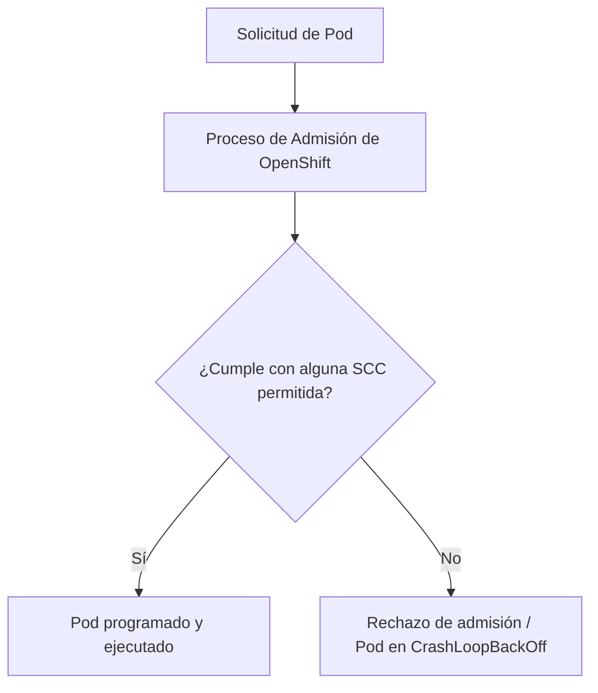
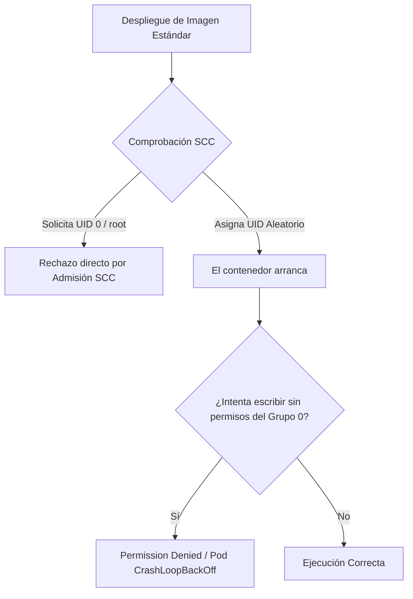
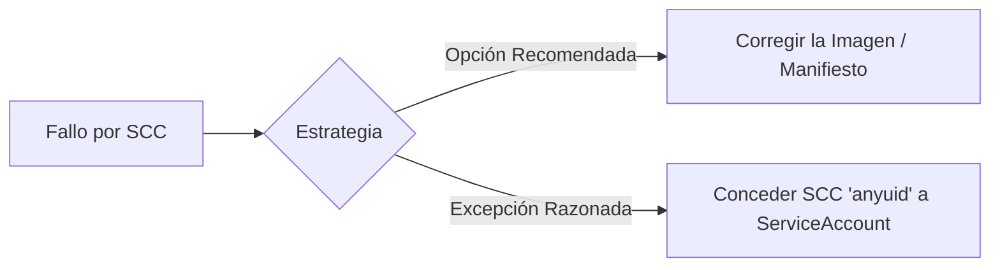

# 2.6 Políticas de seguridad de la plataforma (SCC)

En Kubernetes tradicional, los contenedores suelen ejecutarse con permisos amplios por defecto a menos que se configure explícitamente lo contrario. En cambio, **OpenShift prioriza la seguridad desde el primer segundo** mediante un mecanismo propio denominado **Security Context Constraints (SCC)**.

En este apartado aprenderemos cómo OpenShift aplica estas políticas de seguridad, cómo diagnosticar los fallos habituales al desplegar imágenes estándar de registros públicos y cómo conceder permisos de manera segura sin comprometer la plataforma.

---

## Objetivos de aprendizaje

Al finalizar este apartado serás capaz de:

* Entender qué es una Security Context Constraint (SCC) y por qué es fundamental en OpenShift.
* Comprender la política predeterminada `restricted-v2`, la asignación arbitraria de UID y los permisos de grupo 0.
* Identificar y diagnosticar los errores de despliegue causados por bloqueos de SCC.
* Saber cuándo y cómo asignar la SCC `anyuid` a una ServiceAccount en lugar de concederla a un usuario final.

---

## ¿Qué es una Security Context Constraint (SCC)?

Una **Security Context Constraint (SCC)** es un recurso de clúster que define el conjunto de condiciones y restricciones de seguridad con las que un Pod debe cumplir para ser admitido en el clúster.

En esencia, las SCC actúan como un cortafuegos de seguridad para los pods:



### ¿Qué aspectos controla una SCC?

* **ID de Usuario (UID):** Define con qué usuario del sistema operativo dentro del contenedor se puede ejecutar el proceso.
* **Privilegios de contenedor:** Controla si el contenedor puede ejecutarse como `root` (UID 0) o si requiere capacidades de Kernel avanzadas (`NET_ADMIN`, `SYS_ADMIN`).
* **Sistemas de archivos y volúmenes:** Determina qué tipos de volúmenes se pueden montar y con qué permisos de grupo (`FSGroup` / GID).
* **Escalado de privilegios:** Impide que los procesos dentro del contenedor mevean o eleven sus permisos (`allowPrivilegeEscalation: false`).

---

## La política predeterminada: `restricted-v2`

En las versiones modernas de OpenShift (4.11+), todos los proyectos de usuario aplican por defecto la SCC llamada **`restricted-v2`**.

Esta política impone las siguientes restricciones fundamentales:

1. **UID arbitrario (Non-Root estricto):** OpenShift ignora la instrucción `USER` escrita en el `Dockerfile` de la imagen si esta especifica `root` o un UID fijo. En su lugar, OpenShift asigna dinámicamente un ID de usuario único y aleatorio dentro de un rango predefinido para cada proyecto (por ejemplo, UID `1000650000`).
2. **Permisos de grupo 0 (`root` group):** Como el UID cambia dinámicamente, las imágenes construidas adecuadamente para OpenShift deben pertenecer al grupo **GID 0 (`root`)** y contar con permisos de lectura/escritura para ese grupo en las carpetas donde necesiten escribir datos temporales o logs (por ejemplo, `/tmp`, `/var/run`, `/var/log`).
3. **Impedir escalada de privilegios:** Desactiva la capacidad del contenedor de obtener permisos de superusuario mediante comandos `sudo` o binarios SUID.

!!! note "Grupo 0 no significa usuario Root"
    En Linux, pertenecer al grupo `root` (GID 0) **no concede privilegios administrativos**. Simplemente permite compartir carpetas y ficheros entre el usuario dinámico asignado por OpenShift y los recursos del sistema configurados para el grupo 0.

---

## El problema clásico: Imágenes de contenedor no adaptadas

Muchas imágenes públicas disponibles en Docker Hub o Quay.io (como la imagen oficial de `nginx` o `redis`) están diseñadas asumiendo que se ejecutarán como `root` (UID 0) o como un usuario fijo (por ejemplo, UID 101).

Cuando intentamos desplegar estas imágenes en OpenShift sin modificaciones, ocurren dos situaciones típicas:



1. **Rechazo directo por el proceso de admisión:** Si el manifiesto exige `runAsUser: 0` o solicita capacidades privileged, OpenShift rechaza la creación del Pod directamente.
2. **Fallo de ejecución por permisos de archivo (`Permission Denied`):** El Pod arranca con un UID dinámico (ej. `1000650000`), pero cuando la aplicación intenta escribir en una carpeta que pertenece a `root:root` con permisos `755`, el sistema operativo deniega la escritura y el contenedor falla inmediatamente.

---

## Mecánica de solución: Diagnosticar y corregir el rechazo por SCC

Frente a un fallo de despliegue por restricciones de seguridad, el equipo de operaciones/desarrollo debe decidir entre dos caminos principales:



### Opción A: Corregir la imagen (Buenas Prácticas)
* Modificar el `Dockerfile` para que pertenezca al grupo `0` y ajustar los permisos del directorio de trabajo (`chmod -R g+rwX /app`).
* En el caso de NGINX, utilizar imágenes unprivileged (como `nginxinc/nginx-unprivileged`) diseñadas específicamente para ejecutar en puertos superiores al `1024` y carpetas de caché abiertas.

### Opción B: Conceder la SCC `anyuid`
Si no podemos modificar la imagen original (por ejemplo, un software de terceros cerrado), se puede relajar la seguridad **únicamente para la carga de trabajo específica** mediante la SCC `anyuid`.

!!! warning "Principio de Menor Privilegio"
    **NUNCA** debes conceder la SCC a usuarios finales ni a proyectos enteros. Las SCC se conceden siempre a **ServiceAccounts** específicas para aislar los privilegios exclusivamente al Pod que lo requiere.

---

## Caso Práctico: Diagnóstico y resolución de un fallo por SCC

A continuación resolveremos un escenario real donde un despliegue falla debido a las restricciones de la plataforma.

### 1. Escenario: Despliegue de una imagen que requiere ejecutar como Root
Intentamos desplegar la imagen estándar de NGINX en nuestro proyecto actual:

```bash
oc create deployment nginx-oficial --image=nginx:latest
```

Verificamos el estado del Pod:

```bash
oc get pods
```

*Resultado:*
```text
NAME                            READY   STATUS             RESTARTS   AGE
nginx-oficial-6d5f74c77-x8z9q   0/1     CrashLoopBackOff   2          45s
```

### 2. Diagnóstico del problema

Inspeccionamos los logs del contenedor para identificar la causa raíz:

```bash
oc logs deployment/nginx-oficial
```

*Resultado típico:*
```text
2026/10/09 09:15:22 [emerg] 1#1: mkdir() "/var/cache/nginx/client_temp" failed (13: Permission denied)
nginx: [emerg] mkdir() "/var/cache/nginx/client_temp" failed (13: Permission denied)
```

**Análisis:**
* OpenShift ha asignado un UID arbitrario (por ejemplo, `1000650000`) al contenedor cumpliendo la política `restricted-v2`.
* La imagen oficial de NGINX intenta escribir en `/var/cache/nginx`, pero esa carpeta solo tiene permisos de escritura para el usuario `root`.

Podemos confirmar con qué UID se está ejecutando el contenedor:

```bash
oc describe pod -l app=nginx-oficial | grep "User:"
```

---

### 3. Resolución mediante concesión de la SCC `anyuid`

Para permitir que esta aplicación concreta se ejecute con su usuario previsto (o con UID arbitrario que requiera permisos especiales), crearemos una **ServiceAccount** dedicada y le asociaremos la SCC `anyuid`.

#### Paso 1: Crear una ServiceAccount dedicada
Creamos una ServiceAccount específica para este componente dentro de nuestro proyecto:

```bash
oc create sa sa-nginx-anyuid
```

#### Paso 2: Asociar la SCC `anyuid` a la ServiceAccount
Utilizamos el comando `oc adm policy` para otorgar la restricción de seguridad **únicamente a la ServiceAccount creada**:

```bash
oc adm policy add-scc-to-user anyuid -z sa-nginx-anyuid
```

Desglose del comando:
* `add-scc-to-user anyuid`: Nombre de la Security Context Constraint que permite ejecutar contenedores con cualquier UID (incluido root).
* `-z sa-nginx-anyuid`: Abreviatura de `--serviceaccount`. Especifica el nombre de la ServiceAccount en el proyecto actual.

!!! tip "Comprobación de vinculación"
    Para verificar qué ServiceAccounts o usuarios tienen asignada una SCC específica, se puede ejecutar:
    ```bash
    oc describe scc anyuid
    ```

#### Paso 3: Asignar la ServiceAccount al Deployment
Actualizamos la especificación de la plantilla de nuestro Deployment para que utilice la nueva ServiceAccount:

```bash
oc set serviceaccount deployment/nginx-oficial sa-nginx-anyuid
```

Alternativamente, esto se refleja en el manifiesto YAML bajo `spec.template.spec.serviceAccountName`:

```yaml
apiVersion: apps/v1
kind: Deployment
metadata:
  name: nginx-oficial
spec:
  replicas: 1
  selector:
    matchLabels:
      app: nginx-oficial
  template:
    metadata:
      labels:
        app: nginx-oficial
    spec:
      serviceAccountName: sa-nginx-anyuid
      containers:
      - name: nginx
        image: nginx:latest
        ports:
        - containerPort: 80
```

#### Paso 4: Verificación del estado final

Comprobamos que OpenShift reconsidere la programación del Pod bajo la nueva política asignada:

```bash
oc get pods -w
```

*Resultado esperado:*
```text
NAME                            READY   STATUS    RESTARTS   AGE
nginx-oficial-84df8c99b-k9l2m   1/1     Running   0          12s
```

El Pod ha alcanzado el estado **Running** correctamente porque la SCC `anyuid` vinculada a `sa-nginx-anyuid` le permite ejecutar con los permisos de usuario que requiere la imagen.

---

## Ideas clave para recordar

!!! tip "Resumen de seguridad"
    * **`restricted-v2`** es la política predeterminada que garantiza el aislamiento impidiendo la ejecución como root y asignando UIDs aleatorios.
    * Para que una imagen personalizada sea compatible con OpenShift de forma nativa, sus archivos de trabajo deben tener **permisos para el grupo `0` (`root`)**.
    * **NUNCA** debes otorgar permisos de SCC a usuarios globales o proyectos enteros; asigna siempre la SCC a una **ServiceAccount** específica.
    * El flujo de resolución recomendado ante rechazos de SCC es: diagnosticar el error en logs/eventos, evaluar la adaptación de la imagen y, únicamente si no es posible modificar la imagen, aplicar `anyuid` a la ServiceAccount del Pod.