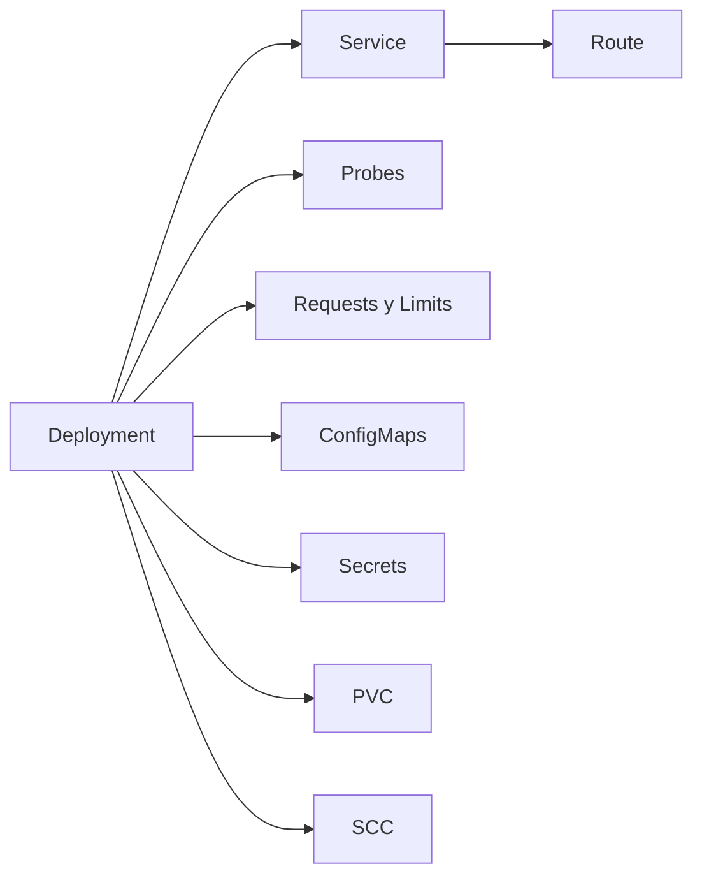
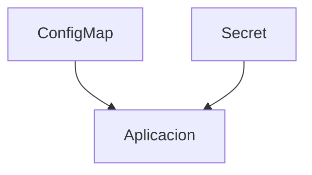
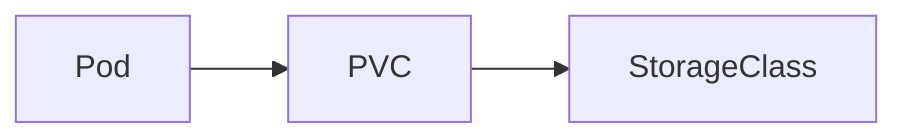
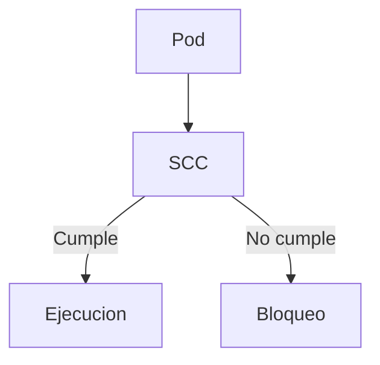
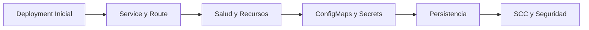
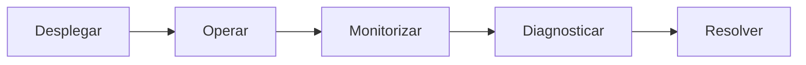

# 2.7 Cierre

A lo largo de esta sesión hemos recorrido los principales recursos que intervienen en el despliegue y operación básica de aplicaciones sobre OpenShift.

Partiendo de un despliegue sencillo, hemos ido incorporando progresivamente capacidades que aparecen habitualmente en cualquier entorno real:

* Actualización y rollback de aplicaciones.
* Exposición de servicios dentro y fuera del clúster.
* Comprobaciones de salud.
* Gestión de recursos.
* Configuración externa.
* Gestión de secretos.
* Persistencia de datos.
* Aplicación de políticas de seguridad.

Cada uno de estos elementos resuelve un problema concreto, pero su verdadero valor aparece cuando trabajan conjuntamente.

## Qué debemos recordar

### El Deployment es el núcleo de la aplicación

Durante la sesión hemos comprobado que el Deployment es el recurso más utilizado para aplicaciones sin estado.

Su responsabilidad principal consiste en:

* Mantener el número deseado de réplicas.
* Sustituir Pods fallidos.
* Gestionar actualizaciones.
* Mantener revisiones.
* Permitir rollbacks.

!!! tip "Idea clave"
    Un Pod individual es efímero. El Deployment es quien garantiza que la aplicación continúe existiendo aunque los Pods cambien continuamente.

### Service y Route tienen funciones diferentes

Es habitual que los alumnos confundan ambos conceptos durante los primeros contactos con Kubernetes y OpenShift.

Recordemos:

| Recurso | Objetivo |
| :--- | :--- |
| **Service** | Acceso interno estable |
| **Route** | Acceso externo a la aplicación |

Un Service puede existir sin Route. Sin embargo, una Route necesita apuntar a un Service para poder publicar la aplicación.

### Una aplicación arrancada no implica una aplicación operativa

Las sondas permiten que la plataforma tome decisiones de forma automática.

| Sonda | Propósito |
| :--- | :--- |
| **Startup Probe** | Validar arranque inicial |
| **Readiness Probe** | Determinar si puede recibir tráfico |
| **Liveness Probe** | Detectar bloqueos o errores permanentes |

Gracias a ellas Kubernetes puede:

* Retirar Pods no preparados del balanceo.
* Reiniciar procesos bloqueados.
* Esperar correctamente durante el arranque.

!!! note "Importancia de las sondas"
    Muchas incidencias en producción no se deben a fallos de la plataforma, sino a una definición incorrecta de las probes.

### Configuración y aplicación son elementos distintos

Hemos visto cómo desacoplar la configuración de la imagen mediante ConfigMaps y Secrets.

Esta práctica aporta varias ventajas:

* Reutilización de imágenes entre entornos.
* Menor necesidad de reconstrucciones.
* Gestión centralizada de parámetros.
* Mejor separación de responsabilidades.

### Los Pods son temporales, los datos no

Uno de los conceptos más importantes para quienes se incorporan al ecosistema Kubernetes es comprender que un Pod puede desaparecer en cualquier momento.

Por esta razón:

La persistencia debe almacenarse fuera del ciclo de vida del Pod. Cuando los datos son importantes, la persistencia deja de ser una opción para convertirse en un requisito.

### La seguridad forma parte del diseño

OpenShift aplica políticas de seguridad desde el primer momento. Durante la sesión hemos comprobado cómo las SCC condicionan la ejecución de los contenedores.

El enfoque recomendado consiste en adaptar las aplicaciones a las políticas de seguridad de la plataforma siempre que sea posible.

!!! warning "Restricción de privilegios"
    Conceder permisos más amplios debe considerarse una excepción justificada y no la configuración habitual.

## Visión global de la sesión

La evolución seguida durante esta sesión puede resumirse en el siguiente recorrido:

Hemos pasado de ejecutar una aplicación sencilla a disponer de una aplicación:

* Publicada.
* Operativa.
* Configurable.
* Persistente.
* Escalable.
* Alineada con las políticas de seguridad de OpenShift.

## Preparando la siguiente sesión

Hasta este momento nos hemos centrado en desplegar correctamente aplicaciones dentro de la plataforma. La siguiente etapa consiste en aprender a operarlas.

En un entorno real surgen continuamente situaciones como:

* Aplicaciones que no arrancan.
* Pods reiniciándose.
* Problemas de conectividad.
* Consumo excesivo de recursos.
* Errores de configuración.
* Fallos de infraestructura.

La siguiente sesión se centrará en las herramientas y técnicas necesarias para diagnosticar este tipo de incidencias.

## Resumen final

!!! tip "Mensajes clave de la sesión"
    * Deployment gestiona el ciclo de vida de las aplicaciones.
    * Service proporciona conectividad interna estable.
    * Route publica aplicaciones hacia el exterior.
    * Las probes permiten automatizar decisiones operativas.
    * Requests y Limits ayudan a utilizar correctamente los recursos del clúster.
    * ConfigMaps y Secrets separan configuración y aplicación.
    * Los datos persistentes requieren almacenamiento externo al Pod.
    * OpenShift aplica seguridad mediante SCC desde el diseño de la plataforma.
    * Una aplicación correctamente desplegada debe ser también operable, mantenible y segura.
>>>>>>