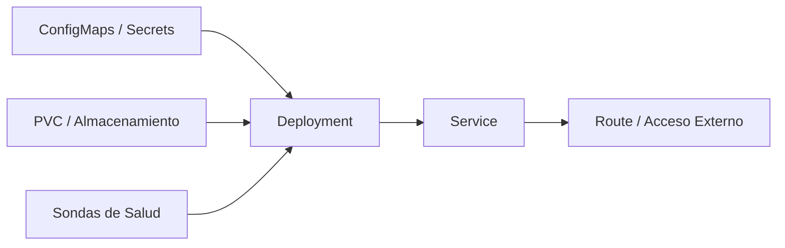

# 2.7 Cierre y recapitulación

A lo largo de esta segunda sesión hemos recorrido el ciclo completo de despliegue y gestión de aplicaciones en OpenShift, evolucionando desde un contenedor básico hasta una arquitectura robusta, persistente, configurada externamente y protegida por las políticas de seguridad de la plataforma.

## Qué hemos aprendido hoy

Para consolidar los conocimientos adquiridos, hagamos repaso de los componentes clave con los que hemos trabajado a lo largo de la sesión:

| Componente / Recurso | Propósito Principal en OpenShift |
| :--- | :--- |
| **Deployment** | Gestión del ciclo de vida de los Pods, asegurando réplicas estables y permitiendo actualizaciones controladas mediante estrategias como `Recreate` o `RollingUpdate`. |
| **Service y Route** | Creación de una red interna estable (`Service`) y exposición controlada de la aplicación hacia el exterior del clúster (`Route`). |
| **Sondas (Probes)** | Mecanismos automáticos de control de salud (`readiness`, `liveness` y `startup`) que permiten a OpenShift supervisar el estado real de la aplicación. |
| **ConfigMaps y Secrets** | Desacoplamiento de la configuración y los datos sensibles respecto al código fuente de la imagen de contenedor. |
| **Volúmenes y PVC** | Conexión de almacenamiento persistente a las cargas de trabajo para garantizar la pervivencia de los datos ante reinicios de Pods. |
| **SCC (Security Context Constraints)** | Definición de restricciones de seguridad a nivel de plataforma para garantizar que los contenedores ejecutan con los privilegios mínimos necesarios. |

## Arquitectura integrada de la aplicación

Todos los elementos que hemos configurado de forma independiente a lo largo de la sesión forman parte de un ecosistema coherente. Cuando una aplicación se ejecuta en OpenShift en un entorno real, no depende únicamente de su código: se apoya en una capa de infraestructura declarativa que gestiona su red, su configuración, su salud y sus datos de forma automatizada.

!!! note "La filosofía declarativa"
    En OpenShift, describir el estado deseado mediante manifiestos YAML permite que la plataforma supervise y mantenga la salud, el almacenamiento y la conectividad de nuestras aplicaciones sin intervención manual constante.

## Hacia dónde vamos en la siguiente sesión

Una vez dominados los fundamentos de despliegue, red, configuración y almacenamiento en OpenShift, en la próxima sesión daremos el salto hacia los mecanismos operativos de supervisión, diagnóstico y recuperación. 

Bajo el título **«Vigilar y recuperar»**, aprenderemos a interpretar métricas, consultar logs, diagnosticar incidencias mediante el método estándar de la plataforma y asegurar la continuidad operativa de nuestras aplicaciones.